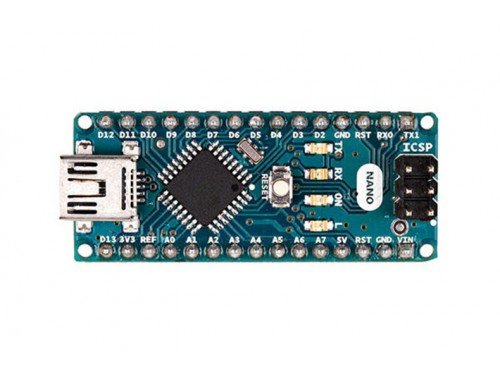
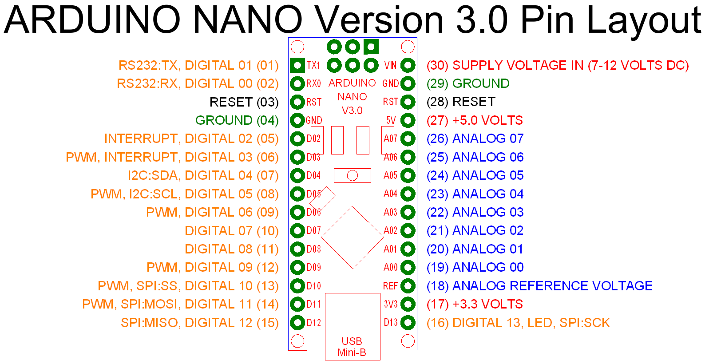

# Arduino Nano 3.x

The Arduino Nano is based on the ATmega328P. It is similar to the Arduino Uno.
  

 [1](https://store-cdn.arduino.cc/usa/catalog/product/cache/1/image/500x375/f8876a31b63532bbba4e781c30024a0a/A/0/A000005_front_2.jpg)

   

## Pinout
  

 [2](http://www.keywild.com/arduino/gallery/Nano_PinOut.png)
  

## Tech Specs
 
| Tech | Specs |
| ---  | ---   |
| Microcontroller | ATmega328 |
| Operating Voltage | 5 V |
| Flash Memory | 32 KB of which 2 KB used by bootloader |
| SRAM | 2 KB |
| Clock Speed | 16 MHz |
| EEPROM | 1 KB |
| DC Current per I/O pins | 40 mA (I/O pins )
| Input Voltage | 7 - 12 V |
| Analog IN Pins | 8 |
| Digital I/O Pins | 22 (6 of which are PWM) |
| PWM Output | 6 |

  

## Power 

- Mini-B USB connection
- 6-20V unregulated external power supply (pin 30)
- 5V regulated external power supply (pin 27)

  

## Memory

Non-volatile (information persists when power is turned off)
- Flash  (programs are stored here)
- EEPROM (memory space programmers use to store long-term information)

Volatile (information lost when power cycles)
- SRAM (static random access memory) This is where the program creates and manipulates variables as it runs
    - data (initialized global and static variables)
    - bss (allocated for uninitialized global and static variables)
    - heap (dynamically allocated)
    - stack (local variables)
        - Every function call creates a stack frame that makes the stack grow toward the heap
        - Each stack frame contains 
            - all parameters passed to the function
            - all local variables declared in the function
        - Data is usable within the function, but the stack memory space is reclaimed when the function exits. 

 [3](https://i.ytimg.com/vi/iOJ52VIvqYM/maxresdefault.jpg)
  

## UART Serial Communication

**UART TTL**

The ATmega328 provide UART TTL (5V) serial communication, which is available on digital pins 0 (RX) and 1 (TX). 

**USB** 

An FTDI FT232RL on the board channels this serial communication over USB and the FTDI drivers (included with the Arduino software) provide a virtual com port to software on the computer. 

The RX and TX LEDs on the board will flash when data is being transmitted via the FTDI chip and USB connection to the computer (but not for serial communication on pins 0 and 1).
