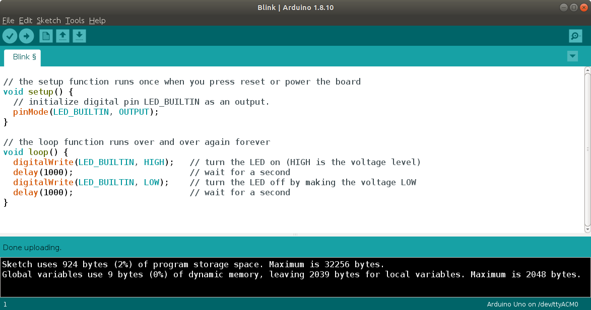
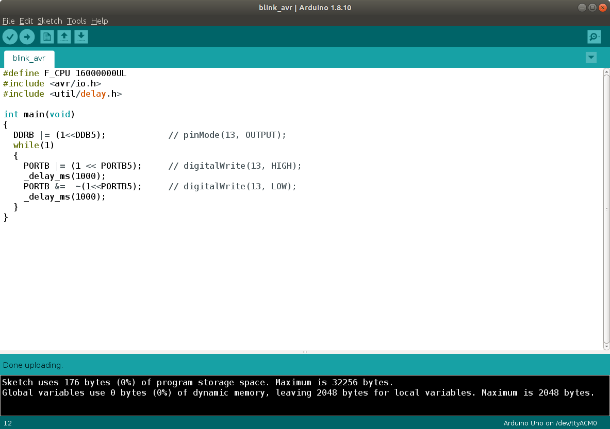

## Blink Memory Usage - Arduino vs Atmel C

The Arduino library functions are very convenient to use. Because these functions are written for a variety of boards, they often require extra memory space compared to writing C code using the avr libraries to directly access the registers.

 

### Arduino Blink Sketch

The Arduino blink example below uses 924 bytes (2%) of program memory space.

 

### avr C Program

The program example below uses the avr libraries to directly manipulate the register settings. This produces the same blink behavior, using only 176 bytes (0%) of program memory space.

 

### Summary

Looking at the two programs, the second is very cryptic and takes new programmers longer to learn than using the Arduino functions. Many programmers choose to use the Arduino library functions to speed project development time. As programs grow larger, it is possible to run out of memory space or to face hard to debug errors due to limited memory operations. Arduino functions often execute more slowly than the avr C code.

Take a look at the Arduino source code for pinMode and digitalWrite to gain an understanding of the length and complexity of the code. https://github.com/arduino/ArduinoCore-avr/blob/master/cores/arduino/wiring_digital.c 

For robotics applications, we often use the Arduino functions as a fast proof of concept method. For optimization of memory space and speed of execution, an avr C program will often require less program memory, less variable memory, and execute faster.