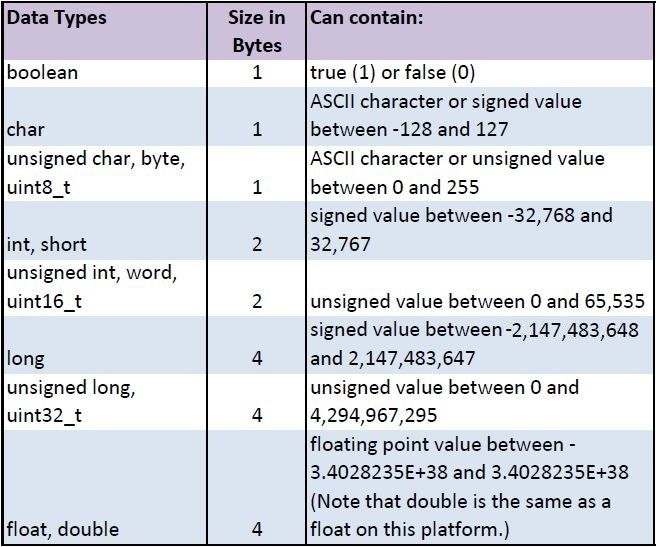

## Optimizing Arduino Program Memory

**Remove Unused Code**
- Unused Libraries - Are all the #include libraries actually used?
- Unused Functions - Are all the functions actually being called?
- Unused Variables - Are all the variables being used?
- Unreachable Code - Are there conditional expressions which will never be true?

If you are not sure, comment out the #include, function, or variable declaration. If the program still compiles, that code is not being used. <br> <br>

**Consolidate repeated code**

If you have the same sequence of code statements in two or more places, consider making a function for that code.<br>
<br>

### Optimizing SRAM

- Move constant data to PROGMEM, https://www.arduino.cc/reference/en/language/variables/utilities/progmem/
- Avoid dynamic memory allocation
- Reduce buffer sizes 
- Prefer local to global allocation
- Reduce oversized variables. Use only as many bytes as are needed.

<br>

 [1](https://cdn-learn.adafruit.com/assets/assets/000/031/818/medium800/learn_arduino_DataTypes.jpg?1460932589)

<br><br>

### SRAM Management Tutorials

- Improve your Arduino programming skills - SRAM Management, Joop Brokking  https://youtu.be/iOJ52VIvqYM 
- Adafruit   https://learn.adafruit.com/memories-of-an-arduino/optimizing-sram
<br><br>

### Optimize this Arduino Sketch

<p>The following program, example1.ino, blinks an led and prints messages at certain time intervals.

```
const unsigned long BLINK_INTERVAL = 500;
const unsigned long PRINT_INTERVAL = 550;
unsigned long blinkTime, printTime;
byte ledState;

void setup() {
  pinMode(LED_BUILTIN, OUTPUT);
  Serial.begin(38400);
  ledState = 1;
  digitalWrite(LED_BUILTIN, ledState);
  blinkTime = millis();
  printTime = millis();
  Serial.println("setup function complete");
}

void loop() {
  if( (millis() - blinkTime) > BLINK_INTERVAL)
  {
    ledState = ledState ^ (byte)0x01;
    digitalWrite(LED_BUILTIN, ledState);
    blinkTime = millis();
  }
  else if( (millis() - printTime) > PRINT_INTERVAL)
  {
    Serial.print("Time to write a message, printTime: ");
    Serial.println(printTime);
    printTime = millis();
  }
  else
  {
    unsigned long count = millis();
    Serial.println("kill time in loop");
    while( (millis() - count) < 250); 
  }
}
```

<p>The program uses 7% of program memory space and 13% of dynamic memory when compiled for an Arduino Uno.</p>


<br>

### The F() macro

The string inside a program instruction is normally saved in RAM. If your sketch uses a lot of string constants, it can easily fill up RAM. If there is free FLASH memory space, the F macro indicates that the string must be saved in FLASH.

`Serial.println("setup function complete");`

Simply place the string inside F() as shown below.

`Serial.println(F("setup function complete"));`

<p>What is the effect of using the F() macro with the string constants in the example program above? the program still uses 7% of program memory space, but global variables now only use 9% of dynamic memory.</p>


<br>

