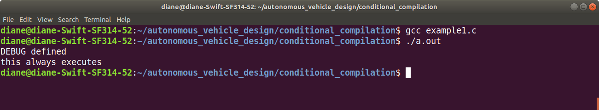

# Conditional Complilation in C Programming Lanuage

Conditional compilation means that the source code is compiled if certain condition(s) hold true. When the condition(s) are false, the source code is not included during compilation.

Conditional compilation is useful for debugging. Printing information is a useful debugging technique to display information during program testing. After a program is tested and considered working, the debugging statements are removed, as they are no longer needed. Removing the debug statements shrinks the size of the program and speeds program execution.

Often, after debugging statements are removed, problems are discovered, and debugging statements have to be added back to the code. Instead of removing the debugging statements, they can be commented out when not needed and uncommented again when needed. This can be a time consuming process.

The C preprocessor provides a better alternative, conditional compilation.


## Using #define to create an alias for Serial.print, Serial.println

The program shown below, example1.ino, uses #define directive to create alias names for Serial.print and Serial.println. Compile the program. How much memory space does it use?

```c++
/* Use preprocessor directive to create an alias for the
 *  Serial.print, Serial.println functions.
 *  
 *  Everywhere we type serialDebug(x), the preprocessor 
 *  replaces that code with Serial.print(x)
 *  
 *  Everywhere we type serialDebugln(x), the preprocessor 
 *  replaces that code with Serial.println(x)
 *  
 *  To remove the serial debug statements from the compiled
 *  program, change #define debug(x) Serial.print(x)
 *  to #define debug(x) 
 *  
 *  This says to replace debug(x) with nothing
 */
#define debug(x) Serial.print(x)
#define debugln(x) Serial.println(x)


const unsigned long BLINK_INTERVAL = 500;
unsigned long blinkTime;
unsigned long wasteTime;
byte ledState;

void setup()
{
  Serial.begin(38400);
  delay(250);
  debugln("Serial Debug Ready");
    
  pinMode(LED_BUILTIN, OUTPUT);
  ledState = 0;
  digitalWrite(LED_BUILTIN, ledState);
  blinkTime = millis();
}

void loop()
{
    if(millis() - blinkTime >= BLINK_INTERVAL){
        ledState = ledState ^ 0x01;     // toggle state 
        digitalWrite(LED_BUILTIN, ledState);
        blinkTime = millis();
        debug("ledState: ");
        debugln(ledState);
    }
    else{
      wasteTime = millis();
      while((millis() - wasteTime) < 200);
    }
}
```


Now, compile the program with the directives. You should see that it requires less memory space because the debugging statements are not included in the compiled program.

```c
#define debug(x) 
#define debugln(x) 
```


## Using #define with #ifdef, #endif pairs

The program shown below, example2.ino, uses #define DEBUG to create a symbol used in conjunction with #ifdef DEBUG, #endif pairs to mark code for compilation.

Lines of source code that should be compiled for debugging, are surrounded by #ifdef, #endif directive pairs as follows:

The #ifdef directive specifies that if DEBUG exists as a macro, i.e. defined with a #define directive, then the statements between #ifdef and #endif are retained in the source file sent to the compiler. If DEBUG does not exist as a macro, then these statements are not passed onto the compiler.

To turn on debugging statements, define this macro in the source file.

```c
#define DEBUG 
``` 

To turn it off, comment it out, or remove it, then recompile the source code.

```c++
/* Use preprocessor directive to create a synmbol named DEBUG
 *  
 *  Surround statements with 
 *  
 *  #ifdef DEBUG
 *    Serial.println("message");
 *  #endif
 *  
 *  When the symbol #define DEBUG is commented out or removed from
 *  the program all the statement surrounded by #ifdef DEBUG  #endif
 *  will not be compiled into the program.
 *  
 */
 
#define DEBUG

const unsigned long BLINK_INTERVAL = 500;
unsigned long blinkTime;
unsigned long wasteTime;
byte ledState;

void setup()
{
  #ifdef DEBUG
  Serial.begin(38400);
  delay(250);
  Serial.println("Serial Debug Ready");
  #endif
    
  pinMode(LED_BUILTIN, OUTPUT);
  ledState = 0;
  digitalWrite(LED_BUILTIN, ledState);
  blinkTime = millis();
}

void loop()
{
    if(millis() - blinkTime >= BLINK_INTERVAL){
        ledState = ledState ^ 0x01;     // toggle state 
        digitalWrite(LED_BUILTIN, ledState);
        blinkTime = millis();
        
        #ifdef DEBUG
        Serial.print("ledState: ");
        Serial.println(ledState);
        #endif 
    }
    else{
      wasteTime = millis();
      while((millis() - wasteTime) < 200);
    }
}

```

Output with #define DEBUG

<br><br>


If the #define DEBUG is commented out as shown below, after compiling and running the program, the debug message does not print out.

```
#include <stdio.h>

// #define DEBUG

int main(void)
{
    #ifdef DEBUG
        printf("DEBUG defined\n");
    #endif 
    printf("this always executes\n");
    return 0;
}
```

</br></br>

## Using #if instead of #ifdef

This example uses the #if directive instead of the #ifdef directive. The #define DEBUG is changed to #define DEBUG 1.

The statement #if DEBUG is true when DEBUG is 1 and false when DEBUG is 0.


```c++
/* Use preprocessor directive to create a synmbol named DEBUG
 *  
 *  Surround statements with 
 *  
 *  #if DEBUG
 *    Serial.println("message");
 *  #endif
 *  
 *  When the program is compiled with # define DEBUG 1 
 *  the conditional statements #if DEBUG are true and the source code
 *  is compiled into the program.
 *  
 *  When the program is compiled with #define DEBUG 0
 *  the conditional statements #if DEBUG are false and the sourc code
 *  is not compiled into the program
 *  
 */
 
#define DEBUG 1

const unsigned long BLINK_INTERVAL = 500;
unsigned long blinkTime;
unsigned long wasteTime;
byte ledState;

void setup()
{
  #if DEBUG
  Serial.begin(38400);
  delay(250);
  Serial.println("Serial Debug Ready");
  #endif
    
  pinMode(LED_BUILTIN, OUTPUT);
  ledState = 0;
  digitalWrite(LED_BUILTIN, ledState);
  blinkTime = millis();
}

void loop()
{
    if(millis() - blinkTime >= BLINK_INTERVAL){
        ledState = ledState ^ 0x01;     // toggle state 
        digitalWrite(LED_BUILTIN, ledState);
        blinkTime = millis();
        
        #if DEBUG
        Serial.print("ledState: ");
        Serial.println(ledState);
        #endif 
    }
    else{
      wasteTime = millis();
      while((millis() - wasteTime) < 200);
    }
}
```

</br></br>

Hopefully, this technique will aid in your debugging and testing, by shortening the amount of time required for adding and removing debugging statements from the source code.
