# Differential Drive Robots

A differential wheeled robot is a mobile robot whose movement is based on two separately driven wheels placed on either side of the robot body. Its direction of travel is determined by the individual wheel velocities. To balance the robot, additional wheels or casters may be added.  

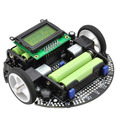 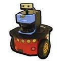   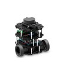  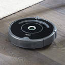  

Differential wheeled robots are used extensively in robotics, because their steering motion is easy to model and control.  

## Differential Drive Steering

Typically, there are two motor driven wheels with other non-driven wheels added for stability. Each wheel is driven individually by a moter. The attached motor controls the wheel's rotational velocity.  

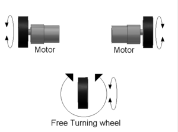 [2](https://upload.wikimedia.org/wikipedia/commons/thumb/d/d3/Tanklike.png/300px-Tanklike.png)  

A differential drive robot has the following motions:

- Straight-line motion - turn drive wheels at the same rate, in the same direction
- In-place (zero turning radius) rotation - turn drive wheels at the same rate in the opposite direction
- Left-turn - turn right wheel at a faster rate than the left wheel
- Right turn - turl left wheel at a faster rate than the right wheel
  

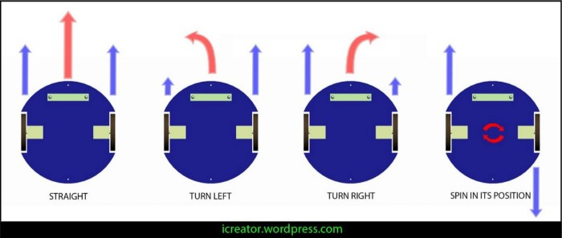 [1](https://encrypted-tbn0.gstatic.com/images?q=tbn:ANd9GcR_2BvHdtTKwBg0_nG0d45piaT5RozGZEY1sA&usqp=CAU )
  

## Advantages and Disadvantages of Differential Drive

Advantages

- Simplicity - The differential drive system is very simple, often the drive wheel is directly connected to the motor (usually a gearmotor--a motor with internal gear reduction--because most motors do not have enough torque to drive a wheel directly).

- Aribtrary motion - Arbitrary motion paths can be implemented by dynamically modifying the angular velocity and/or direction of the drive wheels.  In practice, however, complexity is reduced by implementing motion paths as alternating sequences of straight-line translations and in-place rotations.

- In-place rotation (zero radius turn) can be done
  

Disadvantages

- Control - It can be difficult to make a differential drive robot move in a straight line.  Since the drive wheels are independent, if they are not turning at exactly the same rate the robot will veer to one side.  Making the drive motors turn at the same rate is a challenge due to slight differences in the motors, friction differences in the drivetrains, and friction differences in the wheel-ground interface.  To ensure that the robot is traveling in a straight line, it may be necessary to adjust the motor RPM very often (many times per second).  This may require interrupt-based software and assembly language programming.  It is also very important to have accurate information on wheel position.  This usually comes from the odometry sensors.  
  

## Differential Drive Model

We create mathematical models of the robot so that we can control the robot's motion using known physical robot parameters, control signals, and state information. 

- Robot Parameters
  - Distance between wheels
  - Wheel radius
- Control Signals - inputs to control system
  - Rotational wheel velocity
    - VL : left wheel velocity
    - VR : right wheel velocity
- State Information
  - Position: x, y
  - Orientation (heading): &theta;

The robot model needs to connect the control system inputs VL, VR to the states x, y, &theta;.

Physically, the robot is designed with the drive wheels symmetrically located on each side of the robot chassis. The drive wheels are not physically connected with an axle, but we model the vehicle with a single fixed axle and wheels separated by a specified track width. The wheels can be driven independently. Vehicle speed and heading is defined from the axle center. The state of the vehicle is defined as a three-element vector, [x y &theta;], with a global xy-position, specified in meters, and a vehicle heading, &theta;, specified in radians.

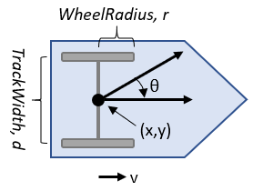 [3](https://www.mathworks.com/help/robotics/ref/diffdrive_annotated.png)

## Coordinate Systems

Two different coordinate systems are defined to describe the position of the robot in its environment.

1. Inertial Coordinate System: This coordinate system is a global
frame which is fixed in the environment or plane in which the robot
moves. This frame is considered as the reference frame
and is denoted as {XI, YI}.

2. Robot Coordinate System: This coordinate system is a local
frame attached to the robot, and thus, moving with it. This frame is
denoted as {Xr, Yr}.  

The two defined frames are shown in the figure below.The origin of the robot frame is defined to be the mid-point A on the axis between the wheels. The center of mass C of the robot is assumed to be on the axis of symmetry, at a distance d from the origin A.  

The robot position and orientation in the interial frame can be defined as

PI = [xa, ya, &theta;]

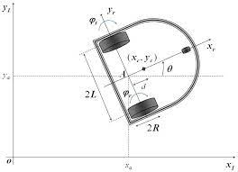 [4](https://d3i71xaburhd42.cloudfront.net/4e9809960be9ec7f1ad8fadf61dad8cb1c8818d0/5-Figure3-1.png)  

#### Mapping Between Two Coordinate Frames

The position of any point on the robot can be defined in the robot frame and the inertial frame as follows.  

Let XR = [xr, yr, &theta;r]

and  

XI = [xI, yI, &theta;I]

The two coordinates are related by the following transformation:

XI = R(&theta;) XR

where R(&theta;) is the orthogonal rotation matrix  

| X | Y | &theta; |
| --- | --- | --- |
| cos(&theta;) | -sin(&theta;) |  0 |
| sin(&theta;) | cos(&theta;)  |  0 |
| 0 | 0 | 1 |
  

## Kinematic Constraints

The motion of a differential-drive mobile robot is characterized by two non-holonomic constraint equations, based upon the assumption of no lateral wheel slip motion and pure rolling motion. A non-holonomic constraint is a constraint on the feasible velocities of a body.  

**No lateral wheel slip motion**  

The constraint means the robot can move only in a curved rolling motion (forward and backward) but not sideways. Any motion perpendicular to the direction in which a wheel is rolling is known as lateral slip. In the robot frame, this condition means that the velocity of the center-point A is zero along the lateral axis. Linear velocity is parallel to the x axis (robot frame).

- xdotra = v
- ydotra = 0

In the inertial reference frame,  

- xdotI = v cos &theta;  
- ydotI = v sin &theta;  
- &theta;dotI  = &omega;  

Using the orthogonal rotation matrix R(&theta;), the velocity in the inertial frame gives the constraint equation

- ydota cos(&theta;) - xdota sin(&theta;) = 0   

**Pure Rolling Constraint**

Each wheel maintains a single point of contact P with the ground as shown in the figure below. There is no slipping of the wheel in its longitudinal axis (xr) and no skidding in its orthogonal axis (yr). The velocities of the contact points in the robot frame are related to the wheel velocities by

- vpR = R&phi;dotR
- vpL = R&phi;dotL

where  
- R is the wheel radius  
- &phi;dot is the wheel's angular velocity  

 

In the inertial frame, these velocities can be calculated as a function of the robot center-point A:

xdotpR cos(&theta;) + ydotpR = sin(&theta;) =  R&phi;dotR

xdotpL cos(&theta;) + ydotpL = sin(&theta;) =  R&phi;dotL
  

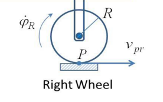  

**Non-holonomic Constraints**

For differential drive systems, the non-holonomic constraint means that the robot can not drive straight to a goal that is not in-line with its orientation. It must either rotate to the desired orientation before moving forward or rotate as it moves.  

 [2](http://faculty.salina.k-state.edu/tim/robot_prog/_images/holonomic.png)  

## Kinematic Model

Kinematic modeling is the study of the motion of mechanical systems without considering the forces that affect the motion. The robot kinematic model represents the robot velocities as a function of the driving wheel velocities, using the geometric parameters of the robot.

The linear velocity of each driving wheel is given by

vR = R&phi;dotR
vL = R&phi;dotL

The linear velocity of the robot, in the robot frame is the average of the linear wheel velocities:

v = (vR + vL) / 2

The angular velocity of the robot is

&omega; = (vR - vL) / (2L)

or equivalently,

&omega; = R (&phi;dotR - &phi;dotL) / (2)

where R is the wheel radius and 2L is the distance between the wheels (track width).

These velocities can be represented in term of the center-point A velocities in the robot frame as follows:

xdot ra = R (&phi;dotR + &phi;dotL) / (2)  

ydot ra = 0

&theta;dot = &omega; = R (&phi;dotR - &phi;dotL) / (2L)

  

The velocities in the interial frame are as follows:

xdot Ia = R cos(&theta;) (&phi;dotR + &phi;dotL) / (2)  

ydot Ia = R sin(&theta;) (&phi;dotR + &phi;dotL) / (2) 

&theta;dot = &omega; = R (&phi;dotR - &phi;dotL) / (2L)

Or they can be expressed in terms of the robot linear and angular velocities.

xdot Ia = v cos(&theta;)

ydot Ia = v sin(&theta;)

&theta;dot = &omega;
  

## Instantaneous Center of Curvature (ICC)

For a wheeled mobile robot to exhibit rolling motion, there must exist a point around which each wheel on the vehicle follows a circular course. This point is known as the instantaneous center of curvature (ICC) or the instantaneous center of rotation (ICR). The ICC must lie on a line coincident with the roll axis of each wheel that is in contact with the ground.

If all wheels are to exhibit rolling contact with the ground, the ICC must exist and each wheel's velocity must be consistent with a rigid rotation of the entire vehicle about the ICC.

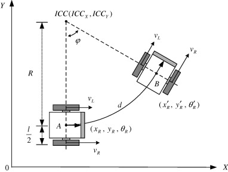 [7](https://ars.els-cdn.com/content/image/1-s2.0-S0957415808000512-gr3.jpg)  

### Use ICC to describe a small displacement of the robot

In the figure above, 

- R - distance from the robot point A to the ICC point.
- L - distance from robot wheel to point A, where 2L is the distance between both wheels.
- &phi; - central angle of arc
- Point A, initial robot pose - XR, YR, &theta;R
- Point B, robot pose after movement - X'R, Y'R, &theta;'R  

Let,

- dL - arc length distance travelled by left wheel
- dR - arc length distance travelled by right wheel
- d - arc length distance traveled by the robot reference point
- &Delta;&theta; - change in orientation 

The distances traveled can be described in terms of the circular arc traveled.

- dL = R &Delta;&theta;
- dR = (R + 2L) &Delta;&theta;
- d = (R + L) &Delta;&theta;
- &Delta;&theta; = &phi; (equals rotation about arc's center point)

Typically, we do not know &Delta;&theta; and are trying to compute both d and &Delta;&theta;.

We know dL and dR from wheel encoder sensors and L from our physical robot model. Mathematically, we can solve for &Delta;&theta; in terms of dL and dR.   

Algebraically rearrange dR equation.

- dR = (R + 2L) &Delta;&theta;
- &Delta;&theta; L = (dR - R &Delta;&theta;) / 2
- Substitute dL for R &Delta;&theta;
- &Delta;&theta; L = (dR - dL) / 2
- &Delta;&theta; = (dR - dL) / (2L)
  

Now, solve for d in terms of  dL and dR.  

- d = (R + L)  &Delta;&theta;
- d = R &Delta;&theta; + L &Delta;&theta;
- d = dL + (dR - dL) / 2
- d = (dL + dR) / 2  

This is the average distance of each wheel.
  

We can also find R using the equations

- dL = R &Delta;&theta;
- dR = (R + 2L) &Delta;&theta;

and equating them in terms of &Delta;&theta;

- dL / R = &Delta;&theta;
- dR / (R + 2L) =  &Delta;&theta;

Thus, 

- dL / R = dR / (R + 2L)
- (R + 2L) dL = R dR

- R = (2L dL) / (dR - dL)

### Use Arc Length Distance to calculate change in global Coordinates

We can model the arc length distance as a straight line if that motion distance is small. Odometry information is computed very fast, at least 20-30 time per second or faster. Over these short time steps, we can approximate the curve as a straight line.

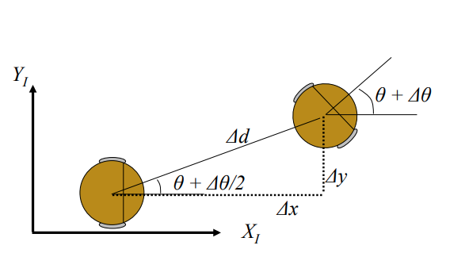 [8](https://www.hmc.edu/lair/ARW/ARW-Lecture01-Odometry.pdf)
  

The new heading is the previous heading, &theta; plus &Delta;&theta;. The change in x and y are calculated as follows:

- &Delta;x = &Delta;d cos(&theta; + &Delta;&theta;/2)
- &Delta;y = &Delta;d sin(&theta; + &Delta;&theta;/2)

**Summary**

- &Delta;x = &Delta;d cos(&theta; + &Delta;&theta;/2)
- &Delta;y = &Delta;d sin(&theta; + &Delta;&theta;/2)
- &Delta;&theta; = (dR - dL) / (2L)
- &Delta;d = (dL + dR) / 2  

  
