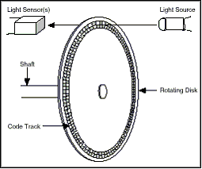
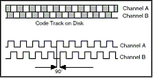

# Odometry 

"Odometry is the use of data from motion sensors to estimate change in position over time. It is used in robotics to estimate the robot's position relative to a starting location. This method is sensitive to errors due to the integration of velocity measurements over time to give position estimates. Rapid and accurate data collection, instrument calibration, and processing are required in most cases for odometry to be used effectively." (https://en.wikipedia.org/wiki/Odometry)

## Rotary Encoder

"A rotary encoder, also called a shaft encoder, is an electro-mechanical device that converts the angular position or motion of a shaft or axle to analog or digital output signals.

There are two main types of rotary encoder: absolute and incremental. The output of an absolute encoder indicates the current shaft position, making it an angle transducer. The output of an incremental encoder provides information about the motion of the shaft, which typically is processed elsewhere into information such as position, speed and distance." https://en.wikipedia.org/wiki/Rotary_encoder 

Odometry means measuring wheel rotation with the Optical Encoders – like the odometer on your car. Odometry is not always as accurate as one would like, but it is the cornerstone of tracking robot movement.

It is on all robots from inexpensive robots for children to multi-million dollar robots.
Even when Alternatives to Odometry are used, odometry is used as a supplement or back up.
Some Alternatives to Odometry are not easily portable to other locations or may fail to work in certain locations or conditions.
Odometry can be reliable enough to make it quite useful. Just don’t expect it to be perfect. It can especially have problems with drift when the wheels slip on the floor.

## Optical Encoder

An encoder is an electrical mechanical device that converts linear or rotary displacement into digital or pulse signals. The most popular type of encoder is the optical encoder. This consists of a rotating disk, a light source, and a photo detector (light sensor). The disk, which is mounted on the rotating shaft, has patterns of opaque and transparent sectors coded into the disk (see Figure 1). As the disk rotates, these patterns interrupt the light emitted onto the photo detector, generating a digital or pulse signal output.  

Two lasers shine light beams onto a ring around the axle of each drive wheel. The ring has cuts perpendicular to the rotation. So as the axle and ring turn, the optical receivers detect pulses of light. The two lasers are offset from each other such that the timing of the pulses detected allows the encoder to determine if the wheels are turning forwards or in reverse. The encoder counts the pulses or ticks to determine wheel displacement. The number of cuts in the ring determines the resolution of the encoder (N).

 [1](https://www.pc-control.co.uk/images/encoder1.gif)

## Incremental Encoder

An incremental encoder generates a pulse for each incremental step in it's rotation. Although the incremental encoder does not output absolute position, it can provide high resolution at an acceptable price. 

The most common type of incremental encoder uses two output channels (A and B) to sense position. Using two code tracks with sectors positioned 90° out of phase, the two output channels of the quadrature encoder indicate both position and direction of rotation. If A leads B, for example, the disk is rotating in a clockwise direction. If B leads A, then the disk is rotating in a counter-clockwise direction. Therefore, by monitoring both the number of pulses and the relative phase of signals A and B, you can track both the position and direction of rotation

 [2](https://www.pc-control.co.uk/images/encoder2.gif)

Each time that the encoder is sampled, the difference between the current tick count and the previous sample is calculated. Then, knowing the number of ticks per revolution (N) and the radius of the wheel (R), the distance traveled in the time interval is calculated.

- &Delta;tick = tick - old_tick

- D = 2 &pi; r (&Delta; tick) / N

where  

- D is the distance the wheel traveled
- r is the wheel radius
- One revolution = 2 &pi; r 
- N is ticks per revolution

## Odometry Error Sources

Limited resolution during integration
§ Unequal wheel diameter
§ Variation in the contact point of the wheel
§ Unequal floor contact and variable friction can lead to
slipping 