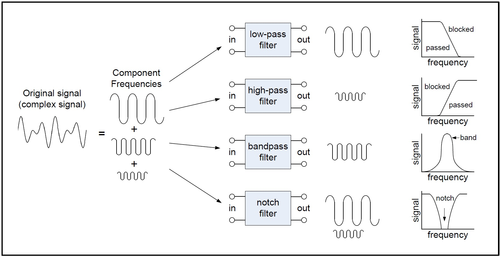
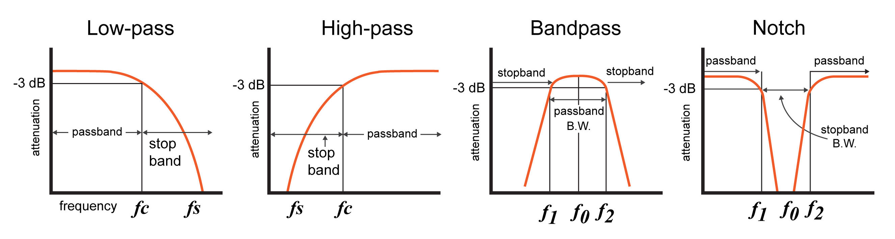

# Filtering Noise From Sensor Readings

Ideal sensors will always generate perfect output, exactly matching the input being sensed. The reality is that there are no perfect, ideal sensors. Sensor output may contain errors such a bias, noise, and time lags in reponse. This module will explore the use of filters to remove noise from sensor readings.
 
 

## What is noise?

Noise is any unwanted signal value that is combined with the desired signal. Noise can be generated internally and/or externally. Internal noise is caused by imperfections in the electrical design or thermal noise due to changing temperature. External noise sources include electromagnetic interference, radio frequency interference, sudden large current draws from motors turning on and off, and physical vibration.

External noise can be lessened with shielding, vibration damping, and environmental temperature control. Eliminating internal noise, due to electrical design imperfections is beyond our control, as we are not manufacturing the sensor. Our only physical hardware control is correctly wiring the sensor circuit, avoiding any loose connections, and reducing the length of any wiring leads to avoid induced noise.
 
 

## Filtering Objective

Our objective is to obtain sensor data that accurately represents the measured environment, by filtering out noise. The filter should smooth erratic sensor data with as little time delay as possible.
 
 

## What is a Filter?

A filter is a circuit capable of passing (or amplifying) certain frequencies while attenuating other frequencies. Thus, a filter can extract important frequencies from signals that also contain undesirable or irrelevant frequencies.
 
 

## Types of Filters

- Low-pass filter 
- High-pass filter
- Band-pass filter
- Band-reject (band-stop, notch) filter

The image below gives a general idea how each filter works. Note that the terms "high" and "low" refer to a relative value with respect to a filter's cutoff frequency.  

[1](https://www.allaboutcircuits.com/uploads/articles/four_major_filters.jpg)

  

## Terminology

Response curves are used to describe how a filter behaves. A response curve is simply a graph showing an attenuation ratio (VOUT / VIN) versus frequency (see figure below). Attenuation is commonly expressed in units of decibels (dB). Frequency can be expressed in two forms: either the angular form ω (units are rad/s) or the more common form of f (units of Hz, i.e., cycles per second). These two forms are related by ω = 2πf. Finally, filter response curves may be plotted in linear-linear, log-linear, or log-log form. The most common approach is to have decibels on the y-axis and logarithmic frequency on the x-axis.   

[2](https://www.allaboutcircuits.com/uploads/articles/Davis_intro_to_filters_filter_types.jpg)

  

Terminology used to describe filter response curves:

**3dB Frequency** (f3dB). This term, pronounced "minus 3dB frequency", corresponds to the input frequency that causes the output signal to drop by -3dB relative to the input signal. The -3dB frequency is also referred to as the cutoff frequency, and it is the frequency at which the output power is reduced by one-half (which is why this frequency is also called the "half-power frequency"), or at which the output voltage is the input voltage multiplied by 1/√2 . For low-pass and high-pass filters there is only one -3dB frequency. However, there are two -3dB frequencies for band-pass and notch filters—these are normally referred to as f1 and f2.

**Center frequency** (f0). The center frequency, a term used for band-pass and notch filters, is a central frequency that lies between the upper and lower cutoff frequencies. The center frequency is commonly defined as either the arithmetic mean (see equation below) or the geometric mean of the lower cutoff frequency and the upper cutoff frequency.

**Bandwidth** (β or B.W.). The bandwidth is the width of the passband, and the passband is the band of frequencies that do not experience significant attenuation when moving from the input of the filter to the output of the filter.

    Stopband frequency (fs). This is a particular frequency at which the attenuation reaches a specified value.
    
    For low-pass and high-pass filters, frequencies beyond the stopband frequency are referred to as the stopband.
    
    For band-pass and notch filters, two stopband frequencies exist. The frequencies between these two stopband frequencies are referred to as the stopband.

**Quality factor** (Q): The quality factor of a filter conveys its damping characteristics. In the time domain, damping corresponds to the amount of oscillation in the system’s step response. In the frequency domain, higher Q corresponds to more (positive or negative) peaking in the system’s magnitude response. For a bandpass or notch filter, Q represents the ratio between the center frequency and the -3dB bandwidth (i.e., the distance between f1 and f2).
  

## Physical and Digital Filters

The filters described above can be (1) physically implemented with circuitry and(2) implemented as a digital filter. In signal processing, a digital filter is a system that performs mathematical operations on a sampled, discrete-time signal to reduce or enhance certain aspects of that signal. We will focus on digital filter implementation.
 
 

Next, we derive the general equations for a first-order [digital low-pass filter](digital_lowpass_filter.md) and a first-order [digital high-pass filter](digital_highpass_filter.md). Following that is a discussion of some [filtering algorithms](filtering_algorithms.md).

For more information on recursive IIR and FIR filters, see [digital filters](introduction_to_digital_filters.md)