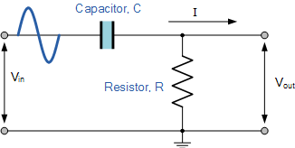
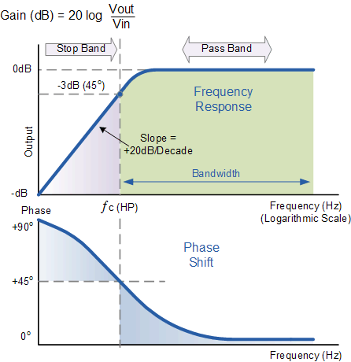

# Digital High-Pass IIR Filter based on Analog Passive RC Low-Pass Filter

## Analog Passive RC High-Pass Filter

A High Pass Filter is the exact opposite to the low pass filter circuit as the two components have been interchanged with the filters output signal now being taken from across the resistor.  

[Image 1: High-pass RC Filter][1]

[1]: https://www.electronics-tutorials.ws/wp-content/uploads/2018/05/filter-fil11.gif
  

Where as the low pass filter only allowed signals to pass below its cut-off frequency point, ƒc, the passive high pass filter circuit as its name implies, only passes signals above the selected cut-off point, ƒc eliminating any low frequency signals from the waveform.

The capacitor reactance is very high at low frequencies so the capacitor acts like an open circuit and blocks any input signals at VIN until the cut-off frequency point ( ƒC ) is reached. Above this cut-off frequency point the reactance of the capacitor has reduced sufficiently as to now act more like a short circuit allowing all of the input signal to pass directly to the output as shown below in the filters response curve.

The cutoff frequency is the same formula as the low pass filter: fc = 1 / (2 &pi; RC)
  

[Image 2: High pass frequency response][2]

[2]: https://www.electronics-tutorials.ws/wp-content/uploads/2018/05/filter-fil13.gif
  

## Time-Domain Analysis

Using Kirchhoff's Laws and the definition of capacitance:

1) vout(t) = R i(t)
2) Qc(t) = C (vin(t) - vout(t))

3) i(t) = &delta;Qc / &delta;t

where Qc(t) is the charge stored in the capacitory at time t.

Substituting equation 2 into 3,

4) i(t) = C (&delta;vin / &delta;t - &delta;vout / &delta;t)

Substituting equation 4 into 1 for i(t),

5) vout(t) = RC (&delta;vin / &delta;t - &delta;vout / &delta;t)

 

## Discrete High-Pass Filter Equation

Represent the input output signals, Vin, Vout, with the discrete time signals: x[n], y[n].

Discretize the derivative

y[n] = RC((x[n]-x[n-1])/&Delta;t - (y[n]-y[n-1])/&Delta;t)

Rearranging terms to solve for y[n]

y[n](1 +RC/&Delta;t) = RC( (x[n]-x[n-1])/&Delta;t + y[n-1])/&Delta;t)

 
Let &alpha; = (RC)/(RC + &Delta;t).

The discrete time implementation of the RC high-pass filter is

y[n] = &alpha; y[n-1] + &alpha; (x[n] - x[n-1])

where
- y[n]   current filter output
- y[n-1] previous filter ouput
- x[n-1] previous input
- x[n]   current input
  

## Summary

High-pass filtering is the opposite of low-pass filtering. Instead of smoothing out a signal, you’re left with any high frequency noise and rapid changes.
