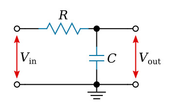
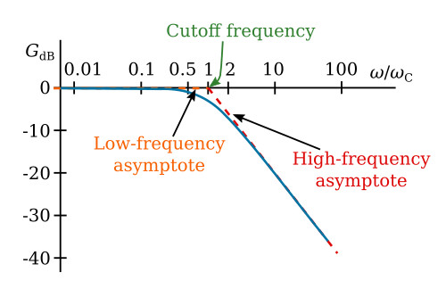
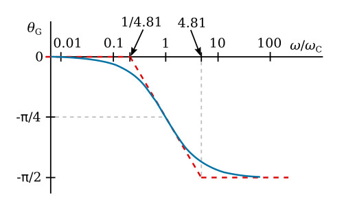

# Digital Low-Pass IIR Filter based on Analog Passive RC Low-Pass Filter

## Analog Passive RC Low-Pass Filter

[Image 1: Low-pass RC Filter][1]

[1]: https://ecstudiosystems.com/discover/textbooks/basic-electronics/filters/images/rc-low-pass-filter.jpg
 

## Behavioral Circuit Analysis

The opposition to the flow of alternating current due to capacitance is called "capacitive reactance." The capacitive reactance of the capacitor in the circuit is XC = 1 / (2 &pi; fC), units: Ohms

Mathematical circuit analysis, using a voltage divider relationship

Vout = (-jXC / (R=jXC)) Vin  

The ratio of Vout / Vin is called the transfer function. It provides the gain/attenuation relationship between the input and output voltage.

G(j&omega;) =  Vout / Vin = (1/(j&omega;C)) / (R + 1/(j&omega;C))

G(j&omega;) = 1 / (1 + j&omega;/&omega;c)

where &omega;c = 1/(RC) and is called the characteristic frequency.  

The cutoff frequency in hertz form is given by f-3dB = 1/(2&pi RC)
  

### Polar Form of Transfer function

G(j&omega;) = 1/sqrt(1+(&omega;/&omega;c)2) < -arctan(&omega;&omega;c)

Capacitor reactance varies inversely with frequency, while the resistor remains constant as frequency changes. At low frequencies, XC will be large compared to the resistive value of the resistor.
  

### Frequency Response

Bode plots are used to display the frequency characteristics of a filter. The magnitude of the transfer function (amplitude characteristic) versus frequency is plotted on one curve and the phase characteristic as a separate curve but with the same frequency axis. The amplitude characteristic, which may vary over a wide range, can be conveniently plotted in terms of decibels. 
  

#### Amplitude 

The filtered signal's amplitude is the absolute value (magnitude) of the transfer function,

G(&omega;) = 1 / sqrt( 1 + (&omega;/&omega;c)2)

In decibels,

GdB = 20 log10 G(&omega;)

GdB = 20 log10 (1 / sqrt( 1 + (&omega;/&omega;c)2))

GdB = -10 log10 [ 1 + (&omega;/&omega;c)2)]   

From this relationship, we see that for low frequencies, &omega;/&omega;c << 1, GdB = -10 log10 1 = 0 

The low-frequency behavior is essentially independent of frequency and can be represented by a horizontal straight line at 0 dB as in the figure below. The actual amplitude characteristic given by the transfer function is asymptotic to this straight line for small &omega;.
  

 [3](https://ecstudiosystems.com/discover/textbooks/basic-electronics/filters/images/amplitude-characteristic-line.jpg)
  

For high frequencies, &omega;/&omega;c << 1, GdB = -10 log10 (&omega;/&omega;c)2) = -20 log10(&omega;/&omega;c)   

This is of the form GdB = -20x, where x = log10 (&omega;/&omega;c). The straight line so defined is the high-frequency asymptote of the actual characteristic. The slope of the asymptote is dGdB/dx = -20; that is, when x increases one unit, GdB decreases by 20 dB. Therefore, the slope of the high-frequency asymptote is -20 dB per decade.

The characteristic frequency (aka breakpoint or cutoff) occurs where the two straight-line asymptotes intersect at at &omega;/&omega;c = 1. Together, the two asymptotes form a broken-line approximation to the actual characteristic. Depending upon the accuracy desired, neither line may be a sufficiently good approximation to the actual characteristic in the neighborhood of ω = ωC. It can be shown that the maximum error occurs at ω/ωC = 1 and is approximately 3 dB.
  

#### Phase Angle

The phase angle of the transfer function of the filter is given by

&theta; = -arctan(&omega;/&omega;c)

The phase angle starts at zero for ω = 0 and approaches -π/2 radians at large ω. 

 [4](https://ecstudiosystems.com/discover/textbooks/basic-electronics/filters/images/phase-characteristic-line.jpg)
  

## Time-Domain Analysis

Using Kirchhoff's Laws and the definition of capacitance, the current through the resistor and the current through the capacitor are the same when there is no load on the circuit.

1) (Vout(t)- Vin(t))/R =  C dVout(t)/(dt)

Rearrange to differential equation form
2) Vout(t) + RC dVout(t)/(dt) = Vin(t)
 

We need to move from differential equation (continuous time) to difference equation (discrete time). Here, we use the backward Euler method for simplicity. For the best frequency domain match from analog to digital, use Tustin's method. Typically, we do not need to match an exact frequency for filtering our sensors, so the backward Euler method is preferred due to simpler computational requirements.

We approximate continuous-time derivatives by

dV/dt = (V[n] - V[n-1])/ T

where V[n] is a sample at index n and T is the sampling time in seconds. 

This relationship comes from the Taylor series. 

Discrete form of the differential equation:

3) Vout[n] + RC ((V[n] - V[n-1])/ T) = Vin[n]
 

Rearranging the difference equation:

4) Vout[n] = (T / (T+RC)) Vin[n] + (RC/(T+RC)) Vout[n-1]
  

## General Discretize Time Domain Equations

Assume that input and output are sampled at evenly spaced points in time, separated by &Delta;t time. Let the samples of vin be represented by the sequence (x1, x2, x3, ..., xn). Let vout be represented by the sequence (y1, y2, y3, ..., yn).
 

Subsituting x, y gives the recurrence relation

5) yi = xi (&Delta;t)/(RC + &Delta;t) + yi-1 (RC)/(RC + &Delta;t)
  

Let &alpha; = (&Delta;t)/(RC + &Delta;t).

The discrete time implementation of the RC low-pass filter is

6) yi = &alpha; xi + (1-&alpha;) yi-1  

Recognize that this is in the form of an infinite impulse response filter. It is an exponentially weighted moving average. The &alpha; value is an exponential smoothing factor, whose function is to remove high-frequency noise.

By definition, the smoothing factor, &alpha; is subject to 0 <= &alpha; <= 1

Larger values of &alpha; reduce the level of smoothing. Values of &alpha; close to 1 give greater weight to recent changes in data, while values of &alpha; closer to zero have a greater smoothing effect and are less responsive to recent changes. There is no formally correct procedure for choosing &alpha;  
 

The time constant RC is 

7) RC = &Delta;t ((1-&alpha;)/&alpha;)log10 (&omega;/&omega;c)2) = -20 
 

The cutoff frequency fc is

8) fc = 1 / (2 &pi; RC) 

The cutoff frequency fc is

9) fc = 1 / (2 &pi; RC) 

Rearranging equation 9,

10) RC = 1 / (2 &pi; fc) 

Making &alpha; and fc related by

11) &alpha; = (2 &pi; &Delta;t fc) / (2 &pi; &Delta;t fc + 1)

12) fc = &alpha; / ( (1-&alpha;) 2&pi;&Delta;t)  

### Sampling Time

The sampling time T must be sufficiently small to ensure an accurate match between analog and digital domains. T must be chosen to ensure an adequate Nyquist limit.

Example: Sampling at 100 Hz, T = 1/100 sec, the maximum frequency that can be filtered is 50 Hz. Signals from 0 Hz - 50 Hz may be filtered.

### IIR Filter Stability

IIR filters can become unstable for certain values of filter coefficients. For this first order filter, keeping &alpha; in the range [0,1] will ensure output signal stability.
