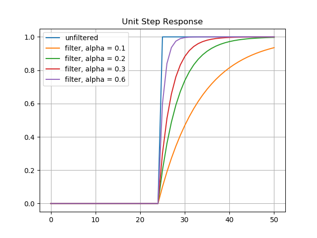

## Filtering Algorithms

We will look at three commonly implemented filtering algorithms:
1. Averaging
2. Running average
3. Exponential Filter
<br>
<br>

## 1. Averaging Filter

Averaging works by adding together a number of measurements and dividing the sum by the number of measurements. 

Average measurement code:

```
float sum = 0.0;
int numMeasurements = 5;
for(int i = 0; i < numMeasurements; ++i)
{
    sum += getSensorMeasurement();
    delay(10);
}
average = sum / numMeasurements;

``` 

The code contains a assumed delay between each measurement. Sensors require time to stabilize between each measurement. The number of measurements is an assumed value as well. The *best* number of measurements will vary from sensor to sensor. 

Noise has less effect on the average, when there are more measurements. There is a diminishing return on the number of measurements. The average of 51 values likely will not be less noisy than 50 values.
<br>
<br>

### Averaging Filter Pros & Cons

Pros:
- simple to calculate

Cons:
- time required to make measurements
- power required to make measurements
<br>
<br>

## 2. Running Average Filter

The running average makes one measurement, adds it to the sum, and then computes the average. 
<br>

### Running average code
```
const int RunAverageCount = 5;
float measurementBuffer[RunAverageCount] = {0.0};
int dataIndex = 0;

float rawSensorData = getSensorMeasurement();
measurementBuffer[dataIndex] = rawSensorData;
dataIndex += 1;
if(dataIndex >= RunAverageCount)
{
    dataIndex = 0;
}

float runningAverageMeasurement = 0.0;
for(int i = 0; i < RunAverageCount; ++i)
{
    runningAverageMeasurement += measurementBuffer[i];
}

runningAverageMeasurement /= RunAverageCount;

delay(10);

```
<br>
<br>

### Running Average Filter Pros & Cons
pros:
- produces a single filtered output faster than averaging method

cons:
- at startup(reset), buffer contains no measurements
- produces a slower response to changes in measurements
- requires more memory for measurement history
<br>
<br>

## 3. Exponentially Moving Average Filter (EMA)

An exponential moving average filter (EMA), also known as an exponentially weighted moving averge (EWMA) is a first-order infinite impulse response filter that applies weighting factors which decrease exponentially over time.

The filter's output, y, is a weighted average of the current input and previous inputs, with the weighting decreasing exponentially.

<p align="center">
    <b>
    y<sub>n</sub> = &alpha; (x<sub>n</sub> + (1-&alpha;) x<sub>n-1</sub> + (1-&alpha;)<sup>2</sup> x<sub>n-2</sub> + (1-&alpha;)<sup>3</sup> x<sub>n-3</sub> + ... )
    </b><br>
</p>
<br>

The formula, as written above, is complex to implement, in terms of changing the weighting of past inputs over time. The formula can be rewritten, with a limited number of terms, as a recursive formula, using the past output from the filter as a filter input.

Let's start with the initial sensor reading at time t = 0.

y<sub>0</sub> = &alpha;x<sub>0</sub><br><br>

The next measurement at time t = 1, produces the equation

y<sub>1</sub> = &alpha;(x<sub>1</sub> + (1-&alpha;)x<sub>0</sub>)<br>
     = &alpha;x<sub>1</sub> + &alpha;x<sub>0</sub> + -&alpha;<sup>2</sup>x<sub>0</sub><br><br>

Subsitute y<sub>0</sub> for &alpha;x<sub>0</sub> and write the equation as y<sub>1</sub> = &alpha;x<sub>1</sub> + y<sub>0</sub> + -&alpha;<sup>2</sup>x<sub>0</sub><br>

Solve the equation y<sub>0</sub> = &alpha; x<sub>0</sub> in terms of x<sub>0</sub>:   x<sub>0</sub> = y<sub>0</sub>/&alpha;<br>

Substitute for x<sub>0</sub>: y<sub>1</sub> = &alpha;x<sub>1</sub> + y<sub>0</sub> + -&alpha;<sup>2</sup>y<sub>0</sub> / &alpha;<br>

which simplifies to y<sub>1</sub> = &alpha;x<sub>1</sub> + y<sub>0</sub> -&alpha;y<sub>0</sub> = &alpha;x<sub>1</sub> + (1-&alpha;) y<sub>0</sub> <br><br>

Similarly, it can be shown that the next measurement will produce y<sub>2</sub> = &alpha;x<sub>2</sub> + (1-&alpha;) y<sub>1</sub> <br><br>

The formula then reduces to <b>y<sub>n</sub> = &alpha;x<sub>n</sub> + (1-&alpha;) y<sub>n-1</sub></b><br><br>

The amount of smoothing is controlled by the weighting parameter &alpha;, where 0 <= &alpha; <= 1. When the weight is large, &alpha; = 0.90, the filter does not smooth the measurements very much, but responds quickly to changes. If the weight is low, &alpha; = 0.10, the filter smooths the measurements a lot, but does not respond quickly to changes.
<br>
<br>


### Selecting &alpha;

The value of alpha may be computed, based on a desired cutoff frequency. The cutoff frequency *f<sub>c</sub>* is defined as the frequency where the power gain is one half. It's also called the *-3dB* point, because 10 log<sub>10</sub> (1/2) = -3.0 dB.

There are several formulas for relating &alpha; to the cutoff frequency *f<sub>c</sub>*. One such formula is shown below.

&omega;<sub>c</sub> = arccos( (&alpha;<sup>2</sup> + 2&alpha; - 2)/ (2&alpha; - 2))  rad/sample 

The sampling frequency, in Hertz (samples/sec), is *f<sub>s</sub>* = (&omega;<sub>c</sub>) / (2 &pi;)

The formula was derived, at the link below. Read this for a thorough presentation of the derivation and pole-zero characteristics of the filter.

https://tttapa.github.io/Pages/Mathematics/Systems-and-Control-Theory/Digital-filters/Exponential%20Moving%20Average/Exponential-Moving-Average.html <br><br>


### How does &alpha; affect smoothing and response to change?

In general, the higher the &alpha;, the more noise is filtered out, but more lag is introduced when reacting to real data changes.

The image below illustrates the impulse response of different alpha values over time. Smaller alpha values filter out the implulse noise faster, as past output is weighted more heavily than current input.<br>


<br>
<br>

The image below illustrates the step response of different alpha values over time. Larger alpha values respond to a change in signal faster, as current input is weighted more heavily than past.<br>


<br>
<br>

[Source code](ema_step_impulse_response.py)


### Initializing Filter Values

- Compute the average of a few data input readings as the initial output
- For the first value, y[0], set the output equal to the input. (No filtering)
- For a control system, set the initial output to the desired set point
<br>
<br>

### EMA Filter code
```
float alpha = 0.2;
float previousOutput = 0.0;

while(1)
{
    currentInput = getSensorData();
    currentOutput = (1-alpha)*previousOutput + alpha * currentInput;
    previousOutput = currentOutput;
    delay();
}

```


### EMA pros and cons

pros:
- requires little memory
- few computations
- weight allows selection of the amount of filtering

cons:
- requires tuning the weight value 


> See the [square wave example](./square_wave/README.md)