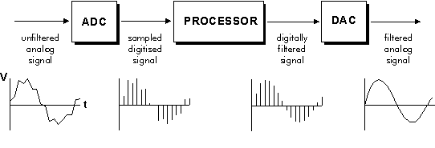

# Introduction to Digital Filters

In signal processing, a filter is used to remove undesirable parts of the signal. Its purpose may be the removal of random noise or to extract parts of the signal within a frequency range.

There are two main types of filters: analog and digital. Analog filters use electronic circuit components (resistors, capacitors, op amps) to produce the filtered signal. The analog signal is a voltage or current.

Digital filters use a digital processor to perform numerical calculations on sampled values of the signal. An analog input signal is sampled and digitized using an ADC (analog to digital converter). Successive sampled values produce a binary number representation of the input signal, which is sent to the digital processor. The digital processor performs numerical calculations to produce the digitally filtered signal. If an analog output is required, a DAC (digital to analog converter) converts the signal back to analog form.

 

[Image 1: DSP System][1]

[1]: https://www.networxsecurity.org/fileadmin/user_upload/images/2015-08/dsp.system.gif
 
 

## Digital Filter Advantages

1. A digital filter is programmable. It can easily be changed without affecting the hardware circuitry. Analog filters can only be changed by redesigning the filter circuit.
2. Digital filters are easily, designed, tested, and implemented on a computer.
3. Digital filters are more stable than analog circuits, with respect to time and temperature.
4. Complex combinations of filters in parallel or cascade are easier to implement digitally, compared to the analog circuitry requirements.
 
 

## Digital Filter Operation

Let's define the "raw" signal to be filtered as a voltage waveform described by the function *V = x(t)* where *t* is time. 

The voltage signal is sampled at time intervals **&Delta;t**. 
 
The sampled time value is 

    <b>xi = x(i &Delta;t)</b> 

 
The digital sequence transferred from the ADC to the processor is represented by the sequence 

    <b>x0, x1, x2, x3,...</b> 

corresponding to the values of the signal at time 

    <b>t = 0, &Delta; t, 2&Delta;t, 3&Delta;t, ... </b> 

t = 0 is the time sampling begins.

 

At time t = n&Delta;t, where n is a positive integer, the sampled input values are x0, x1, x2, x3, ..., xn.

Over the time interval 0 to n, the digital outputs y0, y1, y2, y3, ..., yn

The digital processor output yn is calculated from the values x0, x1, x2, x3, ..., xn. The calculated y values depend on the digital filter implementation.
 
 

## Simple Digital Filter Examples

1. **Simple gain filter**:

    <b>yn = Kxn</b>  
    where K is a constant gain factor. K > 1 makes the filter an amplifier, while 0 < K < 1 makes the filter an attenuator. 

 

2. **Pure delay filter**: The output value at time t = n&Delta;t is the input at time t = (n-1)&Delta;t 

    <b>yn = xn-1</b> 

 

3. **Two term difference filter**: The output value at time t = n&Delta;t is equal to the difference between the current input and the previous input. This is similar to an analog differentiator circuit.  

    <b>yn = xn - xn-1</b> 
    

 

4. **Two term average filter**: The output of the current input and the previous input. This is a simple type of low pass filter as it tends to smooth out high-frequency variations in a signal. 

    <b>yn = (xn + xn-1)/2</b> 

 
 

## Digital Filter Order

The order of a digital filter is the number of previous inputs (stored in the processor's memory) used to calculate the current output. Example 1, the simple gain filter is a zero order filter. The current output yn depends only on the current input xn. The pure delay filter, two term difference filter, and two-term average filter are first order filters because yn depends on the current input xn and the previous input xn-1.

Filters may be of any order from zero upwards.
 
 

## Digital Filter Coefficients

Digital filters can be written in these general forms:

    <b>Zero order: yn = a0 xn </b> 
    <b>First order: yn = a0 xn + a1 xn-1 </b> 
    <b>Second order: yn = a0 xn + a1 xn-1 + a2 xn-2 </b> 

The constants a0, a1, a2, ... are called the filter coefficients.
 
 

## Recursive and non-recursive filters

The four examples above are non-recursive filters. The current output yn is calculated only from the current and previous input values (xn, xn-1, xn-2, ...)

A recursive filter's current output value yn is calculated from both input values and previously calculated output values. These previous output values are stored in the processor's memory.

The term recursive refers to the "going back" to previously calcuated output values, yn-1, yn-2, ...

In general, recursive filters require lower order filters to achieve the desired frequency response than non-recursive filters. Lower order filters translate to fewer calculations required by the processor.

>Note: Non-recursive filters are known as FIR (Finite Impulse Response) filters, while recursive filters are called IIR (Infinite Impulse Response) filters.
>
> The terms FIR and IIR refer to their differing impulse respones. The digital filter's impulse response is the filter's output sequence when a *unit impulse* is applied at its input. A unit impulse is a simple input sequence consisting of a single value 1 at time *t = 0*, followed by all zeros at subsequent sampling instants.
>
>A FIR filter's impulse response is of finite duration. An IIR filter's impulse response theoretically continues forever because the previous output terms feed energy back into the filter input. An IIR's actual impulse response reduces virtually to zero in a finite time.
 
 

## General Recursive Filter Form

## Simple Recursive Filter Example

The simple recursive digital filter represented as

    <b>yn = a0xn + yn-1 </b> 

The current ouput yn is the sum of the current input xn and the previous output yn-1.

At time *t=0*, y-1 is undefined and usually assumed to be zero.

Over time, the filter is the sum of the current input and all the previous inputs. This filter is the digital equivalent of an analog integrator circuit.

    <b>y0 = x0 + y-1 =  x0 </b> 
    <b>y1 = x1 + y0 =  x1 + x0 </b> 
    <b>y2 = x2 + y1 =  x2 + x1 + x0 </b> 

The recursive filter output is based on the current input value and the previous filter output value. The non-recursive output is based only on current and previous input values. In this general form, these formulas appear to be the same algebraically. As we further explore filter design, we will see that the input and output values have differing coefficients that weight the input and output values at various time steps.

    <b>Recursive</b>: y5 = a0x5 + b1y4 
    <b>Non-recurseive</b>: y5 = a0x5 + a1x4 +  a2x3 + a3x2 + a4x1 + a5x0 

 
 

### Recursive (IIR) Filter Order

The order of a recursive filter is the largest number of previous input or output values required to compute the current output.

The simple recursive example above is classified as first order because it uses one previous output value yn-1.
 
 

### Coefficients of recursive (IIR) digital filters

The general symmetrical form of a first-order recursive filter is 

    <b>b0 yn + b1 yn-1= a0xn + a1 xn-1 </b> 

Solving for yn, the general form is

    <b>yn = (a0xn + a1 xn-1 - b1 yn-1) / (b0) </b> 

 
 

## Transfer Function 

The digital filter transfer function is obtained from the symmetrical form of the general equation, with all the output terms on one side of the equation and all the input terms on the other side.

The delay operator, z-1, is applied to the equation. When applied to a sequence of digital values, this operator gives us the previous value in the sequence. Effectively, it introduces a delay of one sampling interval.

Applying a delay to xn gives the previous input xn-1.

    <b>z-1xn = xn-1</b> 

Using the delay operator to describe a recursive digital filter,

    <b>b0 yn + b1 yn-1= a0xn + a1 xn-1 </b> 

becomes

    <b>b0 yn + b1z-1yn + b2 z-2yn = a0xn + a1 z-1xn + a2 z-2xn
    </b> 

Factoring and rearranging provides the relationship between the ouput and input,

    <b>
    yn / xn = (a0 + a1 z-1 + a2 z-2) / (b0 + b1z-1 + b2 z-2)
    </b> 

 
This is the general form of the transfer function for a second-order recursive (IIR) filter.

For higher order filters, further terms of z-1 are added. For a first order filter, the terms in z-2 are omitted.
 

A non-recursive (FIR) filter has a simpler transfer function. The second-order FIR filter's general form is

    <b>
    yn / xn = a0 + a1 z-1 + a2 z-2 / (b0)
    </b> 

