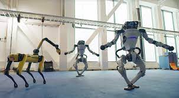
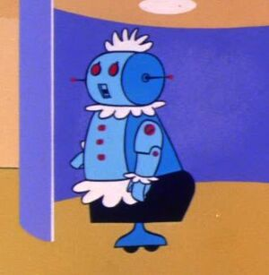
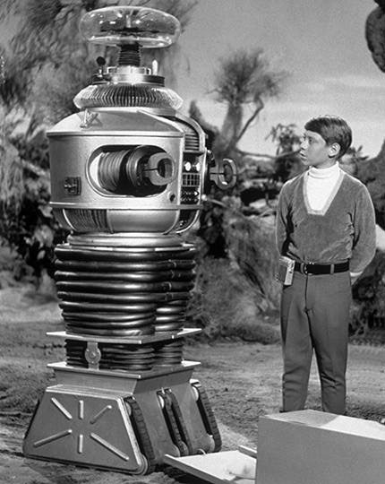

# Mobile Robotics Introduction

## What is a robot?

What is your definition of a robot? My first impressions of the meaning of robot were shaped by Rosey the Robot maid and housekeeper of the Jetson family and the Lost in Space, "Danger, Will Robinson" B9 robot. These robots were machines designed to help humans. My idea of a robot evolved over time and was soley shaped by the entertainment industry as robots existed only in the realm of science fiction. Now we live in the infancy of the robotics age where there are many different types of robots in use and under development.

There is not a one size fits all definition of a robot. Some robots are controlled by humans: (a) surgical robots, (b) remote-controlled drone while others require little to no human interaction. (a) Robot vacuum, (b) self-driving car

- Machine that replaces human effort
- Machine that can sense, think, and act
   - without human intervention
   - in partnership with humans
   - controlled by human operator

The word robot is difficult to define, like it is difficult to define a dog. We know one when we see one. 

 [1](https://s.yimg.com/uu/api/res/1.2/146s6ln0lqEjMwtD9YFDdA--~B/Zmk9ZmlsbDtoPTM3MTt3PTY3NTthcHBpZD15dGFjaHlvbg--/https://s.yimg.com/os/creatr-uploaded-images/2020-12/69f28d70-4a1e-11eb-ba3e-c7eda4cf4c28.cf.webp)  

 [2](https://vignette.wikia.nocookie.net/thejetsons/images/6/6f/Rosey.jpg/revision/latest?cb=20120109214359)  

 [3](https://i2.wp.com/www.boingboing.net/filesroot/200901191304.jpg?resize=430%2C540)   

### What is a Mobile robot?

Mobile robots have the capability to move around in their environment and are not fixed to one physical location. Mobile robots can be "autonomous" (AMR - autonomous mobile robot) which means they are capable of navigating an uncontrolled environment without the need for physical or electro-mechanical guidance devices. Alternatively, mobile robots can rely on guidance devices that allow them to travel a pre-defined navigation route in relatively controlled space (AGV - autonomous guided vehicle).

The components of a mobile robot are a controller, sensors, actuators and power system. The controller is generally a microprocessor, embedded microcontroller or a personal computer (PC). The sensors used are dependent upon the requirements of the robot. The requirements could be dead reckoning, tactile and proximity sensing, triangulation ranging, collision avoidance, position location and other specific applications.[4] Actuators usually refer to the motors that move the robot can be wheeled or legged. To power a mobile robot usually we use DC power supply (which is battery) instead of AC.

Mobile robots are often classified by their operational environments and their mode of locomotion.
- Type of locomotion
   - Wheeled
   - Legged
   - Tracks 

- Environment
   - Land robots are called Unmanned Ground Vehicles (UGVs).
   - Aerial robots are known as  Unmanned Aerial Vehicles (UAVs)
   - Underwater robots are called Autonomous Underwater Vehicles (AUVs)

#### Mobile Robot Navigation

- Manual remote or tele-op - controlled by operator of remote control device.
- Autonomously guided - robot knows some information about its location and how to reach goals or waypoints as it travels.

## How to Develop a Robot

Robots are complex systems that require considerable research, planning, and thought. Use of prior research, analysis and practical experience aid in the development process. The major development steps are listed below. [3](http://motion.cs.illinois.edu/RoboticSystems/WhatIsRobotics.html) 

1. Fabrication: Design and fabricate a mechanism with sensing, actuation, and computing capabilities to fulfill the intended task.
2. Measurement: Develop measurement apparatus(es) and a testing protocol to observe the function of the mechanism
3. Calibration: Use measurements to calibrate (or learn) a model of the mechanism's dynamics, actuation, and sensing
4. Control: Develop and validate a control subsystem that maintains system stability and provides medium-level functionality for planning.
5. Knowledge representation: Decide upon a knowledge representation to be shared between planning and perception subsystems.
6. Perception: Develop and evaluate a perception subsystem that produces knowledge relevant to the task (robot state, maps, object identities)
7. Planning: Implement and test a planning subsystem that generates feasible trajectories to accomplish high-level tasks.
8. Supervisor: Develop a high-level supervisor that schedules tasks, provides a user interface, etc.
9. Testing and evaluation: Test the entire system in the field (on the real task in the real world, and perhaps with human end-users).

The steps in the listed are not followed linearly, because robot design is a cyclic process of trial and error. Any design project will incur many design cycles over its lifetime. The testing process uncovers design flaws and provides new knowledge. Requirements may change over time as well, leading to a redesign.  

## 10 Essential Skills That All Good Roboticists Should Have

To develop robots, you must become a good roboticist. A blog post listed the 10 skills below as essential. [4](https://blog.robotiq.com/10-essential-skills-that-all-good-roboticists-have)

1. Systems Thinking
   - able to understand how mechanical, electrical, programming, and sensing systems work together
   - requires competency in each of these disciplines
  
2. Programming Mindset
   - Programming is an essential skill for robotics
      - Low-level control systems to high-level cognitive systems
   - Must be comfortable learning any new language when required
      - Main programming languages: C/C++ and python 
  
3. Active Learning 
   - Impossible to learn all topics before you need them due to the multitude of topics and the ever-evolving knowledge base.
  
4. Mathematics
   - Requires a good grasp of algebra, geometry, calculus, linear algebra, and differential equations
  
5. Science and Applied Mathematics
   - Application of scientific principles in robotics design and testing
   - Applied mathematics - real world is not as exact as pure mathematics. Need to decide when the result of a calculation is good enough to actually work.
  
6. Judgment and Decision Making
   - There is never one correct solution to any problem in robotics. 
      - What sensors should be used?
         - Vision - which of the hundreds of vision systems available?
         - Obstacle detection - sonar, lidar, infrared, touch
      - What type of locomotion?
         - Wheeled
         - Flight
   - Analytical thinking skills allow you to analyze the problem from various perspectives
   - Critical thinking skills use logic and reasoning to balance strengths and weaknesses of each solution
  
7. Good Communication
   - Explain concepts to non-specialists
      - Explain a structural mechanics problem to a computer scientist
      - Explain high-level programming issues to a mechanical engineer
      - Explain engineering concepts to accountants
   - Writing skills are extremely important
      - Experimental results must be documented as part of the learning/development process
         - Clearly communicate the assumptions, performance measures, and limitations of a sub-system
      - Work must be reported for various audiences
         - Your team will needs in-depth technical data
         - Your boss needs a higher-level summary with the supporting technical data available
         - Marketing team needs a high-level, simplified overview
      - Speaking - must be able to orally present your results and pitch your ideas
      - Instructing - need to teach and train co-workers
  
8. Technology Design
   - Design systems that actually work
   - Trouble shoot problems and provide possible solutions
   - Repair skills
  
9. Complex Problem Solving
   - Everything in robotics is a complex problem. If you like solving problems, you will enjoy robotics. 
   - Forseeing problems is an important skill to develop, along with troubleshooting problems as they arise.
  
10. Persistence
   - Don't give up trying to find a solution
   - Must be adaptable to different approaches 
   - Must also know when to ask for advice and assistance.
  
