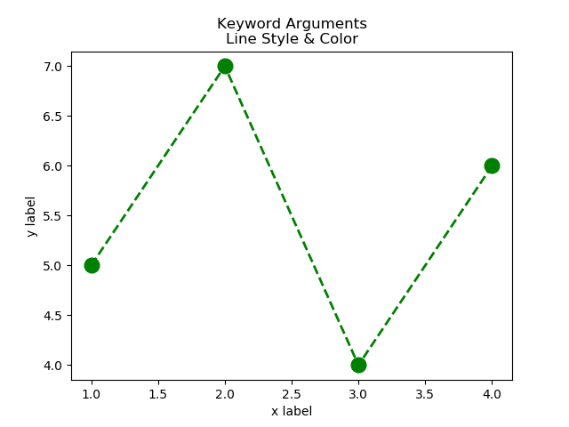

## Plotting Data with Matplotlib

### Lesson 1 - Plot y versus x with default linestyle and color

Source code: [lesson1.py](lesson1.py) 

 
 
 

### Lesson 2 - Plot y versus x with keyword arguments

Source code: [lesson2.py](lesson2.py) 

 
 
 

### Lesson 3 - Plot y versus x, Multiple Data Sets

Source code: [lesson3.py](lesson3.py) 

 
 
 

**API documentation: matplotlib.pyplot.plot https://matplotlib.org/api/_as_gen/matplotlib.pyplot.plot.html**
 
 
 

### Lesson 4 - Subplots

Source code: [lesson4.py](lesson4.py)
 

Uses numpy sin function to generate sinusoidal signals. Considers Nyquist when calculating samples/sec
 

 
 
 

### Lesson 5 - Stem plot

Source code: [lesson5.py](lesson5.py)
 

Stem plots are useful in showing individual samples.
 

 
 
 

**API documentation: matplotlib.pyplot.stem https://matplotlib.org/3.1.1/api/_as_gen/matplotlib.pyplot.stem.html#matplotlib.pyplot.stem**

  

### Lesson 6 - Sampling

Illustrates how sampling frequency affects representation of continuous time signal.
