# Creating a RQT Dashboard

For this tutorial we will be detailing the basics of creating your own rqt dashboard. A dashboard is a single rqt window with one or more plugins displayed in movable, resizable frames. Dashboards generally consist of a number of plugins that in combination provide a suite of UI capabilities for working with robots and robot data.

Dashboards can be populated and configured interactively in an rqt session. A preferred configuration can be saved as a “Perspective”, which saves the plugins loaded, their layout, and where supported, their settings and last-saved initial parameters (such as what topic we were last plotting). In this tutorial we will be working with the turtlesim simulation in ROS melodic.

rqt is a software framework of ROS that implements the various GUI tools in the form of plugins. The tools can still run in a traditional standalone method, but rqt makes it easier to manage all the various windows on the screen at one moment. 


You can run any rqt tools/plugins with:

```bash
rqt
```

My system produced the following error:

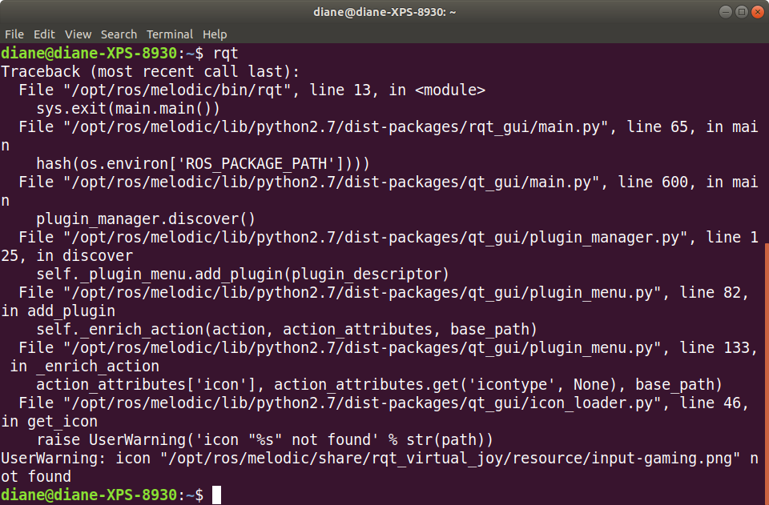

</br></br>

The warning was helpful in fixing the issue: "UserWarning: icon "/opt/ros/melodic/share/rqt_virtual_joy/resource/input-gaming.png" not found". Navigating to that directory and listing its contents shows the resources directory and image are indeed missing.

```bash
cd /opt/ros/melodic/share/rqt_virtual_joy/
ls
```

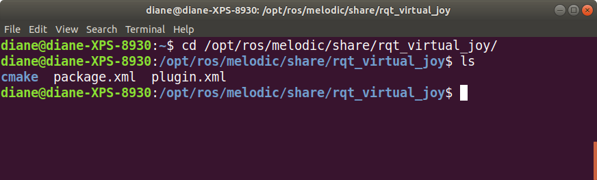

</br></br>

An internet search led me to the github repository: https://github.com/aquahika/rqt_virtual_joystick


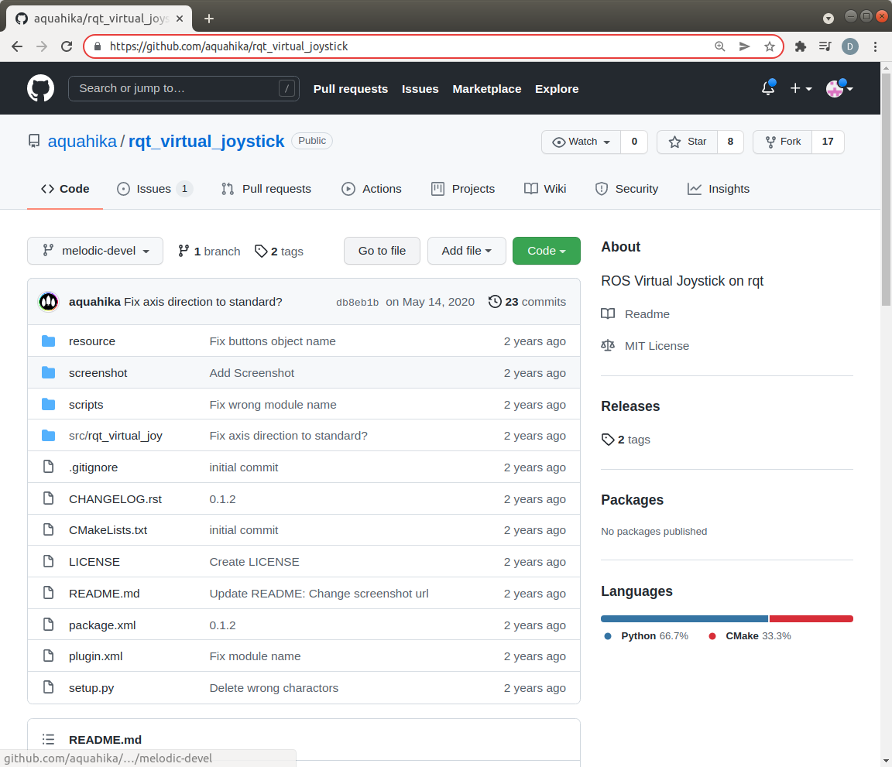

</br></br>

The above image, shows the branch melodic-devel, which I then downloaded as a zip file, unzipped, and copied the contents of the resources directory to /opt/ros/melodic/share/rqt_virtual_joy/. 

```bash
unzip ~/Downloads/rqt_virtual_joystick-melodic-devel.zip
sudo mkdir /opt/ros/melodic/share/rqt_virtual_joy/resource
sudo cp ~/Downloads/rqt_virtual_joystick-melodic-devel/resource/*.* /opt/ros/melodic/share/rqt_virtual_joy/resource/
```

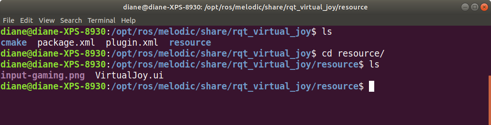

</br></br>

Now, starting rqt works for me. You may not have a blank canvas, as shown below, if you have been using rqt and saved a different default configuration.

```bash
rqt
```

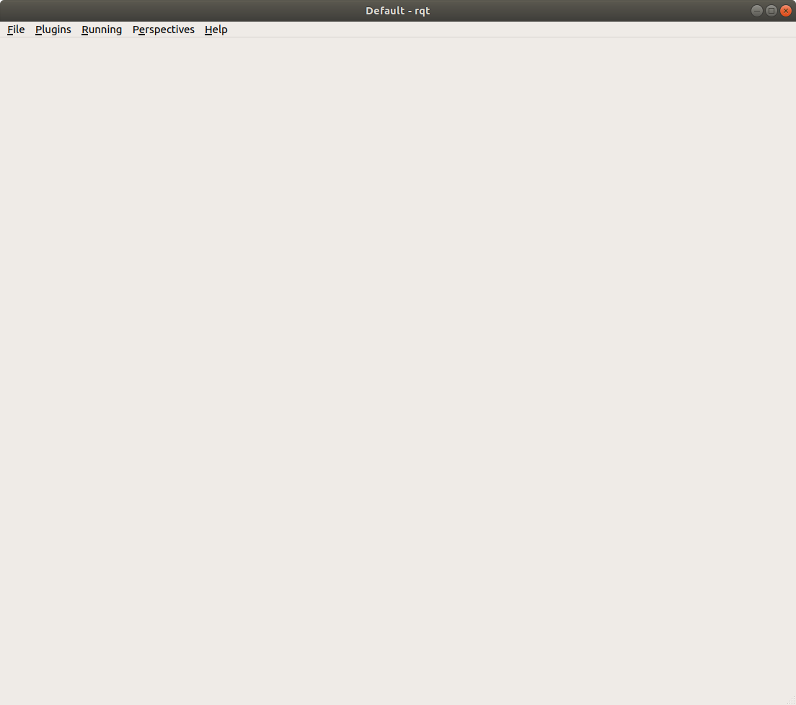

</br></br>

What's really nice about this blank canvas, is that we can load the desired plugins for our robotic application, save the configuration, and then reuse it whenever we test our robot. 

Watch this excellent video, [ROS Training - rqt](https://youtu.be/o90IaCRje2I) showing how to configure rqt for turtlesim.

</br></br>

Having watched the video, the remaining steps may just serve as a reminder.

Let's start the turtlesim simulation with the following commands.

```
roscore
rosrun turtlesim turtlesim_node
```

From the rqt Plugins menu, select Introspection, Node Graph.

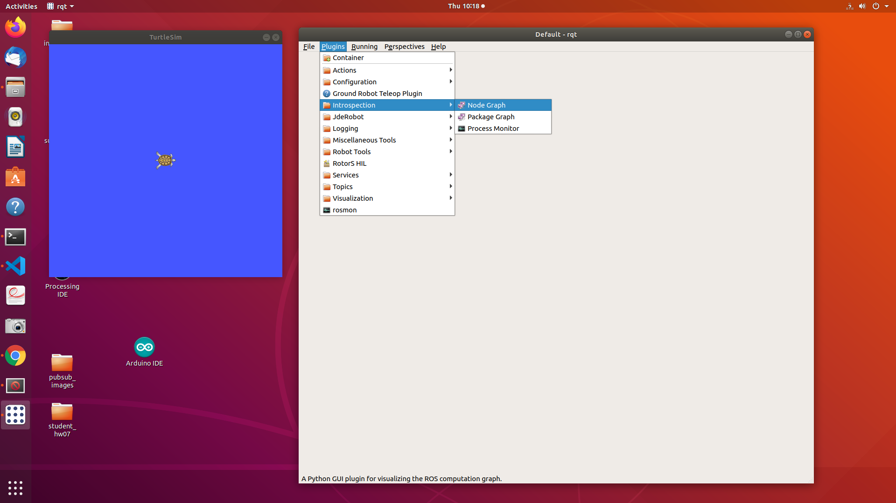

</br></br>

In the screenshot below, with Node/Topics(all) selected, we see the relationships between the turtlesim node and turtle1. Nodes are shown in ovals. Topics are shown in rectangles. The larger rectangle shows all topics in the turtle1 namespace.

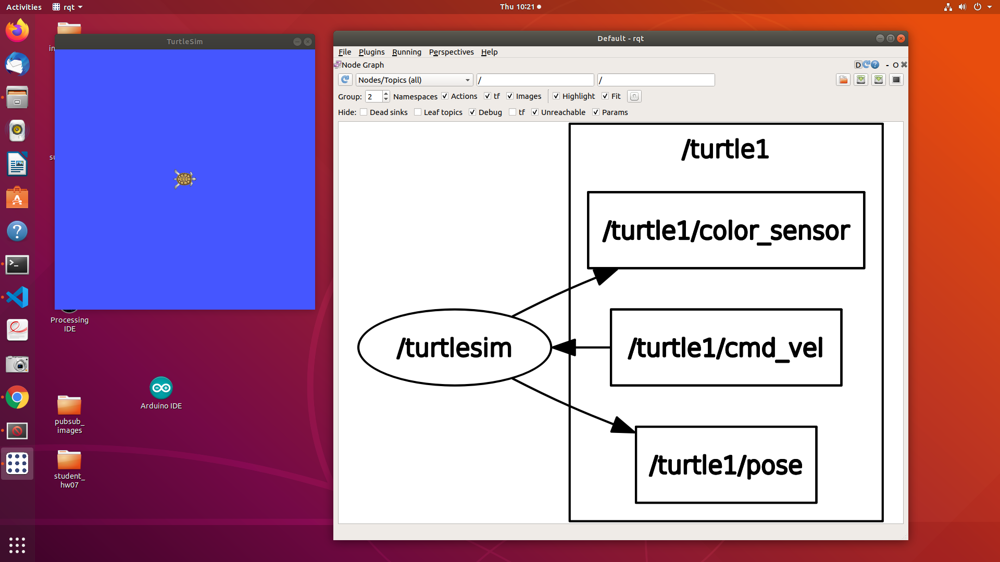

</br></br>


Move your mouse cursor to the turtlesim node. You see the node appear in red, the topics it publishes in green, and the topics it subscribes to in blue, as shown below. Note that the arrows indicate the direction of data flow.

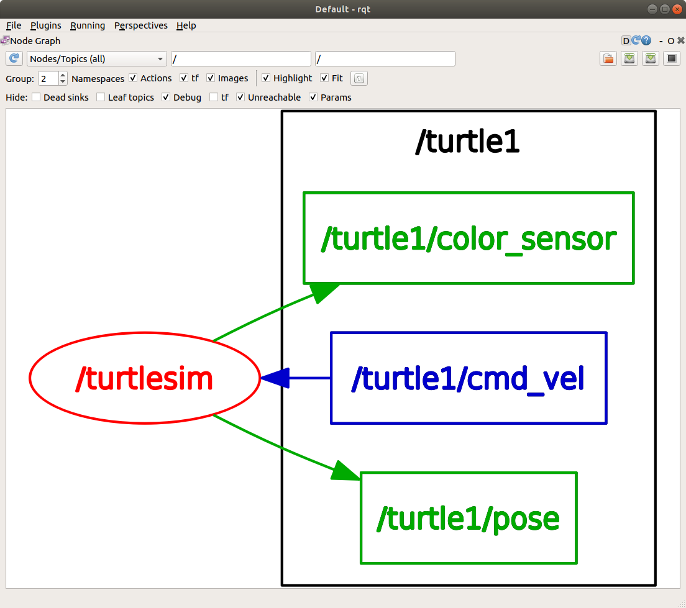

</br></br>

Let's start the turtle_teleop_key node so we can move the turtle around the simulation window.

```bash
rosrun turtlesim turtle_teleop_key
```

Refresh the rqt node graph window and you will now see the teleop_key node has been added, as shown below. It publishes the topic /turtle1/cmd_vel.

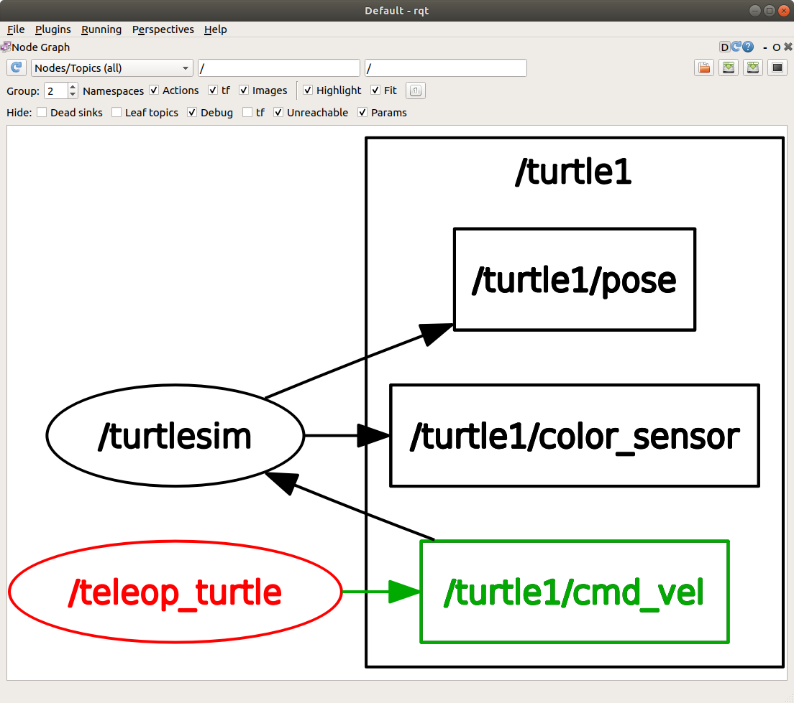

</br></br>

Next, let's add the message publisher. As shown below, select Plugins, Topics, Message Publisher.

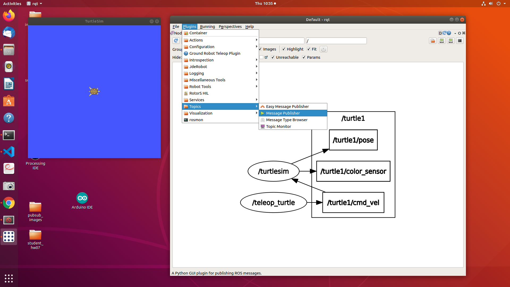

</br></br>

From the Topic dropdown, select /turtle1/cmd_vel and click the green plus button to add the topic. Click on the triangles to the left of the topic to see the individual fields.

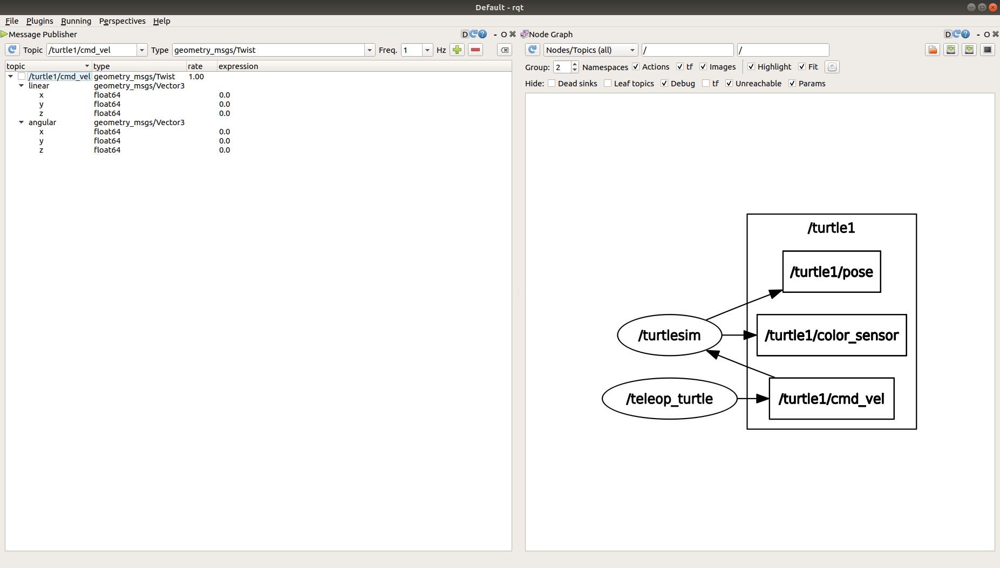

</br></br>

The topic has a default frequency of 1Hz. The screenshot below shows linear x highlighted with a left mouse click. Hovering over it with the mouse cursor, the message "enter valid python expression here ...", as shown below appears.

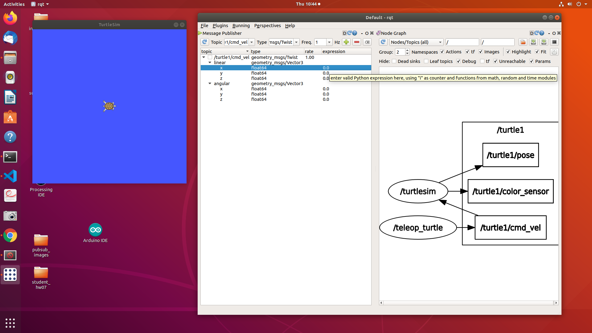

</br></br>

Double clicking on the 0.0 field, type in a value of 1.0. To publish the message, check the box to the left of the topic. The screenshot below shows the turtle is moving in the positive x direction. To stop publishing, uncheck the box. Experiment with publishing different positive and negative velocities.

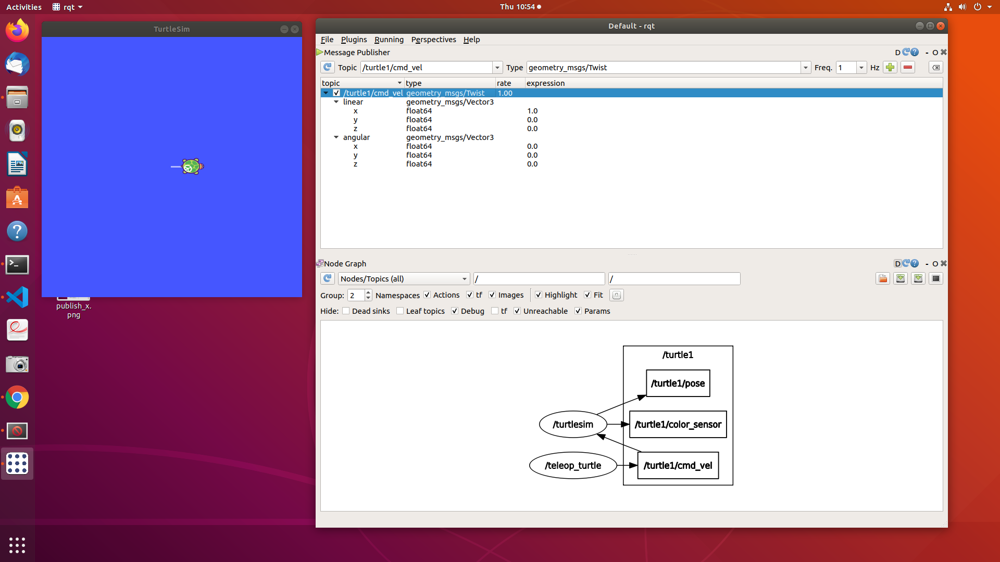

</br></br>

Next let's add service calls. Select Plugins, Services, Service Caller. From the drop-down list, select the reset service.

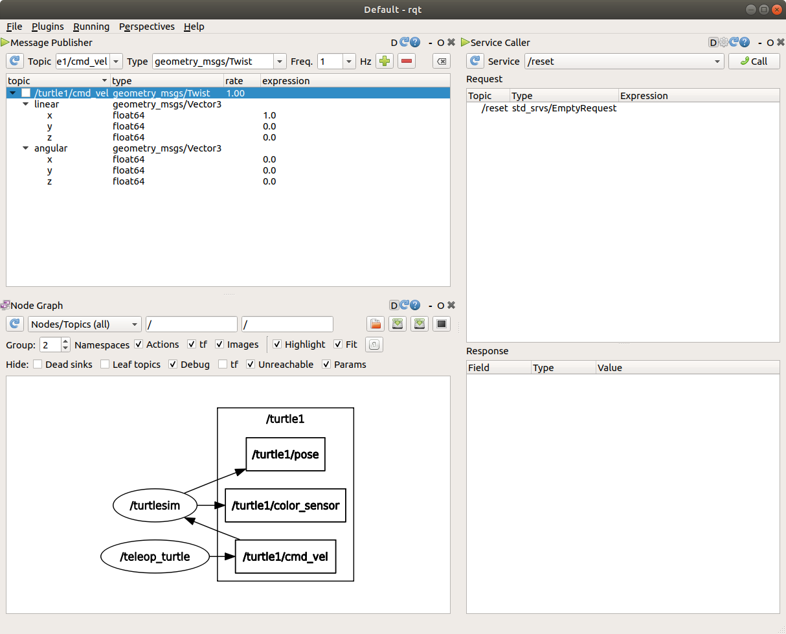

</br></br>

Pressing the Call button will call the reset service and reset the simulation screen, moving the turtle back to the center.

</br></br>

## Saving the rqt configuration

When you’re happy with a dashboard configuration, you can save the perspective by selecting Perspectives > Create Perspective, giving it a name, and asking it to clone the current perspective. These perspectives are saved locally and persist between sessions.

For example, I created a perspective named my_turtlesim, closed rqt and restarted rqt. It opened it as I last saved it, with the my_turtlesim.perspective. The Perspectives menu now shows both the available perspectives.

To export a perspective for closer management such as sharing or persisting to a repository, select Perspectives > Export and give it a name with the filename extension, .perspective.

</br></br>

## Loading a Perspective from command line

```bash
rqt --perspective-file "$(rospack find my_ros_rqt_package)/config/my_dashboard.perspective"
```

For other rqt options, type rqt -h in a terminal.

</br></br>

## More info on plugins

Each plugin has their own uses and settings, for more information about a particular plugin, visit the [rqt plugins page of the ROS Wiki](http://wiki.ros.org/rqt/Plugins). 

