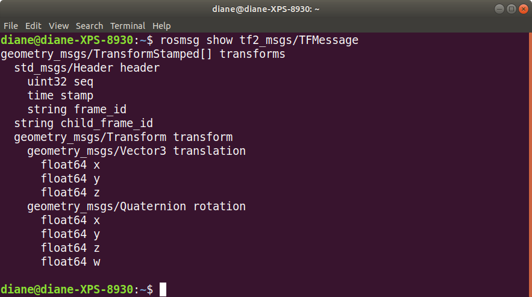

# Writing a tf2 broadcaster (python)

Description: This tutorial teaches you how to broadcast the state of a robot to tf2.

https://wiki.ros.org/tf2/Tutorials/Writing%20a%20tf2%20broadcaster%20%28Python%29

We will not write the code to reproduce the demo from the tf2 introduction tutorial.

## Create a learning_tf2 package

First we will create a catkin package that will be used for this tutorial and the following ones. This package called learning_tf2 will depend on tf2, tf2_ros, roscpp, rospy and turtlesim.

```bash
cd ~/catkin_ws/src
catkin_create_pkg learning_tf2 tf2 tf2_ros roscpp rospy turtlesim
```

## How to broadcast transforms

This tutorial teaches you how to broadcast coordinate frames to tf2. In this case, we want to broadcast the changing coordinate frames of the turtles, as they move around.

Let's first create the source files. Go to the package we just created:

```bash
roscd learning_tf2
```

Make a new directory called scripts in the learning_tf2 package.

```bash
mkdir scripts
cd scripts
```

Use a text editor to create a new file named turtle_tf2_broadcaster.py. The entire program, with comments, is shown below.


```python
#! /usr/bin/env python

import rospy
import tf_conversions
import tf2_ros

import geometry_msgs.msg 
import turtlesim.msg 

def handle_turtle_pose(msg, turtlename):
   '''
   The handler function for the turtle pose message 
   broadcasts this turtle's translation and rotation, 
   and publishes it as a transform from frame "world" 
   to frame "turtleX".
   '''
   # create a Transform Broadcaster object
   br = tf2_ros.TransformBroadcaster()
   
   # create a TransformStamped message
   t = geometry_msgs.msg.TransformStamped()

   # fill in the metadata with the current time
   t.header.stamp = rospy.Time.now()

   # set the name of the parent frame of the link 
   # we're creating
   t.header.frame_id = "world"

   # set the name of the child node of the link
   # we're creating
   # in this, it is the name of the turtle itself
   t.child_frame_id = turtlename

   # copy the data from the 3D turtle pose message
   # into the 3D transform
   t.transform.translation.x = msg.x
   t.transform.translation.y = msg.y
   t.transform.translation.z = 0.0

   # convert the euler angle to quaternion form
   q = tf_conversions.transformations.quaternion_from_euler(0, 0, msg.theta)
   t.transform.rotation.x = q[0]
   t.transform.rotation.y = q[1]
   t.transform.rotation.z = q[2]
   t.transform.rotation.w = q[3]

   # send (broadcast) the transform
   br.sendTransform(t)

if __name__ == '__main__':
   # initialize the node with node name
   rospy.init_node('tf2_turtle_broadcaster')

   # This node takes a single parameter "turtle",
   # which specifies a turtle name, e.g. "turtle1" 
   # or "turtle2".
   # private namespace ~ indicates private
   turtlename = rospy.get_param('~turtle')

   # subscribe to the /turtleX/pose topic
   # where turtlename is substituted for the
   # placeholder %s
   rospy.Subscriber('/%s/pose' % turtlename,
                     turtlesim.msg.Pose,
                     handle_turtle_pose,
                     turtlename)
    rospy.spin()
```

</br>

Don't forget to make the script executable.
```bash
chmod +x turtle_tf2_broadcaster.py
```


How do we know the names of each TFMessage field? The rosmsg show command provides that information, as shown below.

```bash
rosmsg show tf2_msgs/TFMessage 
```



</br>


This node reads a single parameter "turtle", which specifies a turtle name, e.g. "turtle1" or "turtle2".

```python
turtlename = rospy.get_param('~turtle')
```

The node subscribes to the topic "turtleX/pose" and runs the callback function "handle_turtle_pose" on every incoming message.

</br></br>

## Running the broadcaster

Create a launch file directory and then a launch file named start_demo.launch.

```bash
cd ~/catkin_ws/learning_tf2/
mkdir launch
cd launch
```

The launch file contents are shown below.

```xml
<launch>
      <node pkg="turtlesim" type="turtlesim_node" name="sim"/>
      <node pkg="turtlesim" type="turtle_teleop_key" name="teleop" output="screen"/>


    <node name="turtle1_tf2_broadcaster" pkg="learning_tf2" type="turtle_tf2_broadcaster.py" respawn="false" output="screen" >
      <param name="turtle" type="string" value="turtle1" />
    </node>
    <node name="turtle2_tf2_broadcaster" pkg="learning_tf2" type="turtle_tf2_broadcaster.py" respawn="false" output="screen" >
      <param name="turtle" type="string" value="turtle2" /> 
    </node>

  </launch>
```

</br></br>

### Build the package

In the catkin workspace, invoke catkin_make and then overlay the environment.

```bash
cd ~/catkin_ws
catkin_make
source devel/setup.bash
```

Start the demo

```bash
roslaunch learning_tf2 start_demo.launch
```

### Checking the results

Use the tf_echo tool to check if the turtle pose is actually getting broadcast to tf2:

```bash
rosrun tf tf_echo /world /turtle1
```

This should show you the pose of the first turtle. Drive around the turtle using the arrow keys (make sure your terminal window is active, not your simulator window). If you run tf_echo for the transform between the world and turtle 2, you should not see a transform, because the second turtle is not there yet. However, as soon as we add the second turtle in the next tutorial, the pose of turtle 2 will be broadcast to tf2.

To actually use the transforms broadcast to tf2, you should move on to the next tutorial about creating a [tf2 listener](tf2_listener.md).