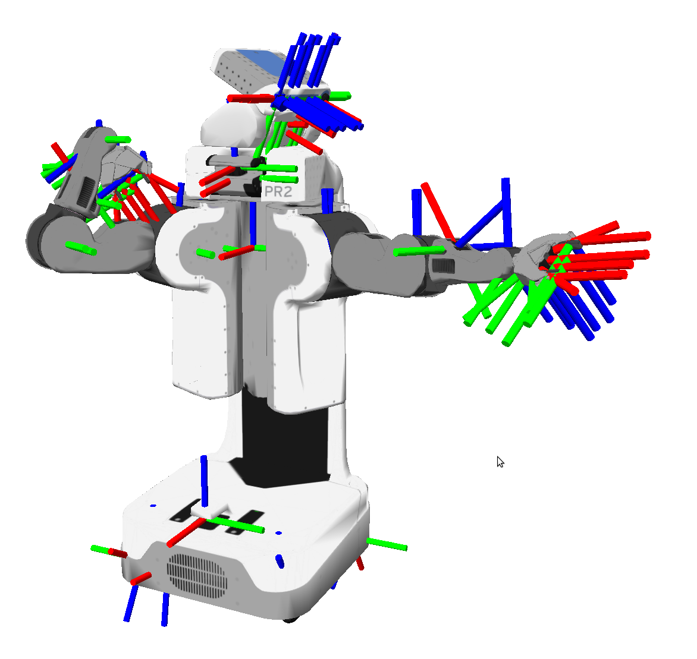
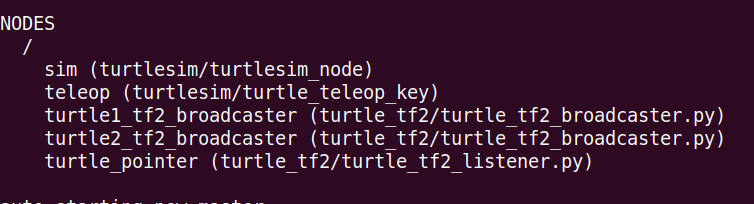
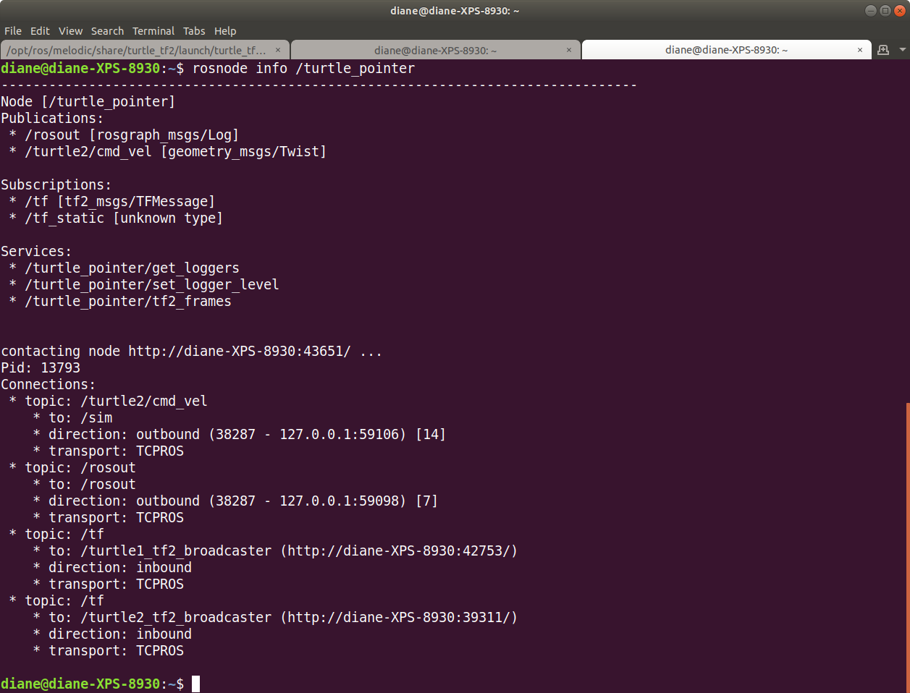

# Introduction to Transforms, tf2 package

https://wiki.ros.org/tf2 

tf2 is the second generation of the transform library, which lets the user keep track of multiple coordinate frames over time. tf2 maintains the relationship between coordinate frames in a tree structure buffered in time, and lets the user transform points, vectors, etc between any two coordinate frames at any desired point in time.

A robotic system typically has many 3D coordinate frames that change over time, such as a world frame, base frame, gripper frame, head frame, etc. tf2 keeps track of all these frames over time, and allows you to ask questions like:

- Where was the head frame relative to the world frame, 5 seconds ago?  
- What is the pose of the object in my gripper relative to my base?  
- What is the current pose of the base frame in the map frame?  

</br></br>



</br></br>

## Tutorials

https://wiki.ros.org/tf2/Tutorials 

</br></br>

### Tutorias/Introduction to tf2 

https://wiki.ros.org/tf2/Tutorials/Introduction%20to%20tf2 


#### 1. Installing the Demo

```bash
sudo apt-get install ros-$ROS_DISTRO-turtle-tf2 ros-$ROS_DISTRO-tf2-tools ros-$ROS_DISTRO-tf
```

</br>

#### 2. Running the Demo

```bash
roslaunch turtle_tf2 turtle_tf2_demo.launch
```

You will see the turtlesim start with two turtles. One turtle will move toward the other.

</br>


</br></br>

Once the turtlesim is started you can drive the center turtle around in the turtlesim using the keyboard arrow keys, select the roslaunch terminal window so that your keystrokes will be captured to drive the turtle.

</br>


</br>

As you can see that one turtle will continuously move to follow the turtle you are driving around.

</br></br>

#### 3. What is Happening?

This demo is using the tf2 library to create three coordinate frames: a world frame, a turtle1 frame, and a turtle2 frame. This tutorial uses a tf2 broadcaster to publish the turtle coordinate frames and a tf2 listener to compute the difference in the turtle frames and move one turtle to follow the other.

There are five nodes running. Both turtles are broadcasting their transforms via the turtle1_tf2_broadcaster and turtle2_tf2_broadcaster nodes.



</br></br>

The rosnode info command shows that the turtle1_tf2_broadcaster node is publishing tf2_msgs/TFMessage to the topic /tf. This node is subscribed to the /turtle1/pose topic.  

```bash
rosnode info turtle1_tf2_broadcaster 
```


</br></br>

Running the rosnode infor command for turtle2_tf2_broadcaster will show it is also publishing to the /tf topic.

```bash
rosnode info /turtle_pointer 
```

The turtle_pointer node is subscribed to the /tf topic.




</br></br>

The relationships are more easily viewed with rqt_graph.

```bash
rosrun rqt_graph rqt_graph
```

We see that both broadcaster nodes are publishing to the same topic, /tf, and that the turtle_pointer node is subscribing to /tf.


</br></br>

To see the contents of /tf, let's echo it twice.

```bash
rostopic echo -n 2 /tf
```

</br></br>


</br></br>


Both turtles are in the same position, as shown in the simulation screen below and the transform, translation, xy coordinates of the child frame ids of turtle1 and turtle2 in the echoed output above. Their angular rotations are different. Note that these transforms are given in the "world frame".

</br></br>


</br></br>

#### 4. tf2 Tools

Use view_frames to create a diagram of the frames being broadcast by tf2 over ROS.

```bash
rosrun tf2_tools view_frames.py
```

You will see

```bash
[INFO] [1637431663.847888]: Listening to tf data during 5 seconds...
[INFO] [1637431668.873415]: Generating graph in frames.pdf file...
```

Here a tf2 listener is listening to the frames that are being broadcast over ROS and drawing a tree of how the frames are connected. To view the tree:

```bash
evince frames.pdf
```

</br>


</br>

Here we can see the three frames that are broadcast by tf2 the world, turtle1, and turtle2 and that world is the parent of the turtle1 and turtle2 frames. view_frames also report some diagnostic information about when the oldest and most recent frame transforms were received and how fast the tf2 frame is published to tf2 for debugging purposes.

</br></br>

##### Using tf_echo

tf_echo reports the transform between any two frames broadcast over ROS.

Usage:

```bash
rosrun tf tf_echo [reference_frame] [target_frame]
```

Let's look at the transform of the turtle2 frame with respect to turtle1 frame which is equivalent to

```bash
rosrun tf tf_echo turtle1 turtle2
```

The terminal output is shown below. The output will continue to echo at 1 Hz, until Ctrl + C stops the process.


</br>


</br>

The screenshot below shows the turtle positions in the simulation. As the transform echo output shows, the translational difference was zero and the rotational difference is 90 degrees.

</br>


</br>

As you drive your turtle around you will see the transform change as the two turtles move relative to each other.

</br>

### rviz and tf2

Let's look at our turtle frames using rviz. Let's start rviz with the turtle_tf2 configuration file using the -d option followed by the name of the rviz configuration file:

```bash
rosrun rviz rviz -d `rospack find turtle_tf2`/rviz/turtle_rviz.rviz
```

</br>


</br>

Click the triangle to the left of tf to see the transforms. Use the arrow keys to move the turtle and watch the frames move in rviz.

</br>

Now that we have examined the turtle_tf2_demo, let's look at how to write the broadcaster (Python) for this demo.

</br>