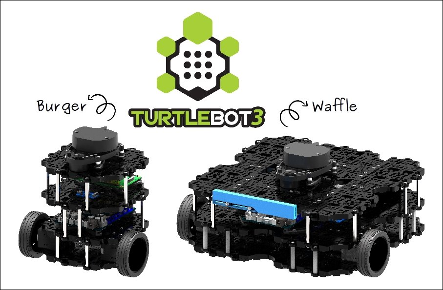
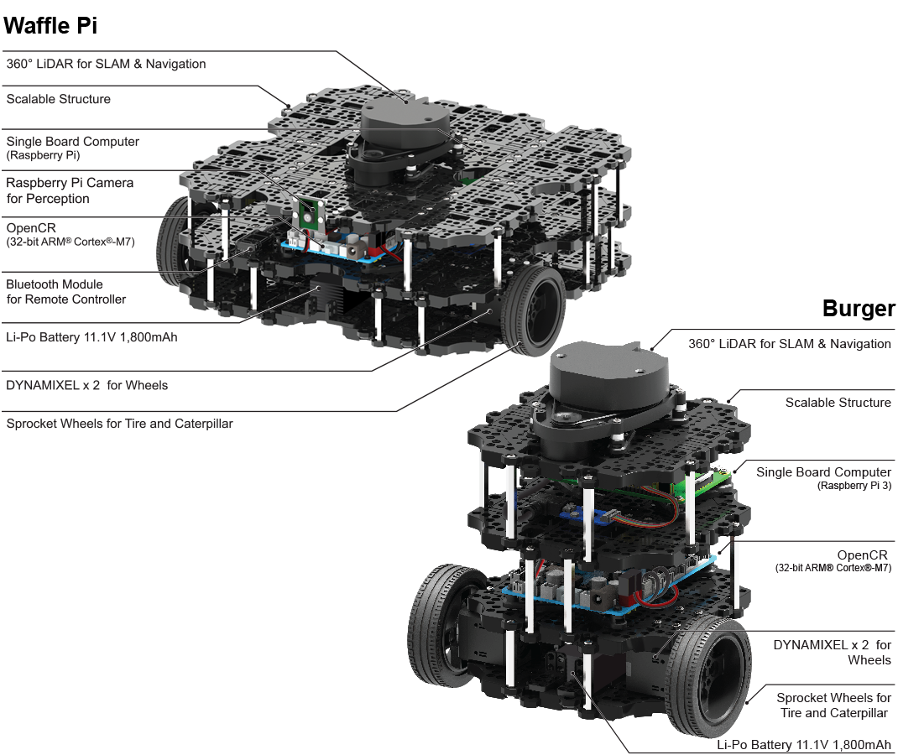
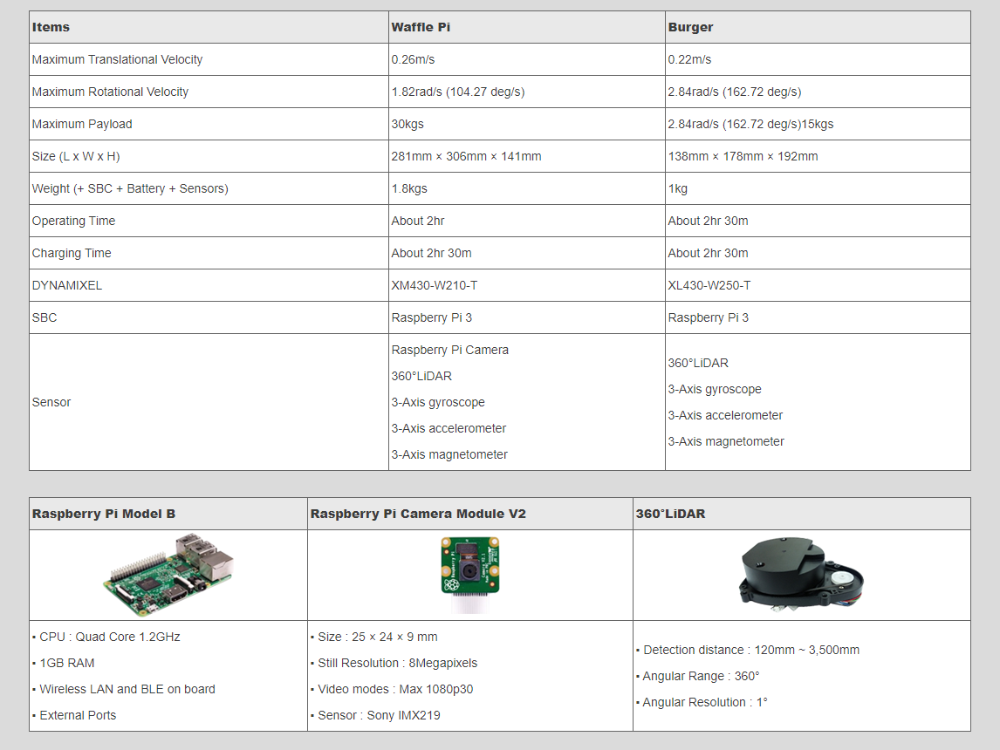

# TurtleBot 3

TurtleBot 3 is a mobile robot designed and manufactured by ROBOTIS that is particularly suitable for education and hobbyist use. 

The two TurtleBot3 models are shown in the two images below:

  

  

The specifications for each model are shown below. The main difference is in the size. The Burger model is has a smaller wheelbase and taller profile than the Waffle. Both versions have three-axis gyros, accelerometers, and magnetometers. They both have a 360 degree LIDAR and a Raspberry Pi 3 single board computer. The Waffle comes equipped with a Raspberry Pi camera, but there is no camera on the Burger. 

In both models, the Raspberry Pi computer interfaces with a controller board, powered by an ARM Cortex-M7, to which the motors and battery are connected. This board, developed by ROBOTIS and called the Open-Source Control module for ROS (OpenCR), is programmable with the Arduino software development environment. 

  

Robotis TurtleBot 3 website: https://www.robotis.us/turtlebot-3/

 

Complete the following tutorials in order.

1. [Installing simulation software](install_sim.md)
2. [Gazebo Simulation Worlds](gazebo_worlds.md)