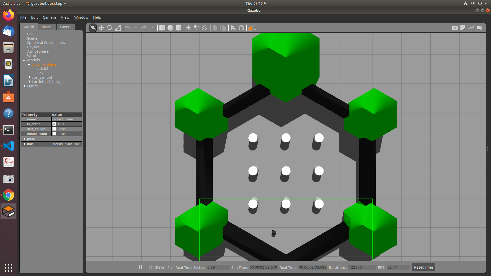
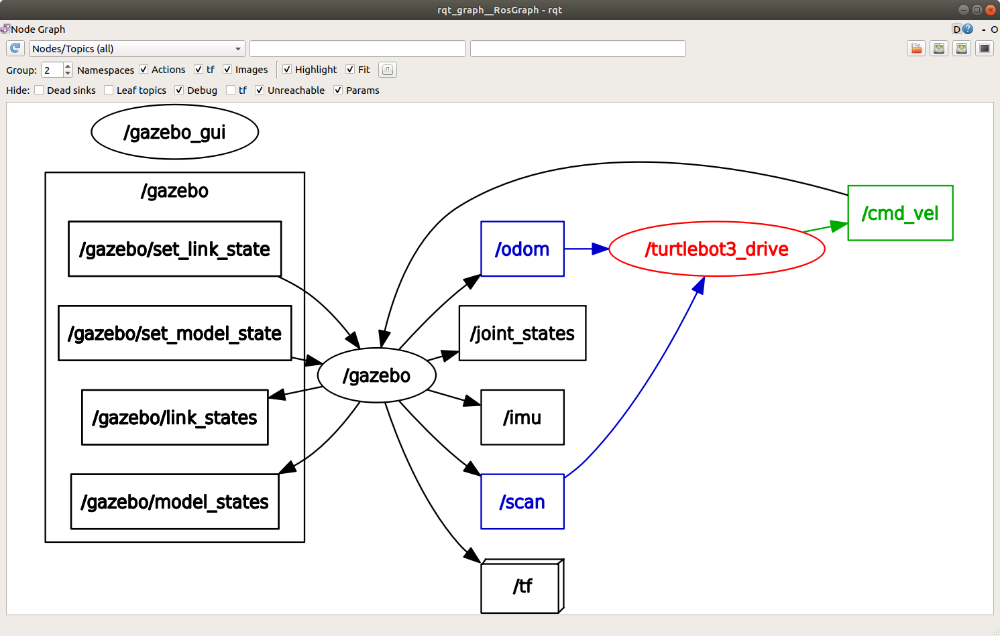
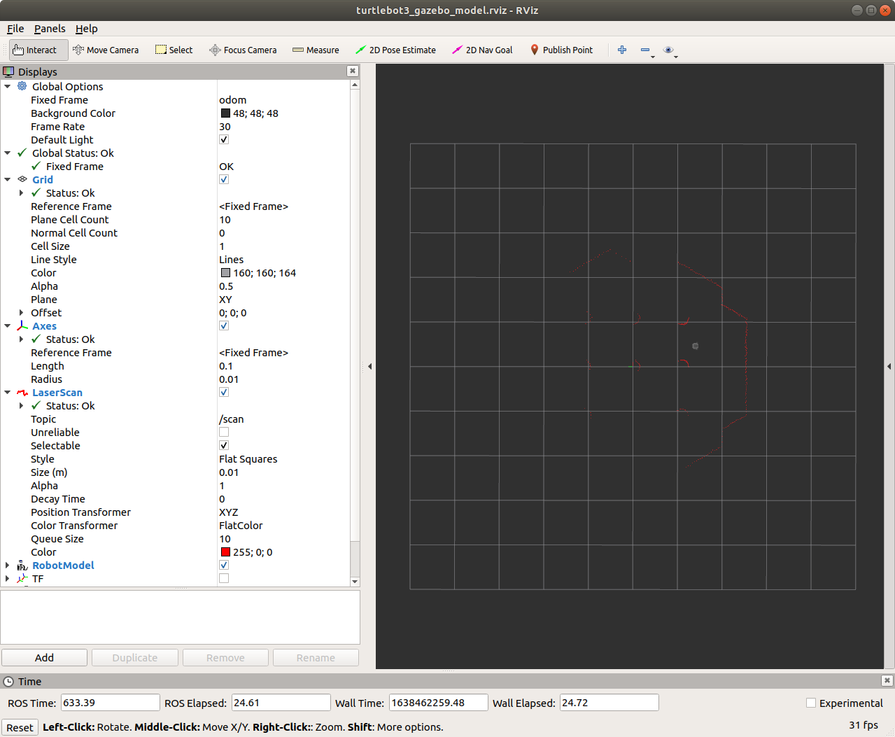
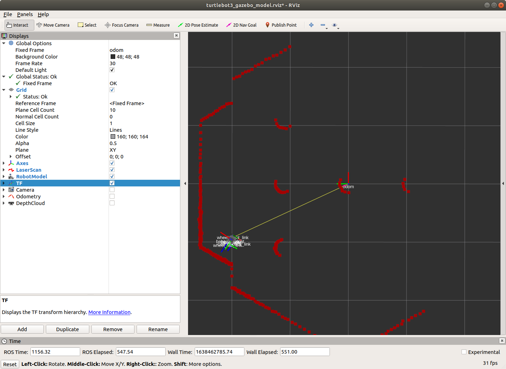

# Launching TurtleBot 3 Autonomous Navigation Simulation

The TurtleBot 3 can also run autonomously, navigating around the TurtleBot 3 world.

Open a new terminal window and type the following commands:

```bash
export TURTLEBOT3_MODEL=burger
roslaunch turtlebot3_gazebo turtlebot3_world.launch
```

> Note: if you already have the command `export TURTLEBOT3_MODEL=burger` in your bashrc file, then you do not need to type this command before starting the simulation.

</br>

Open a second terminal window and type the following commands:

```bash
export TURTLEBOT3_MODEL=burger
roslaunch turtlebot3_gazebo turtlebot3_simulation.launch
```

</br>

You should see the turtlebot moving around in the simulation world, as shown in the image below.



</br></br>


The rqt_graph shows the node turtlebot3_drive subscribes to the odom and scan topics and publishes the cmd_vel topic.



</br></br>

Next, open another terminal window and launch rviz configured to visualize certain TurtleBot 3 published topics by typing the following commands:

```bash
export TURTLEBOT3_MODEL=burger
roslaunch turtlebot3_gazebo turtlebot3_gazebo_rviz.launch
```

</br>

The screenshot below shows the TurtleBot near the right wall of the simulation world, with the red lines represents the laser scan data.

</br>



</br></br>

To see the robot's position, relative to the origin, click the TF box. This will show all the turtlebot transforms. The screenshot below is an example.

</br>



</br></br>

In the next tutorial, we will write a ROS node to read the laser scan data.
