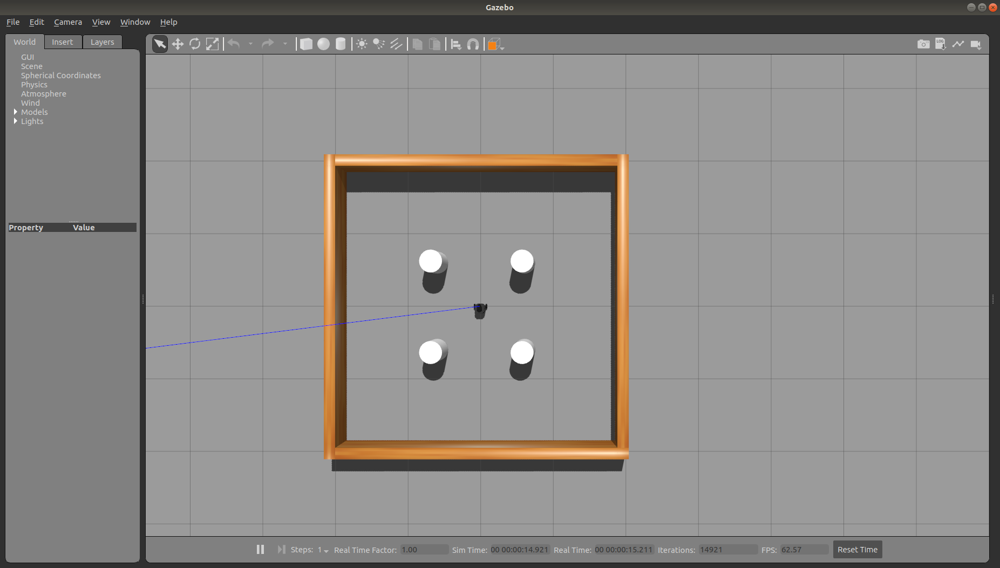
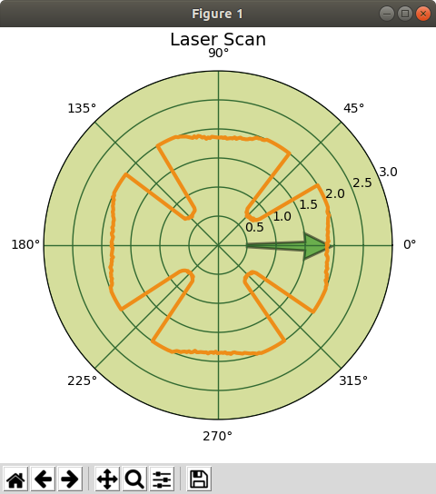
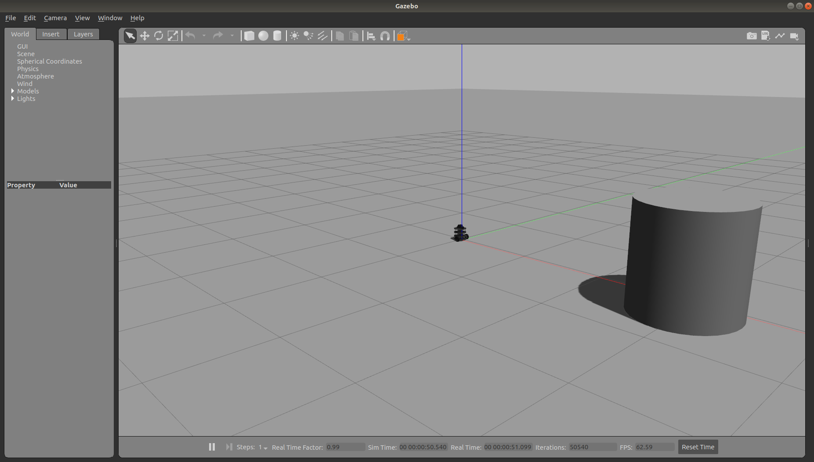
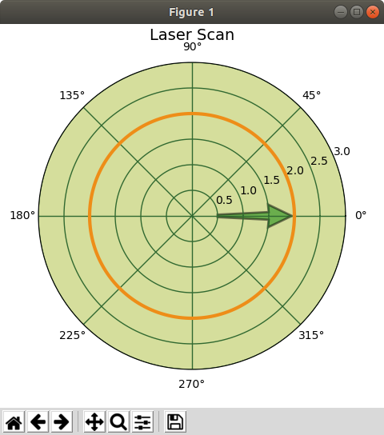
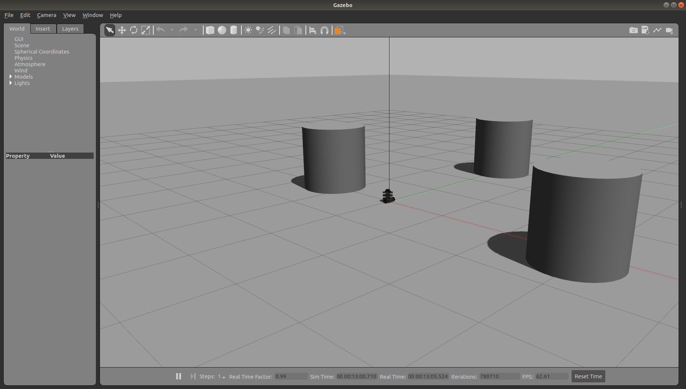
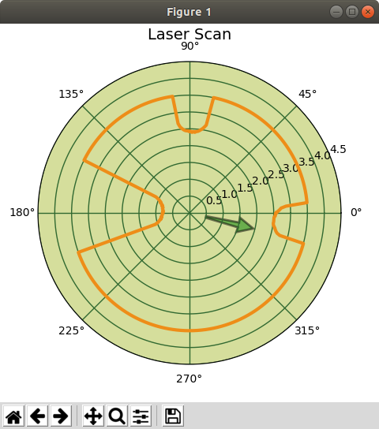

# Obstacle Avoidance Using Laser Scan Data

The following is a logically simple method for determining a heading away from obstacles.


## Step 1 - Launch a turtlebot3 gazebo world simulation

The stage_2 gazebo simulation world is used for this example.

```bash
roslaunch turtlebot3_gazebo turtlebot3_stage_2.launch
``` 



</br></br>


## Step 2 - Create a configuration file for the laser parameters

We will create a configuration file for the laser parameters. Configuration files are yaml files and typically stored in a directory named config. Open a terminal and follow the commands below to create a file named laser_params.yaml in the config directory of the laser_tutorial package.


```bash
cd ~/catkin_ws/src/laser_tutorial/
mkdir config
cd config/
gedit laser_params.yaml
```

</br>

Add the following code to the file.

```yml
# turtlebot 3 burger laser parameters

scan_topic: '/scan'

# laser attributes, angle units are radians
angle_min: 0.0
angle_max: 6.28318977356
angle_increment: 0.0175019223243

# number of measurements
num_measurements: 360

# laser range units are meters
range_min: 0.119999997318
range_max: 3.5

# obstacle avoidance
distance_threshold: 3.5
```

</br>


## Step 3 - Create Avoid Obstacle ROS node

In the scripts directory of the laser_tutorial package, create a file name avoid_obstacle.py and add the source code shown below.

```python
#! /usr/bin/env python
import rospy
import numpy as np
import math
import matplotlib
import matplotlib.pyplot as plt
import matplotlib.transforms as mtransforms

from sensor_msgs.msg import LaserScan 
from geometry_msgs.msg import Twist

class AvoidObstacle:

   # parameters
   SCAN_TOPIC = rospy.get_param("/avoid_obstacle/scan_topic")
   NUM_MEASUREMENTS = rospy.get_param("/avoid_obstacle/num_measurements")
   ANGLE_MIN = rospy.get_param("/avoid_obstacle/angle_min")                   # rad
   ANGLE_MAX = rospy.get_param("/avoid_obstacle/angle_max")                   # rad
   ANGLE_INCREMENT = rospy.get_param("/avoid_obstacle/angle_increment")       # rad
   RANGE_MIN = rospy.get_param("/avoid_obstacle/range_min")                   # meter, m
   RANGE_MAX = rospy.get_param("/avoid_obstacle/range_max")                   # meter, m
   DISTANCE_THRESHOLD = rospy.get_param("/avoid_obstacle/distance_threshold") # meter, m

   def __init__(self):

      # initialize subscriber to topic: /scan, message type: LaserScan, register callback function
      self.laser_subscriber = rospy.Subscriber('/scan', LaserScan, self.laser_callback, queue_size=1)

      # pre-compute sin,cos values as they will be the same for each scan
      self.cosVal = np.cos(np.arange(self.ANGLE_MIN, self.ANGLE_MAX + self.ANGLE_INCREMENT, self.ANGLE_INCREMENT))
      self.sinVal = np.sin(np.arange(self.ANGLE_MIN, self.ANGLE_MAX + self.ANGLE_INCREMENT, self.ANGLE_INCREMENT))


   def laser_callback(self, msg):
      
      # apply threshold filter
      rospy.loginfo_throttle(1, "distance threshold: %f", self.DISTANCE_THRESHOLD)
      
      # initialize a zero-filled array to store filtered range values
      filteredRanges = np.zeros(len(msg.ranges))

      # apply max distance threshold to range values
      for i in range(len(msg.ranges)):
         if msg.ranges[i] <= self.DISTANCE_THRESHOLD:
            filteredRanges[i] = msg.ranges[i]
         else:
            filteredRanges[i] = self.DISTANCE_THRESHOLD

      # laser frame coordinates
      # convert polar to cartesian coordinates: radius, angle to x,y
      xval = (np.asarray(filteredRanges).T * self.cosVal).T
      yval = (np.asarray(filteredRanges).T * self.sinVal).T

      # use the symmetry of the +- x,y coordinates
      # sum the x and y coordinates
      # if there are no obstacles within the DISTANCE_THRESHOLD
      # x will sum to zero, y will sum to zero
      # robot will continue straight ahead
      xsum = np.sum(xval)
      ysum = np.sum(yval)

      # calculate avoid obstacle heading angle
      aoTheta = math.atan2(ysum,xsum)

      # determine x,y of obstacle avoidance heading unit vector
      xheading = math.cos(aoTheta)
      yheading = math.sin(aoTheta)

      # magnitude of vector should be one
      #headingMagnitude = math.sqrt(xheading*xheading + yheading*yheading)
      #rospy.loginfo_throttle(1, "heading vector magnitude: %.2f", headingMagnitude)

      rospy.loginfo_throttle(1, "xheading: %.2f, yheading: %.2f, angle: %.2f degrees", 
               xheading, yheading, aoTheta*180.0/math.pi)


      # create an array of angles for plotting
      scanAngles = np.arange(msg.angle_min, msg.angle_max+msg.angle_increment, msg.angle_increment)

      self.plot_polar(scanAngles, filteredRanges, aoTheta)

      
      

   def plot_polar(self, scanAngles, radialData, aoTheta):
      # polar plot with arrows, using solution from
      # https://stackoverflow.com/questions/23982107/arrows-in-polar-matplotlib-plot

      # radar green, solid grid lines
      plt.rc('grid', color='#316931', linewidth=1, linestyle='-')
      plt.rc('xtick', labelsize=10)
      plt.rc('ytick', labelsize=10)

      # force square figure and square axes looks better for polar
      width, height = matplotlib.rcParams['figure.figsize']
      size = min(width, height)
      # make a square figure
      fig = plt.figure(figsize=(size, size))

      # The dimensions [left, bottom, width, height] of the new axes. 
      # All quantities are in fractions of figure width and height.
      ax = fig.add_axes([0.1, 0.1, 0.8, 0.8], polar=True, axisbg='#d5de9c')

      
      ax.plot(scanAngles, radialData, color='#ee8d18', lw=3)
      ax.set_rmax(self.DISTANCE_THRESHOLD+1)
      plt.grid(True)

      ax.set_title('Laser Scan', fontsize=14)
      
      # arrow is broken in polar plots, use transform
      # https://github.com/matplotlib/matplotlib/issues/5344 
      ax.arrow(0, 0.5, 0, 1, alpha = 0.5, linewidth=2, width=0.1, facecolor = 'green',
         edgecolor = 'black',
         # Remember that you're working in (theta,r) space before the data transform.
         transform=mtransforms.Affine2D().translate(aoTheta, 0) + ax.transData)

      plt.show()


def myshutdown():
   rospy.loginfo_once('myshutdown triggered')


def main():
    
   rospy.init_node('avoid_obstacle')

   ao = AvoidObstacle()

   # register function to call upon ros shutdown
   rospy.on_shutdown(myshutdown)

   while not rospy.is_shutdown():
      try:
         rospy.spin()
      except rospy.ROSInterruptException:
         print('avoid_obstacle shutting down')
   

if __name__ == "__main__":
   main()
```

</br>

Make the script executable.

```bash
chmod +x avoid_obstacle.py
```

</br></br>

## Step 4 - Create a launch file

Add the following launch file, avoid_obstacle.launch to the laser_tutorial launch directory.

```xml
<launch>
  
  <!-- Launch obstacle avoidance, gap detector with parameters -->
  <node pkg="laser_tutorial" name="avoid_obstacle" type="avoid_obstacle.py" output="screen">
   <rosparam command="load" file="$(find laser_tutorial)/config/laser_params.yaml"/>
  </node>

</launch>
```

</br></br>


## Step 5 - Launch the Obstacle Avoidance node

Run the script.

```bash
roslaunch laser_tutorial avoid_obstacle.launch 
```

</br>
Example console output and polar plot are shown below.

```bash
[INFO] [1638905950.310838, 391.162000]: distance threshold: 2.000000
[INFO] [1638905950.320298, 391.171000]: xheading: 1.00, yheading: -0.00, angle: -0.10 degrees
```

</br></br>



</br></br>

Type ctrl + c to stop the node.
</br></br>

## Step 3 - Test in node in empty world

Shutdown the stage 2 world and then launch the empty world. Place obstacles in various locations to observe the obstacle avoidance headings calculated.

```bash
roslaunch turtlebot3_gazebo turtlebot3_empty_world.launch
```

</br>

The screenshot below shows an obstacle placed approximately 2.5 meters in front of the turtlebot. The distance threshold in the config file was changed to 3.5 meters.



</br></br>

Run the avoid obstacle node. The output is shown below. Notice that it computes a rotation of almost 180 degrees to travel in the opposite direct from the detected obstacle.

```bash
[INFO] [1638906541.787151, 380.123000]: distance threshold: 3.500000
[INFO] [1638906541.797595, 380.134000]: xheading: -0.99, yheading: 0.10, angle: 174.12 degrees
```
</br>


</br></br>

Now, change the distance threshold to 2.0. The obstacle is beyond the filtered range, so the robot does not change course. It calculates a heading of straight ahead.

```bash
[INFO] [1638906741.360553, 578.523000]: distance threshold: 2.000000
[INFO] [1638906741.365284, 578.527000]: heading vector magnitude: 1.00
[INFO] [1638906741.369651, 578.531000]: xheading: 1.00, yheading: 0.00, angle: 0.00 degrees
```

</br>



</br></br>

Set the distance threshold back to 3.5 and adding two more obstacles, as shown below.



</br></br>

The avoid obstacle heading is -13.79 degrees, as shown below.

```bash
[INFO] [1638907131.855165, 966.726000]: distance threshold: 3.500000
[INFO] [1638907131.859939, 966.731000]: xheading: 0.97, yheading: -0.24, angle: -13.79 degrees
```

</br>



</br></br>