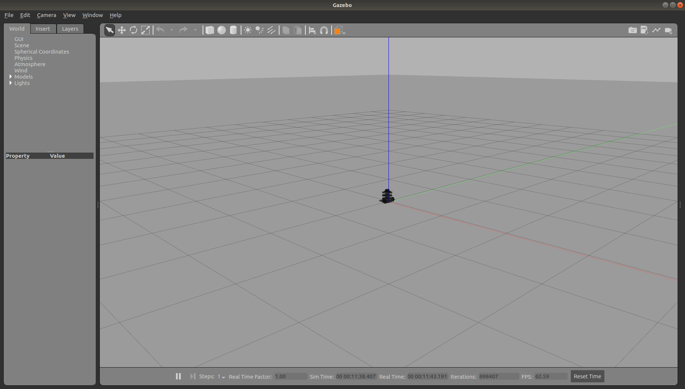
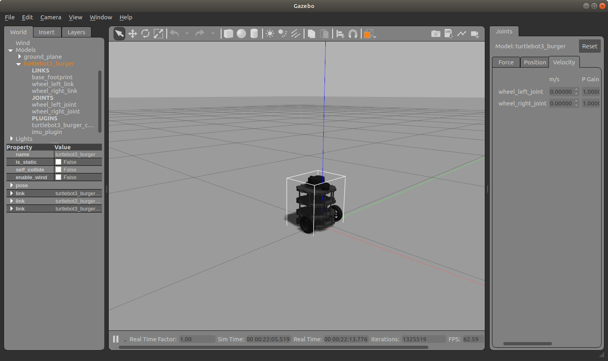
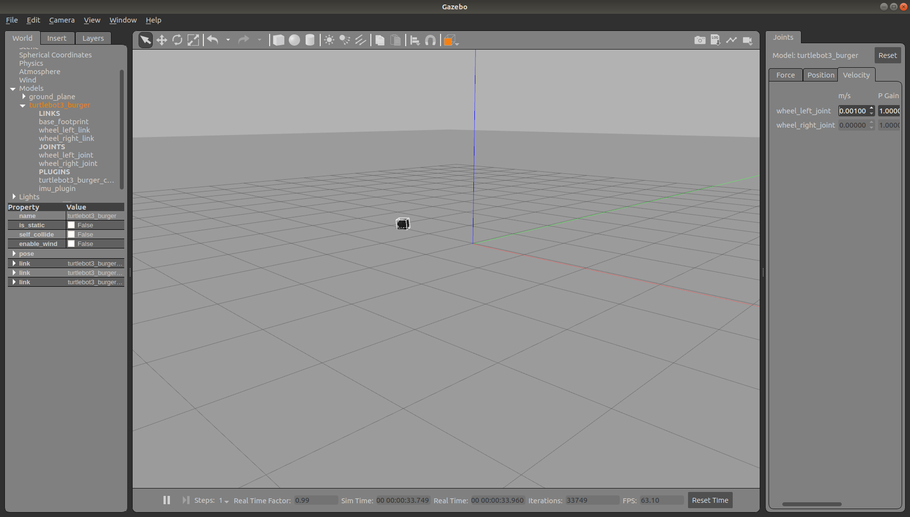
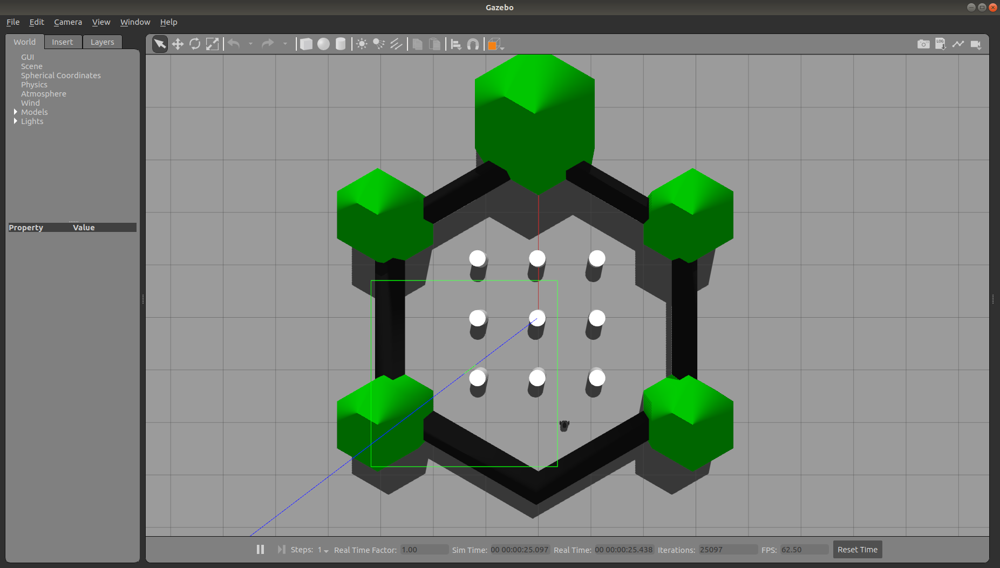
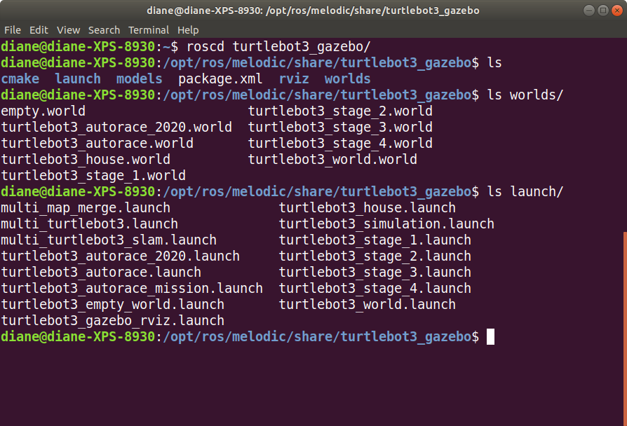

# Launch Gazebo Simulation Worlds

"Three simulation environments are prepared for TurtleBot3. Please select one of these environments to launch Gazebo."(https://emanual.robotis.com/docs/en/platform/turtlebot3/simulation/)

The simulation worlds are found in the turtlebot3_gazebo package.


## Empty World

Open a terminal and type the following command to start Gazebo and load the turtlebot3 model into the empty world.

```bash
roslaunch turtlebot3_gazebo turtlebot3_empty_world.launch 
```

The Gazebo graphical user interface (gui) will start with the turtlebot3 robot model in the center of the empty world, as shown in the screenshot below.  



</br></br>

If you are new to Gazebo, refer to the [Beginner Gui tutorial](http://gazebosim.org/tutorials?tut=guided_b2&cat=) to become familiar with the mouse controls and elements of the user interface.

</br>

The screenshot below is the result of zooming in with the mouse controls, expanding the Models listing by clicking on the triangles, and grabbing the three dots on the right and dragging left to show the Joints panel. The Joints panel can be difficult to open at times. At least that has been my experience. If you cannot open it, move onto the next section, and try again some other time you feel like being frustrated.



</br></br>

Experiment with the Velocity tab of the Joints panel. Velocities other than 0 will cause the turtlebot3 to start moving in the empty world.

If your robot has driven off, out of sight, you can bring it back to the origin with the Edit menu, Reset World option. (Ctrl + R)

Don't worry about the poor control of the robot's velocity. My simple experiments have the robot flipping on its side and sometimes summersaulting out of control. There are easier ways to control the robot.

In the screenshot below, the robot had flipped on its side, spinning about the axis of one wheel.



</br></br>

Close down the simulation by closing the simulation window and typing Ctrl + C in the terminal. It may take a bit of time for the simulation to shut down.
</br></br>

## TurtleBot3 World

Let's open another simulation world.

```bash
roslaunch turtlebot3_gazebo turtlebot3_world.launch 
```

This world will provide some interesting navigational challenges.



</br>

Shutdown the simulation.

</br></br>

## Exploring Other Simulation Worlds

Navigate to the turtlebot3_gazebo package and explore the launch and worlds directories.

```bash
roscd turtlebot3_gazebo/
ls 
ls worlds/
ls launch/
```

Try some of the provided launch files to see the simulation worlds they open. 
</br></br>



</br></br>

The next tutorial, [Keyboard Teleop](.keyboardTeleop.md).