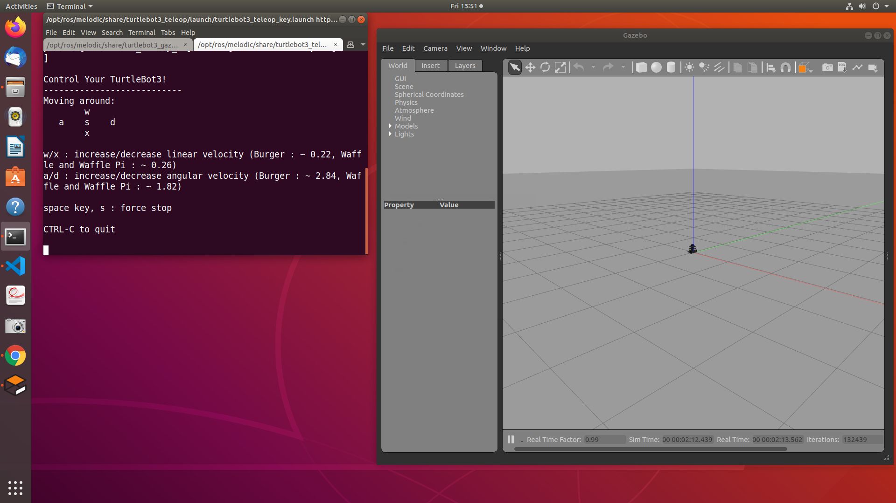
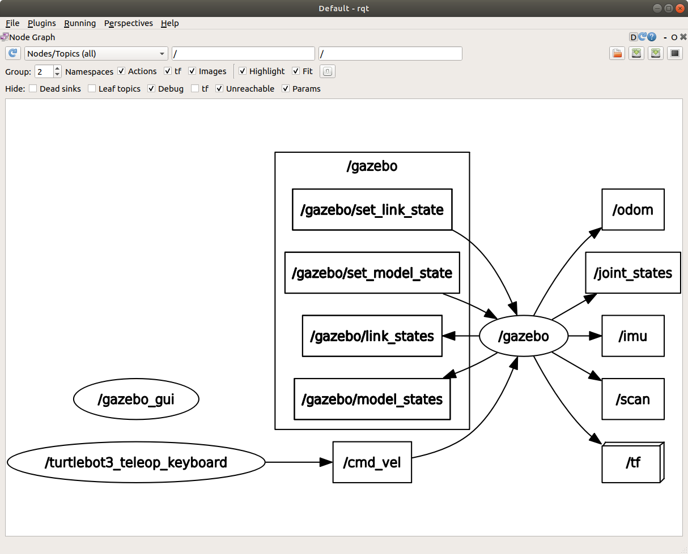
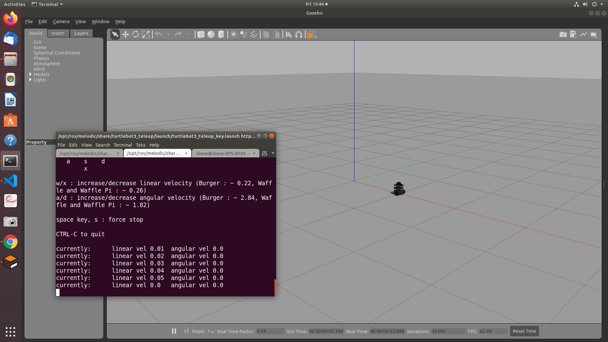
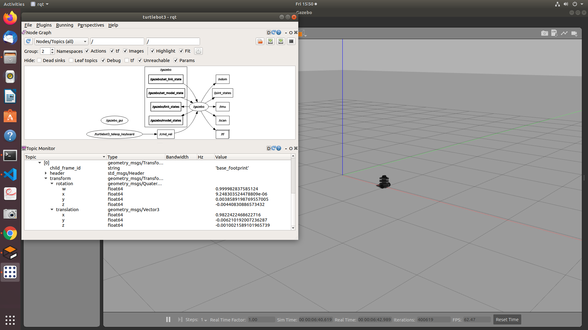

# TurtleBot3 Keyboard Teleoperation 

Let's restart the empty world simulation and then start the teleoperation node in another terminal window.

```bash
roslaunch turtlebot3_gazebo turtlebot3_empty_world.launch 
roslaunch turtlebot3_teleop turtlebot3_teleop_key.launch
```

The Gazebo gui will start with the turtlebot3 centered at the world origin. The terminal the w/x control linear velocity increase/decrease and the a/d keys control angular velocity increase/decrease. The s key forces a stop.</br></br>



</br></br>

In a third terminal, start rqt.

```bash
rqt
```

The node graph for Nodes/Topics(all), found under Plugins -> Introspection -> Node Graph shows the running nodes and flow of topics. The screenshot below indicates there are three nodes running: /gazebo, /gazebo_gui, and /turtlebot3_teleop_keyboard. Nodes are shown in the oval shapes. Topics are shown in rectangles, with the outgoing arrows indicating those are being published, and the incoming arrows indicating subscribers.  



</br></br>

Use the arrow keys to move the turtlebot3 around the empty world. The terminal output will show the velocity. The screenshot below shows the results of using the x key to increase the linear velocity, allowing the robot to move in a straight line velocity until stopped.



</br></br>

Add the Topic Monitor plugin and checking the /tf topic box, to see the robot's pose in world coordinates. The robot has moved approximately 1 meter in the x direction from the origin. </br></br>



</br></br>

