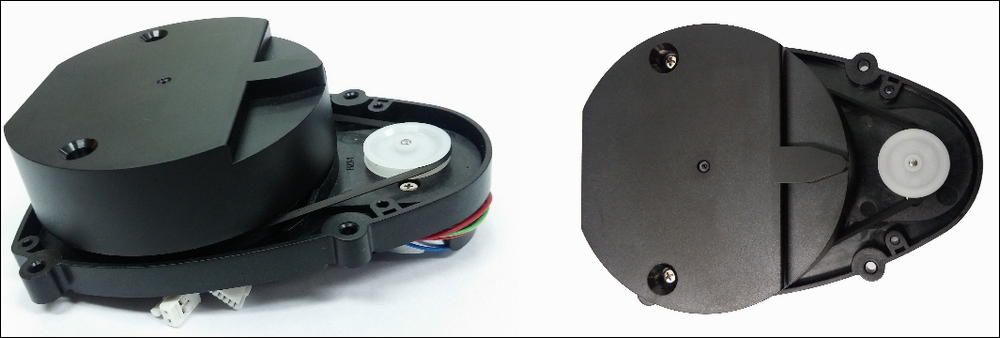

# Laser Distance Sensor

The TurtleBot 3 Burger has a Hitachi-LG laser distance sensor. The sensor rotates in a continuous 360 degrees to collect 2D distance data.

Basic specifications for the Hitcahi-LG device can be found at http://wiki.ros.org/hls_lfcd_lds_driver?action=AttachFile&do=view&target=LDS_Basic_Specification.pdf.

 

  

| Spec | LDS |
| --- | --- |
| Distance range (meters) | 0.120 – 3.5 |
|    |    |
| Distance accuracy (meters) |    |
| 0.120 – 0.499 | ± 0.015 |
| 0.500 – 3.500 | ± 5.0% |
|    |    |
| Distance precision (meters) |    |
| 0.120 – 0.499 | ± 0.010 |
| 0.500 – 3.500 | ± 3.5%
|    |    |
| Rotation |    |
| Scan rate (rpm) | 300 ± 10 |
| Angular range (degrees) | 360 |
| Angular resolution (degrees) | 1 |

  
