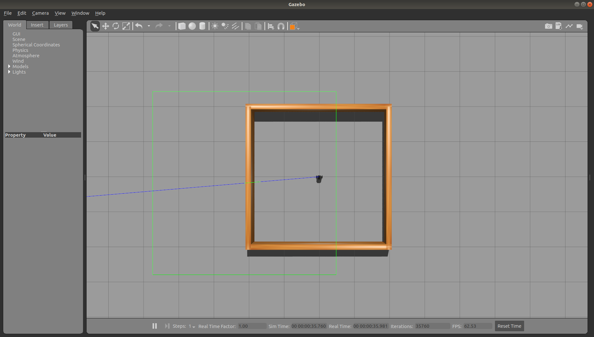
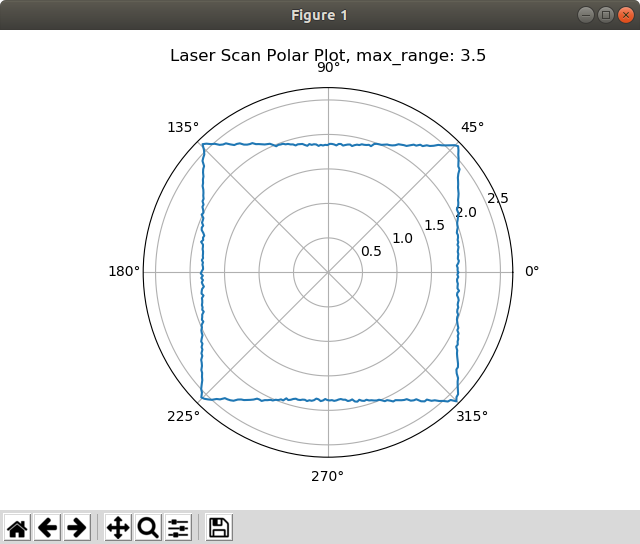
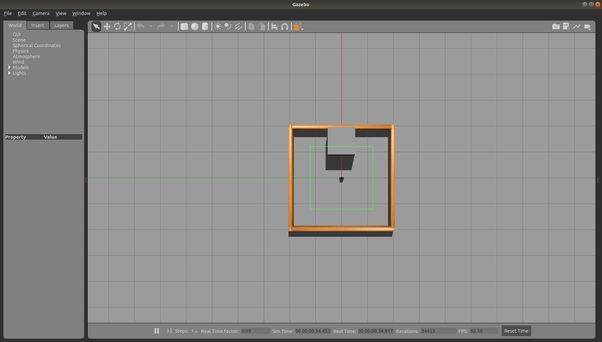
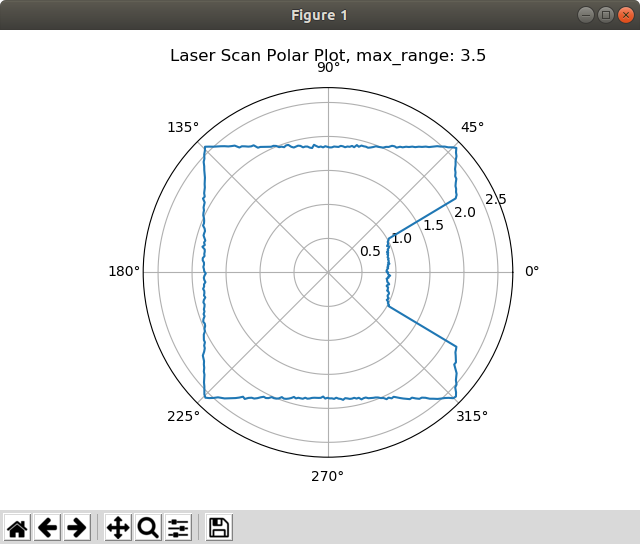

# Polar Plot - Laser Scan Data

Objective: Write a ROS node that subscribes to the /scan topic and plots the laser distance data.


## Step 1 - Launch a turtlebot3 gazebo world simulation

The stage_1 gazebo simulation world is used for this example.

```bash
roslaunch turtlebot3_stage_1.launch
``` 

</br>



</br></br>

Confirm the laser scan topic is published.

```bash
rostopic list
```

</br>

Output:

```bash
/clock
/cmd_vel
/gazebo/link_states
/gazebo/model_states
/gazebo/parameter_descriptions
/gazebo/parameter_updates
/gazebo/set_link_state
/gazebo/set_model_state
/imu
/joint_states
/odom
/rosout
/rosout_agg
/scan
/tf
```

</br>

Find the message type.

```bash
rostopic info /scan
```

</br>

Output:

```bash
Type: sensor_msgs/LaserScan

Publishers: 
 * /gazebo (http://localhost:33487/)

Subscribers: None
```

</br>

Next, let's look at the details of the LaserScan message.

```bash
rosmsg show sensor_msgs/LaserScan 
```

shows us the message structure:

```bash
std_msgs/Header header
  uint32 seq
  time stamp
  string frame_id
float32 angle_min
float32 angle_max
float32 angle_increment
float32 time_increment
float32 scan_time
float32 range_min
float32 range_max
float32[] ranges
float32[] intensities
```

</br>

We need this information to write a python subscriber program to read the laser data.

</br></br>

## Step 2 - Create laser_tutorial package

Create a new package, named laser_tutorial, in a catkin workspace, with the following commands.

```bash
cd ~/catkin_ws/src/
catkin_create_pkg laser_tutorial rospy sensor_msgs
cd ~/catkin_ws
catkin_make
source /devel/setup.bash
```

</br>

Next, create a scripts directory in the laser_tutorial package.

```
cd ~/catkin_ws/src/laser_tutorial 
mkdir scripts
cd scripts
```

Use your text editor to create a file named laser_polar_plot.py in the scripts directory. 

</br></br>

## Step 3 - python source code

The complete source code listing is shown below. The laser callback function will create a polar plot of the distance data.

</br>

```python
#! /usr/bin/env python

import rospy
from sensor_msgs.msg import LaserScan
import numpy as np 
import matplotlib.pyplot as plt 

def clbk_laser(msg):
   rospy.loginfo_once("frame id: %s", msg.header.frame_id)
   rospy.loginfo_once("angle_min: %f", msg.angle_min)
   rospy.loginfo_once("angle_max: %f", msg.angle_max)
   rospy.loginfo_once("angle_increment: %f", msg.angle_increment)
   rospy.loginfo_once("range_min: %f", msg.range_min)
   rospy.loginfo_once("range_max: %f", msg.range_max)
   rospy.loginfo_once("len(msg.ranges): %d", len(msg.ranges))

   # create an array of angles for plotting
   theta = np.arange(msg.angle_min, msg.angle_max+msg.angle_increment, msg.angle_increment)

   plt.polar(theta, msg.ranges)
   plt.title('Laser Scan Polar Plot, max_range: ' + str(msg.range_max))
   plt.show(block=False)
   

def main():
   rospy.init_node('reading_laser')
   sub = rospy.Subscriber('/scan', LaserScan, clbk_laser)
   rospy.spin()


if __name__ == '__main__':
   main()

```

</br>

Make the script executable.

```bash
chmod +x laser_polar_plot.py
```

</br>
Run the script.

```bash
rosrun laser_tutorial laser_polar_plot.py
```

</br>
Example console output and polar plot are shown below.

```bash
[INFO] [1638894213.281348, 571.567000]: frame id: base_scan
[INFO] [1638894213.285926, 571.571000]: angle_min: 0.000000
[INFO] [1638894213.290699, 571.577000]: angle_max: 6.283190
[INFO] [1638894213.294842, 571.581000]: angle_increment: 0.017502
[INFO] [1638894213.299074, 571.585000]: range_min: 0.120000
[INFO] [1638894213.303294, 571.589000]: range_max: 3.500000
[INFO] [1638894213.307668, 571.594000]: len(msg.ranges): 360
```

</br></br>



</br></br>

Type ctrl + c to stop the laser_polar_plot node.
</br></br>

## Step 4 - Add Obstacle to World

Add a box obstacle to the world, placing it in front of the turtlebot3.

</br>



</br></br>

Run the polar plot program again. The plot screenshot below shows that angle 0 degrees corresponds to the robot's x-axis.

```bash
rosrun laser_tutorial laser_polar_plot.py
```
</br>



</br></br>

Experiment by add other obstacles to the world to see that 90 degrees is to the robot's left, 180 degrees is behind the robot, and 270 degrees is to the robot's right.