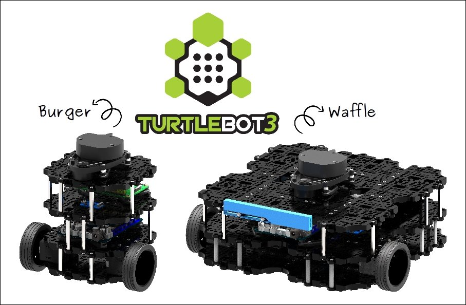

# TurtleBot 3

TurtleBot 3 is a mobile robot designed and manufactured by ROBOTIS that is particularly suitable for education and hobbyist use. 

The two TurtleBot3 models are shown in the two images below:



</br></br>


</br></br>

The specifications for each model are shown below. The main difference is in the size. The Burger model is has a smaller wheelbase and taller profile than the Waffle. Both versions have three-axis gyros, accelerometers, and magnetometers. They both have a 360 degree LIDAR and a Raspberry Pi 3 single board computer. The Waffle comes equipped with a Raspberry Pi camera, but there is no camera on the Burger. 

In both models, the Raspberry Pi computer interfaces with a controller board, powered by an ARM Cortex-M7, to which the motors and battery are connected. This board, developed by ROBOTIS and called the Open-Source Control module for ROS (OpenCR), is programmable with the Arduino software development environment. 


Robotis TurtleBot 3 website: https://www.robotis.us/turtlebot-3/
</br></br>

## Installing TurtleBot3 Simulation Software

TurtleBot3 QuickStart Guide: https://emanual.robotis.com/docs/en/platform/turtlebot3/quick-start/ 

Here, we assume that your computer is running Ubuntu 18.04 and that ROS-melodic has already been installed. If not, the link to the quick start guide contains instructions and an installation script for this process.

### Install Dependent ROS packages

```bash
sudo apt-get install ros-melodic-joy ros-melodic-teleop-twist-joy \
ros-melodic-teleop-twist-keyboard ros-melodic-laser-proc \
ros-melodic-rgbd-launch ros-melodic-depthimage-to-laserscan \
ros-melodic-rosserial-arduino ros-melodic-rosserial-python \
ros-melodic-rosserial-server ros-melodic-rosserial-client \
ros-melodic-rosserial-msgs ros-melodic-amcl ros-melodic-map-server \
ros-melodic-move-base ros-melodic-urdf ros-melodic-xacro \
ros-melodic-compressed-image-transport ros-melodic-rqt* \
ros-melodic-gmapping ros-melodic-navigation ros-melodic-interactive-markers
```

</br></br>

### Install Turtlebot3 Packages

```bash
sudo apt-get install ros-melodic-dynamixel-sdk
sudo apt-get install ros-melodic-turtlebot3-*
```

</br></br>

### Set Turtlebot3 Model Name

Set the default TURTLEBOT3_MODEL name to your model.

```bash
echo "export TURTLEBOT3_MODEL=burger" >> ~/.bashrc
```

## Launching TurtleBot 3 simulation in rviz

```bash
roslaunch turtlebot3_fake turtlebot3_fake.launch 
```

The terminal output shows three nodes are started: robot_state_publisher, rviz, and turtlebot3_fake_node.


</br></br>

The following screenshot should appear.


</br></br>


```bash
rosnode info /robot_state_publisher 
```


