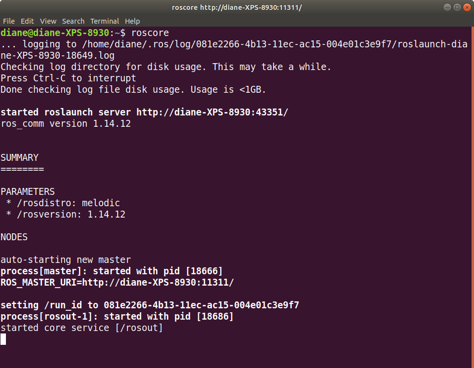
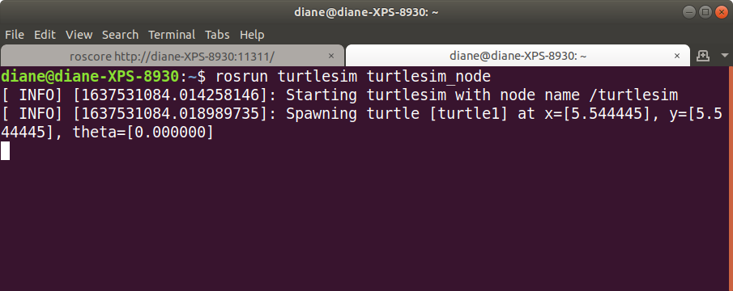
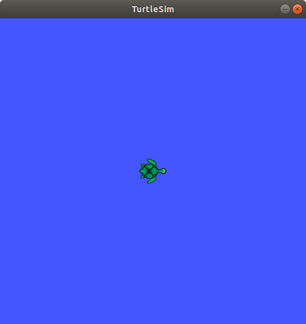
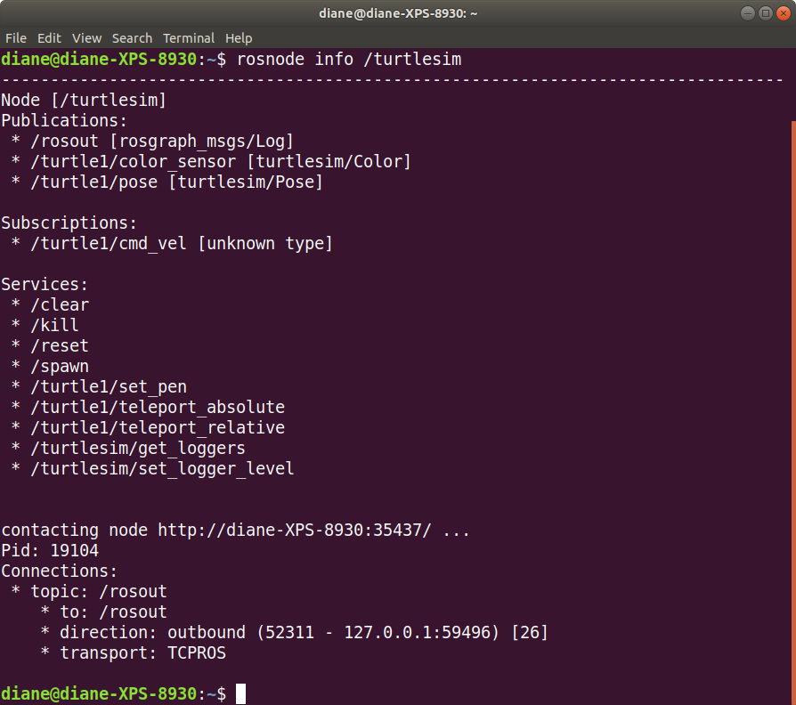

# Getting Started with Turtlesim

To start turtlesim, we need to open separate two separate terminal windows.

First, type the following command in one window and wait for Master to complete startup.

```bash
roscore
```

The output will resemble the screenshot below.



</br>

Keep this terminal open, with roscore running.</br></br>

## rosrun command

Use the rosrun command to start the turtlesim node program. The general form of rosrun is

```bash
rosrun [package name] [executable name]
```

For this example, the package name is turtlesim and the executable name is turtlesim_node. Enter the following command in the second terminal window.

```bash
rosrun turtlesim turtlesim_node
```

You will see terminal output similar to the screenshot below.</br>



</br>

After you have started turtlesim by executing the rosrun command, you will see information about the turtle's position on the screen. The /turtlesim node creates the screen image and the turtle. Here, the turtle is in the center at about x = 5.5, y = 5.5 with no rotation since angle theta is zero. The origin (0, 0) is at the lower-left corner of the screen.



</br></br>


## Turtlesim nodes, rosnode command

Open a third terminal, so we can use some ros commands to learn about the properties of the nodes, topics, services, and messages available.

```bash
rosnode list
```

The output below shows there are two active nodes: /rosout and /turtlesim.


</br></br>

To see the publications, subscriptions, and services of the turtlesim node, type the following command:


```bash
rosnode info /turtlesim
```



</br></br>

The /turtlesim node publishes two topics:

- /turtle1/color_sensor with message type turtlesim/Color
- /turtle1/pose with message type turtlesim/Pose

The /turtlesim node subscribes to one topic:

- /turtle1/cmd_vel - This is followed by [unknown type] because there is no node publishing to that topic. 

The turtlesim node provides several services, which will be discussed later.

</br></br>

## Turtlesim topics and messages

A ROS message is a strictly typed data structure. The command ```rosmsg list ``` lists all the types of ROS messages on your system. Type the command to see what a long list it generates. We will start by examining some of message types used by turtlesim.

Type the command:

```bash
rostopic list
```

</br>

The output:

```bash
/rosout
/rosout_agg
/turtle1/cmd_vel
/turtle1/color_sensor
/turtle1/pose
```

</br>

### rostopic type

The topic type for each topic can be displayed by typing the following general form:

```bash
rostopic type topic_name
```

To see the message type of the topic /turtle1/color_sensor, enter the following command:

```bash
rostopic type /turtle1/color_sensor
```

The output is ```turtlesim/Color```, which is the message type of the topic.

The format of ROS message type names: [package name]/[message type]. 

</br>

### rosmsg list

There are two message types used by the turtlesim package. We learn this by typing:

```bash
rosmsg list | grep turtlesim
```

The output:

```bash
turtlesim/Color
turtlesim/Pose
```

The command rosmsg list generates an output of all the ros messages installed in your system. That output is piped (|) to the command grep turtlesim which filters out everything except items with the expression turtlesim.

</br>

### rosmsg show

The rosmsg show <message type> command displays the fields in a ROS message type.

```bash
rosmsg show turtlesim/Color
```

The output shows there are three fields, each data type unsigned 8 bit integer, named r, g, b. These values control the amount of red, green, and blue in the display background color.

```bash
uint8 r
uint8 g
uint8 b
```

</br></br>

### rostopic echo

To see the current values of red, green, and blue in the background, use the rostopic echo [topic name] command.

```bash
rostopic echo /turtle1/color_sensor
```

</br>

The output:

```bash
r: 69
g: 86
b: 255
```

Press Ctrl + C to stop the output.

</br></br>

## Summary

We've learned how to start the simulation and use the following commands to learn more about the running nodes, topics, and messages.

- rosnode list
- rosnode info [node name]
- rostopic list
- rostopic type [topic name]
- rosmsg show [topic type]
- rostopic echo [topic name]

</br></br>

## Next

In the next tutorial, [publish_cmd_vel](publish_cmd_vel.md), we will move the turtle around the display by publishing to the /turtle1/cmd_vel topic.