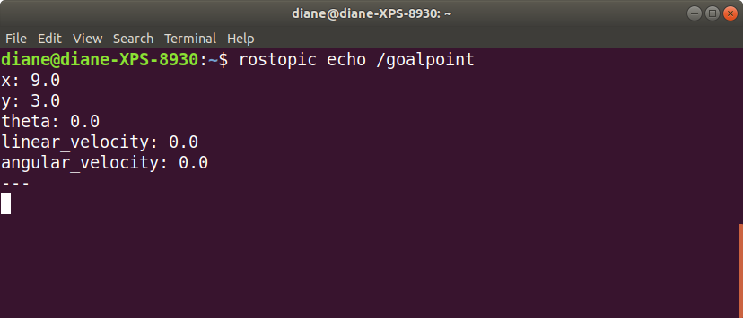

# Go To Goal

In this tutorial, we will create ROS nodes to move the turtlesim robot to goal locations.

**Objective**: Turtle swims from its current position to a given goal location, specified in x, y coordinates.

**Task**: Write a ros node that accomplishes stated objective.

**Constraints**: Velocity, in the turtle's reference frame, is constrained to linear x and angular z. In other words, the turtle may swim forwards and or backwards along its x-axis and rotate about its center, the z axis. The turtle may not strafe sideways along its y axis.</br></br>

## Questions to answer before writing the node

- How does the turtle know the goal location?
  - Options:
    - Hard code the goal location into the program.
      - This is a quick way to prototype and test, but in the longer term, it is not a good option, as the code will have to be changed and then re-executed for different goal locations.
    - Pass as a command line argument
      - Provides more flexibility than hard-coding the goal location.
      - Requires re-starting the program for different goal locations.
    - Prompt the user to enter goal via keyboard input
      - Provides the most flexibility for testing different goal locations
      - Can be written in a way that does not require restarting the program for each new goal location  
</br>

- How does the turtle know its current location?
  - From our previous experience with the simulation, we learned that the turtlesim node publishes the topic /turtle1/pose. The message type is turtlesim/Pose.
  - The turtlesim/Pose message contains the following fields:
    - float32 x
    - float32 y
    - float32 theta
    - float32 linear_velocity
    - float32 angular_velocity  
  - This means our node needs to subscribe to the pose topic.  
</br>

- How do we calculate the turtle's linear and angular velocity?
  - Linear velocity
    - We could use some constant value, such as 1 m/s, or
    - We can base velocity on distance to the goal. When the turtle is far away from the goal, it moves with a greater velocity and then slows as it gets closer to the goal.
      - Euclidean distance: "In mathematics, the Euclidean distance between two points in Euclidean space is the length of a line segment between the two points. It can be calculated from the Cartesian coordinates of the points using the Pythagorean theorem, therefore occasionally being called the Pythagorean distance."[1](https://en.wikipedia.org/wiki/Euclidean_distance)</br></br>

      -  [2](https://commons.wikimedia.org/w/index.php?curid=67617313)  </br></br>

  - Angular Velocity
    - With the given linear velocity constraint of x direction only, the turtle must rotate about its z axis to affect displacement in the reference frame y direction.
    - Angle of Rotation
      - How far does the robot need to turn to head towards the goal point? </br></br>

      -  [3](https://encrypted-tbn0.gstatic.com/images?q=tbn:ANd9GcSaCdLT8jvxsikCX5T3W2ERDTjgkgAP6KRBTw&usqp=CAU)  </br></br>

      - What is the current heading?
        - Pose topic, theta value
      - What is the goal point heading?
        - deltaX = goalPoint.x - current.x;
        - deltaY = goalPoint.y - current.y;
        - goalPointHeading = arctan(deltaY/deltaX);
      - What is the heading error?
        - headingError = goalPointHeading - currentHeading  
      - We then base the angular velocity on the heading error. Angular velocity is faster when the heading error is large and slows down as the heading error decreases. In other words, the angular velocity is proportional to the heading error.

- How do we command the turtle to move at the desired velocity?
  - Publish the cmd_vel topic
- What are the error tolerances?
  - Distance to goal point error tolerance - at what value do we consider the turtle to be close enough to the goal point?
  - Heading error - at what value do we tell the turtle to stop rotating?

</br></br>

## Creating Two ROS Nodes

We will create two ROS nodes, one that controls the turtle's movement and another that gets the goal point coordinates from user input and publishes the goal location. It's better to write separate nodes for these different tasks, as it makes them easier to maintain and reuse.</br></br>

## Goal Point Publisher Node

The goal point publisher node accepts user input for goal x and y coordinates. It then publishes the goal location to a topic named goalpoint.

Navigate to the scripts folder in the moveturtle package. Use your text editor to create a new python program called goalpoint_publisher.py.

```bash
cd ~/catkin_ws/src/moveturtle/scripts/
code goalpoint_publisher.py
```

Add the following code to the file.

```python
#! /usr/bin/env python

import rospy
from turtlesim.msg import Pose 

def set_goal_point():
   print("\nRobot goal point?")
   x = int(input("Enter x: "))
   y = int(input("Enter y: "))
   return x, y
   
def main():
   rospy.init_node("goalpoint_publisher")

   # create publisher
   #  topic name - goalpoint
   #  message type Pose
   #  queue size - do not store any messages that cannot be 
   #               processed quickly enough
   pub = rospy.Publisher('goalpoint', Pose, queue_size=0)
   
   # declare Pose object
   goalpoint = Pose()

   # loop keeps running as long as ROS master is active
   while not rospy.is_shutdown():
      
      # wait for user input
      (goalpoint.x, goalpoint.y) = set_goal_point()

      # publish the goal point to the ROS topic
      pub.publish(goalpoint)
   
      
if __name__ == "__main__":
   main()
```

If you use catkin_install, add the following to the CMakeLists.txt file.

```cmake
catkin_install_python(PROGRAMS scripts/goalpoint_publisher.py
  DESTINATION ${CATKIN_PACKAGE_BIN_DESTINATION}
)
```

Don't forget to make the script executable.

```bash
chmod +x goalpoint_publisher.py
```

</br></br>

### Launch the GoalPoint Publisher Node

Start ROS.

```bash
roscore
```

In another terminal window, start the goalpoint publisher node.

```bash
rosrun turtlemove goalpoint_publisher.py
```

</br>


</br></br>

In a third terminal, list the active topics. You should see /goalpoint. Then echo the topic. Since the queue size is zero, you may need to enter another point to see it echoed.

```bash
rostopic list
rostopic echo /goalpoint
```

</br>


</br></br>


## Create a ROS Node to Move the Turtle to the Goal Point

Next, we need to create a ROS node that subscribes to the /goalpoint topic and publishes a velocity command to move the turtle to the desired goal point.

In the scripts folder of the moveturtle package, create a new program called go_to_goal.py.

```bash
cd ~/catkin_ws/src/moveturtle/scripts/
gedit go_to_goal.py
```

</br>

Let's start with psuedocode for the main function. At startup, we have to initialize ros with the node name, create publishers and subscribers and set a rate for loop execution.  

After setup, loop execution begins until shutdown is signaled. This node's function is to publish a velocity command, dependent on the goal point and current position. The loop will call a set velocity function to calculation the velocity and then publish the velocity command topic.

```python
def main():
  # initialize variables

  # initialize ros node with node name

  # create velocity publisher
   #  topic name - cmd_vel
   #  message type Pose
   #  queue size - do not store any messages that cannot be 
   #               processed quickly enough

  # create turtle pose subscriber
   #  topic name - turtle1/pose
   #  message type - Pose
   #  callback function name - update_pose

  # create goal point subscriber
   #  topic name - goalpoint
   #  message type - Pose
   #  callback function name - update_goal_point

  # Specify a frequency, in Hz, for while loop execution

  # while not rospy.is_shutdown():

      # rospy subscribers are running in separate threads,
      # so we do not have to actively call rospy.spin
      # in the while loop

      # if go to goal flag is true
         # calc_velocity()
    
      # publish velocity

      # sleep to maintain freqeuncy
```

</br>

Next, let's define the pseudocode for the calculate velocity function. The linear and angular velocities are based on the Euclidean distance to goal and heading error, respectively. This function takes the approach of rotating the turtle until the heading error is within an acceptable tolerance. The linear velocity is set to zero until the robot's heading is acceptable. When there is no heading error, the angular velocity is zero and the linear velocity is based on the distance to the goal. This is the simplest approach for controlling a robot: rotate until heading is correct, then translate towards goal.

Alternatively, velocity can be based upon simulataneous rotational and translational movement.  </br>

```python
def calculate_velocity():
   # calculate Euclidean distance from current position to goal point

   # calculate heading error from current postion to goal point

   # compare Euclidean distance to an acceptable distance error tolerance
   # if the distance is greater than the error tolerance
      # compare heading error to acceptable heading error tolerance
      # if heading error is greater than acceptable
         # set angular z velocity to heading error
         # set linear x velocity to zero
      # else
         # set angular z velocity to zero
         # set linear x velocity to distance to goal point
   # else 
      # we have arrived at the goal point
      # set velocity values to zero
      # set go to goal flag to false

```

</br>

The psuedocode for the subscriber call back functions:

```python
def update_pose(msg):
  # set current pose x, y, theta to msg x, y, theta


def update_goal_point(msg):
  # set goal pose x,y to msg x, y
```

Finally, the pseudocode for calculating the heading error:

```python
def calc_heading_error():
   # calculate differences in x, y between current pose and goal
   # deltaX = goal pose x - current pose x
   # deltaY = goal pose y - current pose y
   
   # deltaTheta = arctan(deltaY, deltaX)
   # heading error = deltaTheta - current pose theta

   # restrict heading error to -pi to pi range
   # if heading error > PI
   #    heading error = heading error - 2*PI
   # if heading error < -PI
   #    heading error = heading error + 2*PI

   # return heading error
```

We should now be able to write the program and begin testing its performance. When you're done writing the program, give it executable privileges.
  

```bash
chmod +x go_to_goal.py
```

</br>

To test the program, open at least four terminal windows and type the following commands, in order, one per window.

```bash
roscore
rosrun turtlesim turtlesim_node
rosrun moveturtle go_to_goal.py
rosrun moveturtle goal_publisher.py
```

When your program is running correctly, you should be able to give the turtle multiple goal points to move it around the window.

</br></br>

## Suggestions for Improvement

1. Set limits for the goal locations. The x, y values of the simulation window are in the range [0,12], but the turtle generates a warning message: Oh no! I hit the wall! for values slightly greater than 11 and less than 0.

2. Add proportional control to the velocity calculations. Multiply the heading error by a proportional constant, KPA and multiply the distance error by a proportional constant, KPL. When the proportional constants are greater than one, the turtle arrive at the goal more quickly. Experiment with the proportional constants. Too large a value may cause oscillation, with the turtle never reaching a state within error tolerance.

3. Write an alternate function for calculating velocity, one that sets both angular z and linear x velocity simulataneously, based on the heading and distance errors.

4. Write an object-oriented solution for the go to goal behavior which eliminates the need for global variables.
