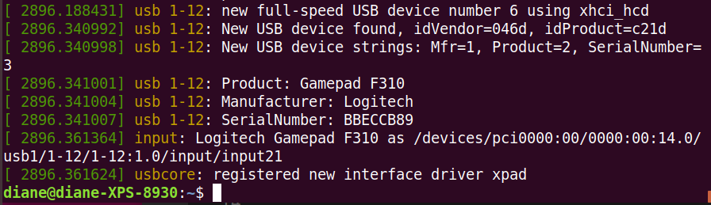

# Configuring and Using a Linux-Supported Joystick with ROS

Most of information comes directly from the ROS [tutorial](http://wiki.ros.org/joy/Tutorials/ConfiguringALinuxJoystick).

Description: This tutorial is an introduction to using the joystick connected to a desktop computer. After reading it, you should be able to bring up the joy node and display the data coming from the joystick over ROS.

</br></br>

## Logitech F310 Gamepad

The Logitech F310 gamepad is used for the this example. ROS supports other gamepads as well.


</br></br>

This is a wired gamepad with a USB connector. Plug the gamepad into the computer's USB port.  

Use the linux dmesg command to ensure the device is recognized and the driver is running. The dmesg command also called as “driver message” or “display message” is used to examine the kernel ring buffer and print the message buffer of kernel. The output of this command contains the messages produced by the device drivers.

```bash
dmesg
```

The dmesg command may generate a long list of messages with the last set related to the device we just plugged into a USB port. To see just the last set of messages:

```bash
dmesg | tail
```

</br>

The screenshot below shows the device is recognized.  



</br>


## Install ROS Joystick Packages

Install the following packages:

```bash
sudo apt-get install ros-melodic-joy ros-melodic-joystick-drivers ros-melodic-teleop-twist-joy
```

</br></br>

## Device Path

Linux assigns a device name, such as js0, to our device. To see a listing of all input devices:

```bash
ls /dev/input/
```

</br>
You will see a listing similar to the one below. The joystick devices are referred to by jsX ; in this case, our joystick is js0. 

```bash
by-id    event1   event12  event15  event18  event20  event4  event7  js0
by-path  event10  event13  event16  event19  event21  event5  event8  mice
event0   event11  event14  event17  event2   event3   event6  event9  mouse0
```

</br>
To ensure that is our device, we list the contents of the by-id directory.

```bash
ls -al /dev/input/by-id/
```

</br>
This confirms that /js0 is the Logitech gamepad.  d

```bash
lrwxrwxrwx 1 root root  10 Dec  1 15:03 usb-Logitech_Gamepad_F310_BBECCB89-event-joystick -> ../event21
lrwxrwxrwx 1 root root   6 Dec  1 15:02 usb-Logitech_Gamepad_F310_BBECCB89-joystick -> ../js0
```

</br>
To ensure the device is working and has the correct permissions, we can use the Linux jstest command. If this command fails, it may prompt you to install the joystick package with ```sudo apt install joystick```.

```bash
jstest /dev/input/js0
```

</br>
You will see the joystick output on the screen. Press the buttons and move the thumbsticks to see the data change.

```bash
Driver version is 2.1.0.
Joystick (Logitech Gamepad F310) has 8 axes (X, Y, Z, Rx, Ry, Rz, Hat0X, Hat0Y)
and 11 buttons (BtnA, BtnB, BtnX, BtnY, BtnTL, BtnTR, BtnSelect, BtnStart, BtnMode, BtnThumbL, BtnThumbR).
Testing ... (interrupt to exit)
Axes:  0:     0  1:     0  2:     0  3:     0  4:     0  5:     0  6:     0  7:     0 Buttons:  0:off  1:off  2:off  3:off  4:off  5:off  6:off  7:off  8:off  9:off 10:off 
```

</br>
Next, check the joystick permissions to make it accessible to ROS.

```bash
ls -al /dev/input/js0
```

</br>
You will see something similar to 

```bash
crw-rw-XX--+ 1 root input 13, 0 Dec  1 15:02 /dev/input/js0
```

</br>
If the XX is rw, this means the device is configured for read/write privileges.  

If the XX is --, you need to add rw privileges with

```bash
sudo chmod a+rw /dev/input/js0
```

</br></br>

## Starting the Joy Node

To get the joystick data published over ROS we need to start the joy node. First let's tell the joy node which joystick device to use- the default is js0.

```bash
roscore
rosparam set joy_node/dev "/dev/input/js0"
```

Next, start the node with

```bash
rosrun joy joy_node
```

</br>

You will see similar output. The Logitech device does not have force feedback. We ignore the warning.

```bash
[ WARN] [1638405625.622317691]: Couldn't set gain on joystick force feedback: Bad file descriptor
[ INFO] [1638405625.626438467]: Opened joystick: /dev/input/js0. deadzone_: 0.050000.
```

</br>
Now in a new terminal you can rostopic echo the joy topic to see the data from the joystick.  

```bash
rostopic echo joy
```

</br>
As you move the joystick around, you will see something similar to  

```bash
---
header: 
  seq: 9414
  stamp: 
    secs: 1325530130
    nsecs: 146351623
  frame_id: ''
axes: [-0.0038758506998419762, -0.0038453321903944016, -0.0, -0.999969482421875, 0.0, 0.0]
buttons: [0, 0, 0, 0, 0, 0, 0, 0, 0, 0, 0, 0]
---
header: 
  seq: 9415
  stamp: 
    secs: 1325530130
    nsecs: 146351623
  frame_id: ''
axes: [-0.0038758506998419762, -0.0038453321903944016, -0.0, -0.999969482421875, 0.0, 0.0]
buttons: [0, 0, 0, 0, 0, 0, 0, 0, 0, 0, 0, 0]
---
header: 
  seq: 9416
  stamp: 
    secs: 1325530130
    nsecs: 146351623
  frame_id: ''
axes: [-0.0038758506998419762, -0.0038453321903944016, -0.0, -0.999969482421875, 0.0, 0.0]
buttons: [0, 0, 0, 0, 0, 0, 0, 0, 0, 0, 0, 0]
---
```

</br></br>

Now that the gamepad is working with ROS, complete the next tutorial [Joy Button Listener](joyButtonListener.md)
