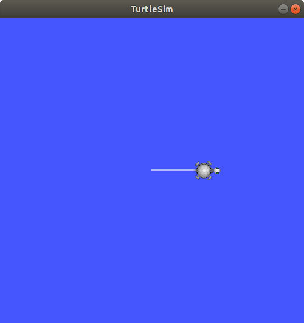
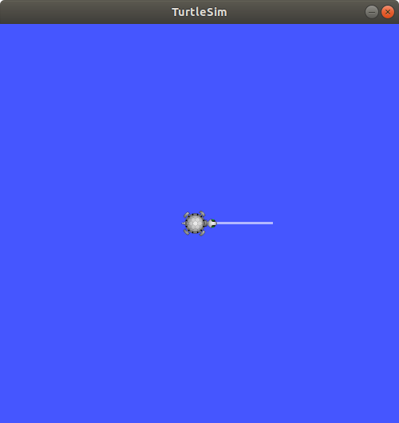
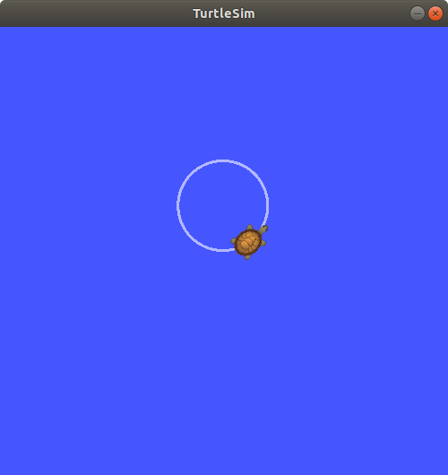

# Publish cmd_vel topic

Description: move the turtle around the turtlesim window by publishing velocity commands.

## Start Simulation

Start ROS Master and  by opening a terminal windows and typing:

```bash
roscore
```

In the second terminal, run the executable turtlesim_node with the command: 

```bash
rosrun turtlesim turtlesim_node
```

## Publish from Command Line

With the simualtion running, open a third terminal and type the following commands

```bash
rostopic list
rostopic info /turtle1/cmd_vel
```

</br>

The first commands shows us a list of active topics. We are intertested in the topic /turtle1/cmd_vel. The second command displays the following:

```bash
Type: geometry_msgs/Twist

Publishers: None

Subscribers: 
 * /turtlesim 
```

This tells us that the /turtlesim node is subscribing to the topic /turtle1/cmd_vel, there is no node publishing that topic and that the message type is geometry_msgs/Twist.

The ROS wiki, http://wiki.ros.org/turtlesim, provides the following information for topic turtleX/cmd_vel.

"The linear and angular command velocity for turtleX. The turtle will execute a velocity command for 1 second then time out. Twist.linear.x is the forward velocity, Twist.linear.y is the strafe velocity, and Twist.angular.z is the angular velocity."

</br>

To see the Twist message format, type:

```bash
rosmsg show geometry_msgs/Twist
```

The output shows that the message format allows six floating-point values which determine the linear and angular velocity of the turtle:

```bash
geometry_msgs/Vector3 linear
  float64 x
  float64 y
  float64 z
geometry_msgs/Vector3 angular
  float64 x
  float64 y
  float64 z
```

</br> </br>

## rostopic pub

We can publish topics from the command line with the rostopic pub command. The general command form is

```bash
rostopic pub [topic name] [message type] [arguments]
```

Let's start by moving the turtle in the forward x direction. Enter the command shown below. We are publishing the topic: /turtle1/cmd_vel. The message type is geometry_msgs/Twist. The option -1 says to only publish this message once. This is followed by the linear and angular velocity arguments of the Twist message fields. The data arguments are actually in YAML syntax, which is described in the YAML Command Line documentation at http://wiki.ros.org/ROS/YAMLCommandLine

```bash
rostopic pub /turtle1/cmd_vel geometry_msgs/Twist -1 '[2.0, 0.0, 0.0]' '[0.0, 0.0, 0.0]'
```

The terminal output:

```bash
publishing and latching message for 3.0 seconds
```

You should see the turtle has moved in the positive x direction, as shown in the screenshot below.



</br>

The turtle was originally spawned at x = 5.54, y = 5.54, theta = 0.0. Use rostopic echo to see its current position. The option -n 1 says to echo it once.

```bash
rostopic echo -n 1 /turtle1/pose
```

</br>

The turtle's x position is now 7.56, with y and theta remaining the same. Why did the turtle move 2 meters in the x direction? Our published command said to move at a linear velocity of 2 meters/sec. The ros wiki indicates that any published commands are executed for one second only. Thus, our turtle moved 2 meters in that one second time interval. 

```bash
x: 7.56044435501
y: 5.544444561
theta: 0.0
linear_velocity: 0.0
angular_velocity: 0.0
```

</br>

We can move the turtle in the reverse x direction, by negating the linear x velocity. Enter the following command:

```bash
rostopic pub /turtle1/cmd_vel geometry_msgs/Twist -1 '[-2.0, 0.0, 0.0]' '[0.0, 0.0, 0.0]'
```

</br>

We now see the turtle moving to the left, negative x direction, and stopping near its starting position of x = 5.54.



</br> </br>

### angular z velocity

We can make the turtle rotate by giving it an angular velocity about the z-axis. In the simulation, imagine the z-axis as coming out of the display, perpendicular to the xy plane.

Enter the command, to see the turtle rotate about its own center. The -r 1 says to publish this command at a rate of 1 Hz. The angular speed, 1.8, is in units of radians/second.

```bash
rostopic pub /turtle1/cmd_vel geometry_msgs/Twist -r 1 '[0.0, 0.0, 0.0]' '[0.0, 0.0, 1.8]'
```

Type Ctrl + C to stop publishing the command and stop the turtle's motion. Reset the simulation with the command


</br>

```bash
rosservice call /reset
```

This places the turtle back in its orginal location and redraws the background, removing the turtle pen lines. Services are discussed in detail in the next unit.

Finally, to move the turtle in a circular, type the command:

```bash
rostopic pub /turtle1/cmd_vel geometry_msgs/Twist -r 1 '[2.0, 0.0, 0.0]' '[0.0, 0.0, 1.8]'
```



</br> </br>

To learn more about the rostopic pub options, type ```rostopic pub -h```.

</br> </br>


## Next Tutorial: Python Publisher Node - Swim Circle

In the next example [swim circle](swim_circle.md), we will write a python publisher node to make the turtle swim in a circle.
