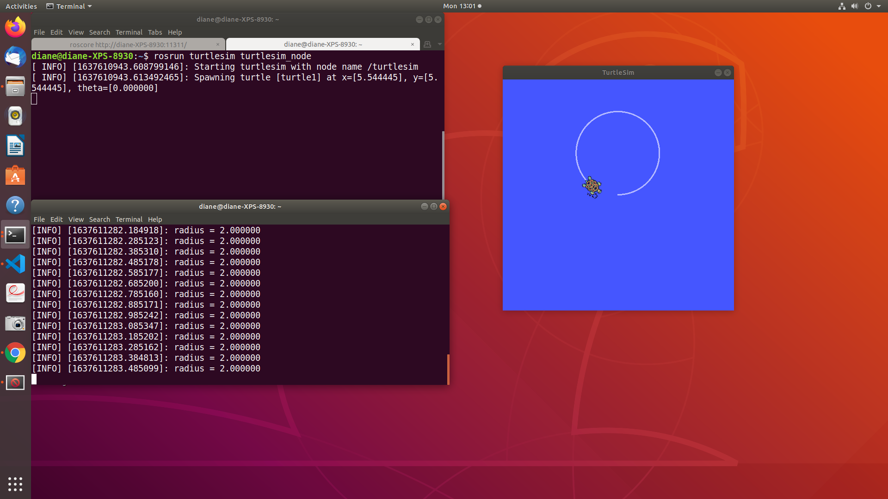

# Creating a python publisher node - swim_circle.py

In the [previous tutorial](publish_cmd_vel.md), we learned how to publish velocity arguments to the cmd_vel topic. Now that we have an understanding of the linear and angular velocity values, we will write a python script that causes the turtle to swim in a circle. We'll start by creating a new package named moveturtle that has dependencies: rospy, std_msgs, geometry_msgs.

Packages are created in the catkin workspace src directory. If you do not have a catkin workspace, follow these [instructions](http://wiki.ros.org/catkin/Tutorials/create_a_workspace) to create one.

Change directories into our workspace src folder:

```bash
cd ~/catkin_ws/src/
```

</br>

Now create the package:

```bash
catkin_create_pkg moveturtle std_msgs rospy geometry_msgs
```

</br>

This will create a directory named moveturtle that contains two files: CMakeLists.txt, package.xml and a directory named src.

Build the package and overlay the environment to let ros know about our new package.

```bash
cd ~/catkin_ws
catkin_make
source devel/setup.bash
```

</br>

Create a new directory named scripts inside the moveturtle directory.

```bash
cd ~/catkin_ws/src/moveturtle
mkdir scripts
cd scripts
```

</br>

In the scripts directory, use your favorite text editor to create a file named move_circle.py.

</br></br>

## Implementation

The first line of every python program makes it an executable script. This means we can run the program with just the program name and do not have to run it with python myprogram.py.

```python
#! /usr/bin/env python
```

</br>

Next, import all the packages used in the program. rospy is a ROS-python library that contains different functions like creating a node, getting time, creating a publisher, etc.  The cmd_vel topic message type is geometry_msgs/Twist, so we import the Twist message class from the geometry_msgs package. We pass a command line argument for the circle's radius, requiring the sys module.

```python
import rospy
from geometry_msgs.msg import Twist 
import sys 
```

</br>

Let's define a function named swim_circle that has one parameter: radius. First, we initialize the node, create the publisher, create a rate variable for loop frequency, and declare a Twist message object. 

```python
def swim_circle(radius):
   # initialize the node with the name move_circle
   # when setting anonymous as true, we can have
   # multiple instances of this node running if needed
   rospy.init_node('move_circle', anonymous=True)

   # create a publisher for the topic name 
   # /turtle1/cmd_vel that publishes Twist messages
   # The queue_size determines how many Twist messages
   # are stored in the queue before they are overwritten
   # The number 10 is used in many ros examples.
   pub = rospy.Publisher('/turtle1/cmd_vel', 
                           Twist, queue_size=10)

   # rate will control the execution time of the loop
   rate = rospy.Rate(10)

   # create a Twist() message object
   vel = Twist()
```

</br>

Next, inside the function we create a while loop that allows the turtle to swim in a circle until the node is shutdown with Ctrl + C. Inside the while loop, we set the linear x velocity to the radius value. The angular.z velocity is hard-coded to 1 radian/second. All other velocity fields are set to zero.

The message is then published. The rospy.loginfo() function publishes the radius each loop iteration.
rate.sleep() is added at the end. The rate object keeps track of the time since the last rate.sleep() was executed and sleeps for the correct amount of time to maintain a 10Hz frequency.

```python
   while not rospy.is_shutdown():
      vel.linear.x = radius
      vel.linear.y = 0.0
      vel.linear.z = 0.0
      vel.angular.x = 0.0
      vel.angular.y = 0.0
      vel.angular.z = 1.0
      rospy.loginfo("radius = %f", radius)
      pub.publish(vel)
      rate.sleep()
```

</br>

Finally, the function is called from this section of code. The radius argument is extracted from the command line arguments and passed to the swim_circle function.

```python
if __name__ == '__main__':
   try:
      swim_circle(float(sys.argv[1]))
   except rospy.ROSInterruptException:
      pass 
```

</br></br>

## Execution of move_circle.py

The file must be given executable privileges. Type the following:

```bash
chmod +x move_turtle.py
```

Next, we start the simulation running. Open a terminal and start ROS Master

```bash
roscore
```

In another terminal, start the simulation.

```bash
rosrun turtlesim turtlesim_node
```

In a third terminal, start the move_circle node.

```bash
source catkin_ws/devel/setup.bash
rosrun moveturtle move_circle.py 2.0
```

Yeah! The turtle is now swimming in a circle.



</br></br>

You can watch the turtle's position change with the command ```rostopic echo /turtle1/pose``` 

Type Ctrl + C to stop the program.

Try running the program again with different radius values.

</br></br>

## Next Tutorial: Go To Goal

In the next example [go to goal](go_to_goal.md), we will create the programming logic to move the turtle to a goal location.  
