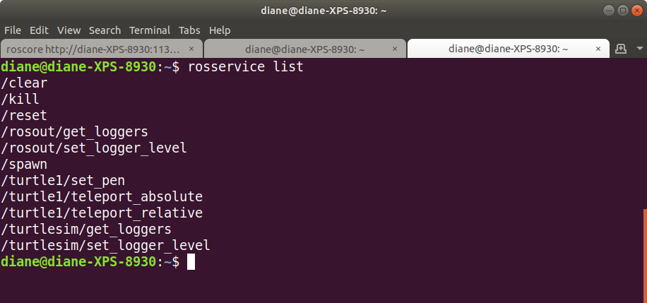
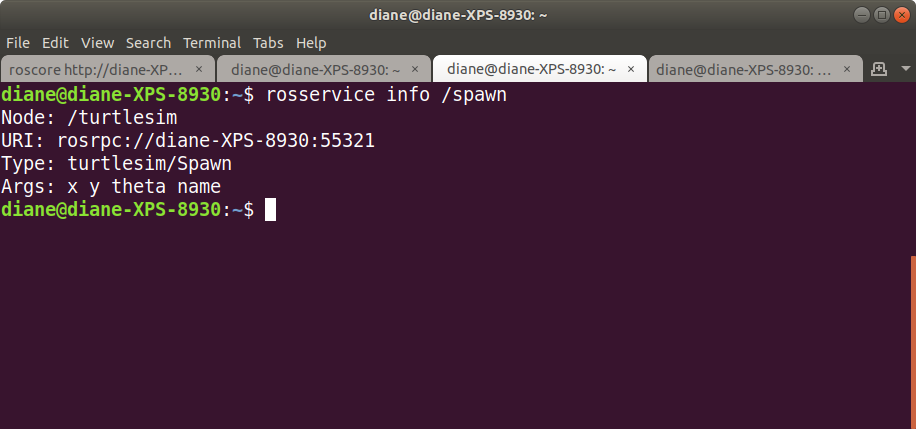
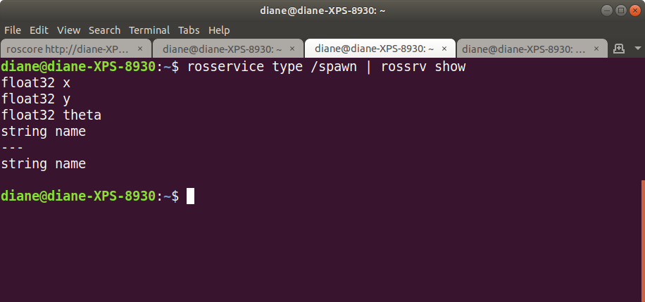
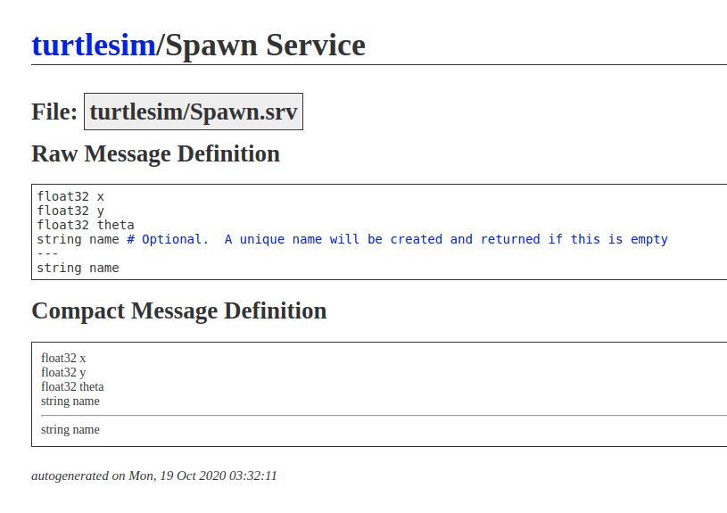
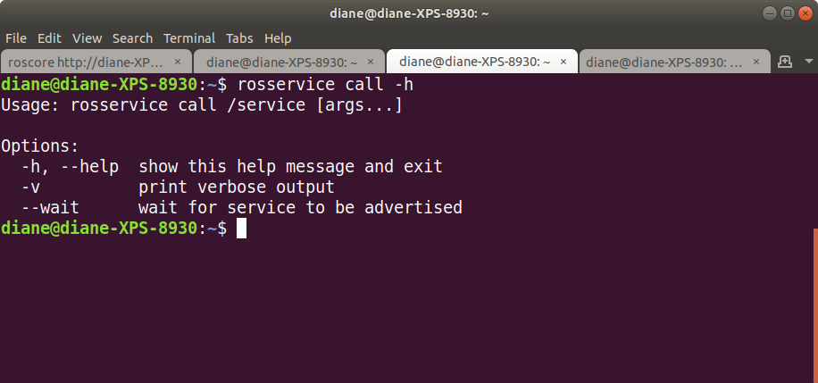
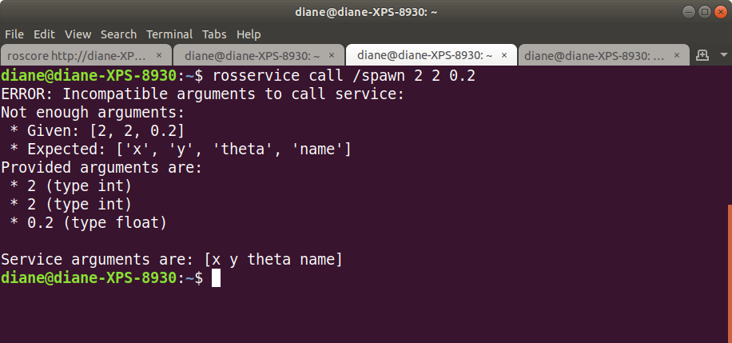
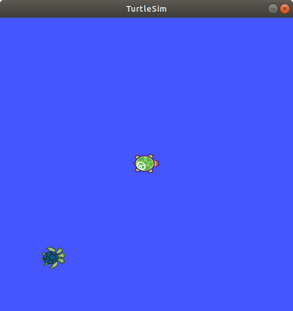

# ROS Tutorials - Understanding Services and Parameters

http://wiki.ros.org/ROS/Tutorials/UnderstandingServicesParams 


## ROS Services

Services are another way that nodes can communicate with each other. Services allow nodes to send a request and receive a response.

</br></br>

## Using rosservice

rosservice can easily attach to ROS's client/service framework with services. rosservice has many commands that can be used on services, as shown below:

Usage:

-rosservice list         print information about active services  
-rosservice call         call the service with the provided args  
-rosservice type         print service type  
-rosservice find         find services by service type  
-rosservice uri          print service ROSRPC uri  

</br></br>

## What turtlesim services are available?

Run the following commands to start turtlesim. Open a terminal and type

```bash
roscore
```

Open a second terminal window and type

```bash
rosrun turtlesim turtlesim_node 
```

Open a third terminal window and type

```bash
rosservice list
```

A screenshot of available services is shown below.



</br></br>

The list command shows us that the turtlesim node provides nine services: reset, clear, spawn, kill, turtle1/set_pen, /turtle1/teleport_absolute, /turtle1/teleport_relative, turtlesim/get_loggers, and turtlesim/set_logger_level. There are also two services related to the separate rosout node: /rosout/get_loggers and /rosout/set_logger_level.


## spawn service

Let's get some information about the spawn service.

```bash
rosservice info /spawn
```
</br></br>



</br></br>

We see that the service takes arguments of x, y, theta, name when called. To see the data types of these arguments, use the rosservice type command, followed by the name of the service. Pipe that output to the command rossvr show to see the respsonse/request data members of Spawn.srv 

```bash
rosservice type /spawn | rossrv show
```

</br></br>



</br></br>

The fields above the dashed line are the request fields: x, y, theta, name. The field below the dashed line is the response.

</br></br>

An internet search provides more details about the service message fields. Note that the name argument in the request is optional.



</br></br>

Let's call the spawn service from the command line. First, we query the help option. 

```bash 
rosservice call -h
```

</br></br>



</br></br>

If we call the service without specifying anything for the name, an error message is generated.

</br></br>



</br></br>

This means we have to at least provide an empty string argument, "", for it to assign the name.

```bash
rosservice call /spawn 2 2 0.2 ""
```

</br></br>

The service call responds with the message turtle2, the name given to the newly spawned turtle.


</br></br>

We now have two turtles in the simulation.

</br></br>




## Calling the spawn service from a program

ROS services are defined by srv files, which contain a request message and a response message.

rospy convert srv files into python source code and creates three classes that you need to be familiar with: services definitions, request messages, and response messages. The class names come directly from the srv file name.

Example:

my_package/srv/Foo.srv -> my_package.srv.Foo​  
my_package/srv/Foo.srv -> my_package.srv.FooRequest​  
my_package/srv/Foo.srv -> my_package.srv.FooResponse​  

Let's apply this knowledge to the turtlesim package service Spawn.srv. There must be three classes: turtlesim.srv.Spawn, turtlesim.srv.SpawnRequest, and turtlesim/srv.SpawnResponse.

We will need to import these into our python program to use the service.

The listing of the available service /spawn means the program running is the server program, making this service available and waiting for a client program to make a request.  

We will now write a client program to request the Spawn service. Name the program spawn_turtle_client.py and place it in the scripts directory of the autoturtle package.

Like every ROS python script, we make it executable and import the rospy module. We also need to import the Spawn service classes that are defined in the turtlesim package. The following will import all the Spawn serivce classes.

```python
!#!/usr/bin/env python
import rospy
from turtlesim.srv import *
```

</br>

Next, define a function named spawn_turtle_client to call the service. The function has four parameters: x, y, theta, and name which are the arguments required by the spawn service.  

To ensure the service is available, call the function  

```rospy.wait_for_service(service, timeout=None)```

Wait until a service becomes available. You can optionally specify a timeout (in seconds) to wait for, in which case a ROSException is raised if the timeout is exceeded.  

You call a service by creating a rospy.ServiceProxy with the name of the service you wish to call. Use the defaults for the persisent and headers arguments.

```rospy.ServiceProxy(name, service_class, persistent=False, headers=None)```

When persistent is true, it keeps the client connected to the server. Typically a client disconnects and then reconnects with each service call. The headers parameter can be used to send identification information with a service call.</br></br>

```python
def spawn_turtle_client(x, y, theta, name):
   # wait until the service is available with no timeout
   rospy.wait_for_service('/spawn')
   try:
      # create a callable instance named spawn_turtle
      spawn_turtle = rospy.ServiceProxy('/spawn', Spawn)
      # call the spawn_turtle instance, 
      # passing the arguments in order to the server
      server_response = spawn_turtle(x, y, theta, name)
      # the reponse message is stored in the name field
      return server_response.name
   except rospy.ServiceException as e:
      # If a service returns an error for the request, 
      # a rospy.ServiceException will be raised. 
      # The exception will contain any error messages 
      # that the service sent.
      print("Service call failed: %s"%e)
```

</br>

To complete the program, let's call the function.

```python
if __name__ == '__main__':
    # Try and Except.
    # If an error is encountered, a try block code execution is stopped and
    # transferred down to the except block.d
    try:
        spawnTurtle(2,2,0.2,"")
        # spin goes into an infinite loop
        # ctrl + c will stop node
        rospy.spin()
    except rospy.ROSInterruptException:
        rospy.loginfo("End of the swim for this Turtle.")
```
