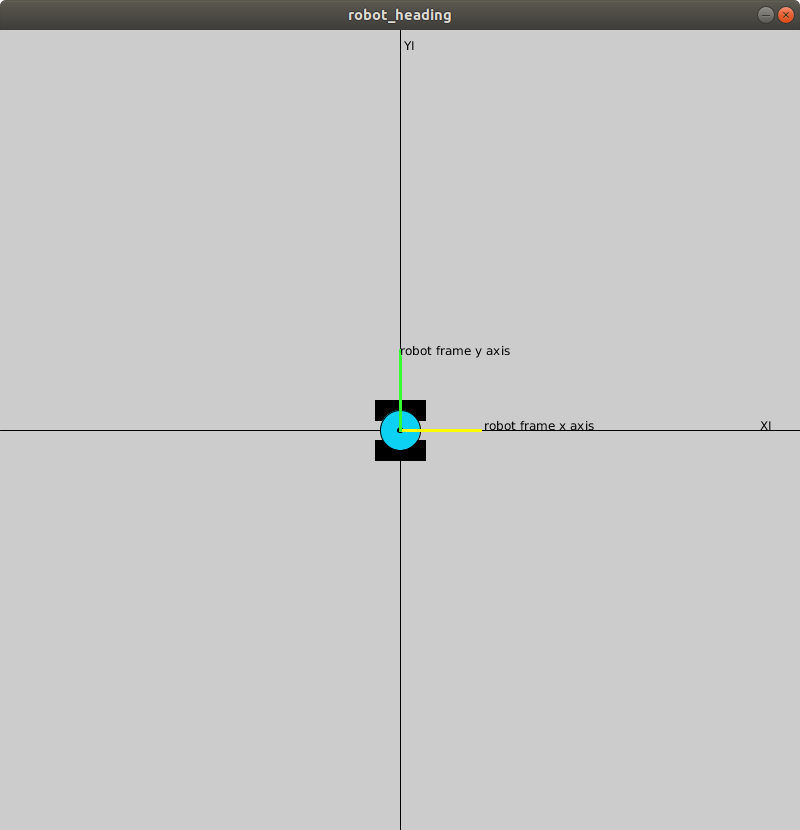
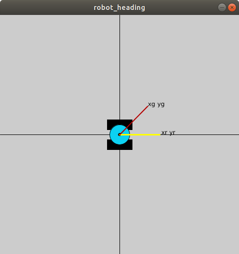
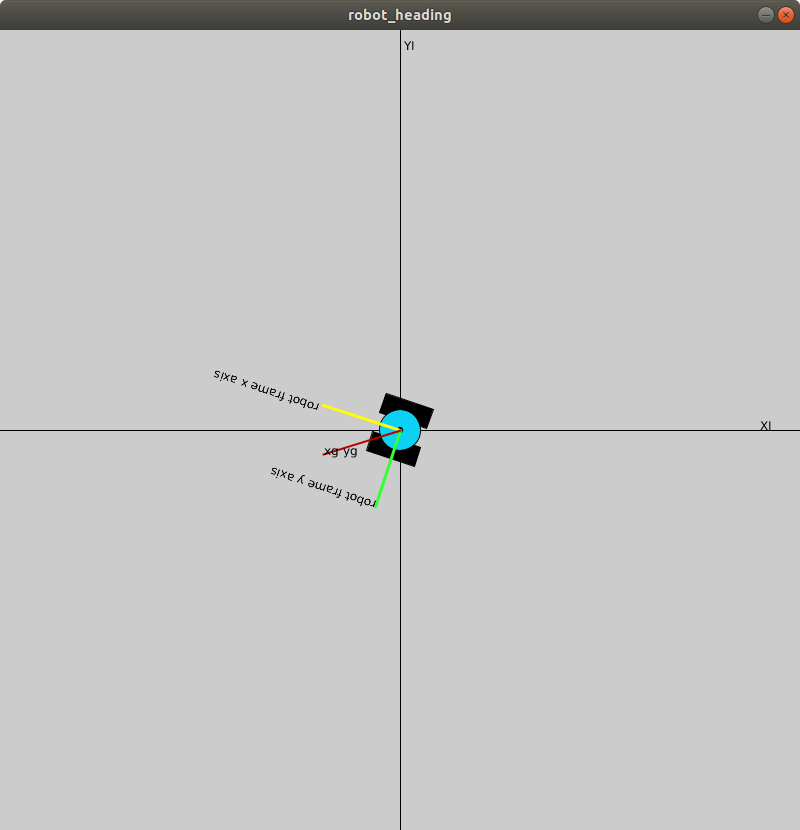
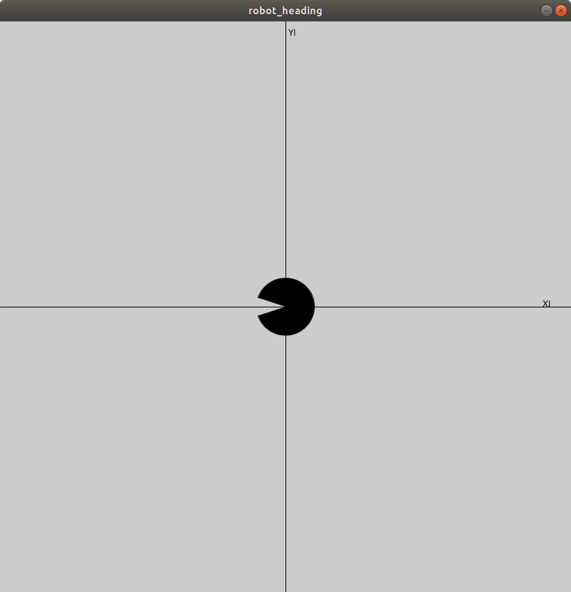

# Calculating Rotational Angle

Robot pose is specified by (xr, yr, &theta;r) where xr, yr coordinates specify the center position of the robot with respect to some fixed point. Typically this fixed point is the origin of the inertial reference frame.

&theta;r inidicates the robot's heading. Heading values are (in radians) are in the interval [-&pi; &pi;], where &theta;r = 0 indicates the robot is pointing along the x-axis. &theta;r increases (is positive) as the robot turns counter-clockwise.

To control a robot's motion, we develop two different controllers: one for linear motion and a second for rotational motion. The rotational controller turns the robot towards the goal, while the linear moves the robot forward until it reaches the goal.


## Calculate Desired Rotation

Given a goal location (xg, yg), calculate the goal heading of the robot. 

The image below shows a differential drive robot at the origin of the inertial reference frame whose axes are labeled XI, YI. The robot's reference frame axes are shown in yellow and green. 



</br></br>

Suppose we want the robot to rotate from its current heading to the goal heading shown in the image below. We want the robot's x-axis (yellow) aligned with the goal heading axis shown in red. The robot's current heading is 0 degrees in the inertial frame, with a desired goal heading of 45 degrees.  



</br></br>

It seems obvious that the rotational controller will rotate the robot a total of 45 degrees. Less obvious is that a rotation of 315 degrees will result in the same alignment. We choose the smaller rotation angle because the robot will achieve the desired position more quickly, with less expenditure of energy.

Typically, when a robot moves from one location to another, we calculate the robot's desired heading &theta;g based on the robot's current pose (xr, yr, &theta;r) and the desired goal pose (xg, yg).

&theta;g = arctan[(yg - yr)/(xg-xr)]

</br></br>

## Proportional Controller

The robot's angular velocity, &omega; is calculated by multiplying the heading error by a proportional constant.

Heading error: &theta;g - &theta;r

Proportional constant: Kp

&omega; = Kp (&theta;g - &theta;r)

As the control loop runs, we expect the angular velocity to be proportionally larger when the robot is farther away from its desired heading than when it is closer to its desired heading.


</br></br>

## Issues with subtracting angles to determine error:

Consider the example shown below, where the robot's heading is -0.9&pi; and the desired goal heading is 0.9&pi;
</br></br>



</br></br>

&theta;g = 0.9&pi;
&theta;r = -0.9&pi;

&theta;error = &theta;g - &theta;r = 0.9&pi; - (-0.9&pi;) = 1.8&pi; 

</br></br>

The image below shows the rotational arc of 1.8&pi; counter-clockwise. Visually, we see there is a much smaller rotation angle in the open wedge of the drawn arc, which is 0.2&pi; clockwise.



</br></br>

The method of always subtracting &theta;r from &theta;g does not always provide the smallest angle of rotation. Both rotations: 0.2&pi; clockwise and 1.8&pi; counter-clockwise will achieve the same resultant heading, but at the expense of time and energy.

We need some additional logic to ensure we calculate the smallest angle of rotation.

## Restricting Heading Error

The heading error is restricted to a range -&pi; to &pi; [-180, 180 degrees). Two possible methods are shown below.

```python
# exampl3 1
deltaX = goalX - currentX
deltaY = goalY - currentY
desiredHeading = atan2(deltaY, deltaX)
headingError = desiredHeading - currentHeading

# restrict to -PI to PI
if(headingError > PI):
   headingError = headingError - (2*PI)
if(headingError < -PI):
   headingError = headingError + (2*PI)
```


```python
# example 2
deltaX = goalX - currentX
deltaY = goalY - currentY
desiredHeading = atan2(sin(deltaY), cos(deltaX))
deltaTheta = desiredHeading - currentHeading

# restrict to -PI to PI
headingError = atan2(sin(deltaTheta), cos(deltaTheta))
```

The atan2 function is a four quadrant function, which produces the angle within the four quadrants of the plane. It helps to determine the sign and the correct quadrant placement of the resultant angle, within the range of [−&pi, &pi;]. The counterclockwise angles are considered positive and clockwise angles are considered negative.

