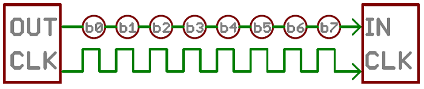
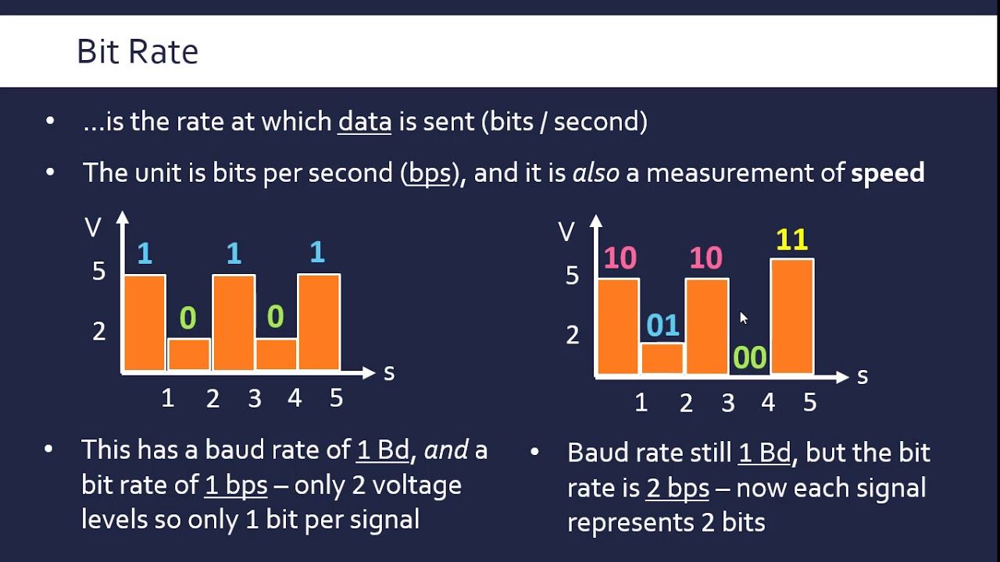
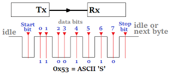
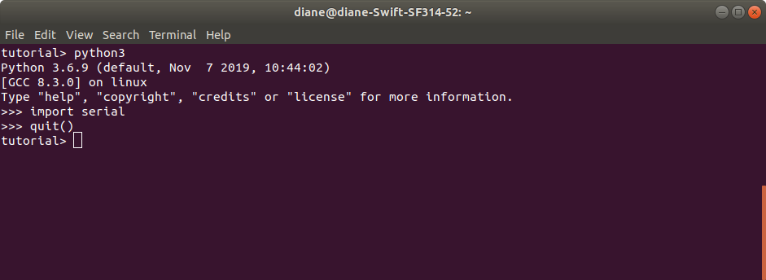

# Serial Communication: Arduino and pySerial

>A robot typically contains multiple computational units that exchange state information and control commands. There are many different communication protocols for exchanging data between computer systems. This module focuses on serial communication between an Arduino microcontroller and a general-purpose computer. Data is physically transferred via a universal serial bus (USB) cable.
<br>
<br>


[Image 1: Arduino Laptop USB connection][1]

[1]: https://www.ladyada.net/images/arduino/serialdata.gif
<br>

## Learning Objectives
- Use python to communicate with external hardware using a serial communication protocol interface
- Arduino Serial library
   - Understand difference between print and write functions
- pySerial library
   - Open serial port connection
   - Read single and multiple byte data using read and readuntil functions
   - Convert byte objects to numeric data types
<br>
<br>

## Content Overview
- Serial Communication - terminology review. Users are assumed to have prior experience with Arduino serial operations.
- Lessons: series of lessons and example code to illustrate serial communication between Arduino and python
<br>
<br>

## Serial Communication Terminology

Serial communication is the process of sending data one bit at a time, sequentially, over a communication channel or computer bus.



[Image 2: Serial Bit Transfer][2]

[2]:https://cdn.sparkfun.com/r/700-700/assets/e/5/4/2/a/50e1ccf1ce395f962b000000.png

</br></br>

### Asynchronous 

Serial communication between the Arduino and computer is asynchronous, meaning the devices are not connected by a common clock. It is critical that both devices are configured exactly the same in terms of

- Baud Rate
- Data bits
- Synchronization bits
- Parity bits
</br>
</br>

### Baud Rate and Bit Rate

The bit rate is the number of transmitted bits per second. Baud rate is defined as the number of signal or symbol changes per second. Baud rate differs from bit rate when more than one bit per baud is transmitted. This involves transmitting symbols representing multiple bits in a transmission interval and beyond the scope of this discussion. Just be aware that bit rate and baud rate differ when the number of bits per baud is not 1.
</br>

```c++
Bit rate = Baud rate x number of bit per baud

Baud rate = bit rate / number of bit per baud
```

</br></br>



[Image 3: Bit rate versus baud rate][3]

[3]: https://i.ytimg.com/vi/8wm0QlbW9cQ/maxresdefault.jpg 

</br></br>
<p>In summary, the baud rate specifies how fast data is sent over a serial line, expressed in the number of signal units per second. We are concerned with bit rate in terms of transmit time.</p>
</br>

| Bit Rate | Baud Rate |
| --- | --- |
| Number of bits transmitted per second | Number of signal units per second |
| Related to computer efficiency | Related to data transmission |
</br></br>

### Framing Data

Each block of data transmitted is sent in a packet or frame of bits. Typically each block is a single byte. The packet consists of the following symbols: start, data, parity, stop.
</br>

#### Synchronization Bits

The start and stop bits mark the beginning and end of a packet. There is always only one start bit, with the number of stop bits configurable as one or two. An idle data line is held at a binary logic level 1. The start bit is indicated when the data line transitions from 1 to 0. Stop bits transition the data line back to te idle state, holding the line at 1.
</br>

#### Parity Bits

Parity is a very simple error checking scheme. It is a single bit, generated by an odd or even scheme. It is optional and not widely used, as it slows downs transfer rates. It can prove useful in noisy mediums.
</br>

#### Data Bits

The amount of data in each packet can be 5 to 9 bits. The standard data size is 8 bits. It is also important to know the endianess of data transmission. Is data sent starting with the most significant bit (msb) to least significant bit (lsb), or vice versa? Typically the least significant bit is transferred first.
<br>
<br>



[Image: Transmission Packet][4]

[4]: https://circuitdigest.com/sites/default/files/inlineimages/u1/Synchronous-Serial-Communication.png

<br>
<br>

## pySerial

pySerial is a python package that encapsulates serial port access on a variety of operating systems: Windows,OSX, Linux, and others. PySerial allows data exchange between computers and external hardware via a serial communication interface.


> Installation, https://pyserial.readthedocs.io/en/latest/pyserial.html#installation
>
> Ubuntu Linux command line. May require root privileges.
>
> For python 2.7: `sudo apt install python-serial`<br>
> For python3.x: `sudo apt install python3-serial`
> <br>
> <br>

<p>To verify the package in installed, start a terminal session by typing python or python3. Then type import serial. If the module is not installed, you will see an error message. Otherwise, you will see the prompt as shown below.  Type quit() to end the session.</p>
<br>
<br>



<br>
<br>

## Lessons
> Study each of these lessons, in order.
<br><br>

### **Lesson 0 - Python program lists connected serial devices**

>This example illustrates how to list device information for connnected serial com ports. It is for your information only and not required to open a serial connection. This example is not guaranteed to run in Windows.
<br><br>

### **Lesson 1 - Arduino transmits bytes as ASCII characters to python program**

>Lesson 1 demonstrates how Arduino's Serial.println function transmits data as ASCII characters. The python receiving program utilizes pySerial's readuntil function to recognize when the entire data message has been received.
>
>Study and run the examples to understand how the Arduino Serial.println function transmits data, as well as how the python program opens the serial connection and reads byte data.
<br><br>

### **Lesson 2 - Arduino transmits bytes as binary values to python program**

>Lesson 2 illustrates how to transmit single and multiple byte integers from Arduino to a python program. The python examples demonstrate how the data is natively received and then converted to the correct integer data value.
>
>Study and run the examples to understand how the Arduino Serial.write function transmits binary data, as well as how the python program reads the binary data.
<br><br>

### **Lesson 3 - python transmits and receives bytes to/from Arduino**

>Lesson 3 demonstrates how to transmit one data message from python to Arduino. 
>
>Study and run the examples to understand how python's pySerial write function works in conjunction with Arduino Serial.readStringUntil function.
<br><br>

### **Lesson 4 - Handling Ctrl+C signal interrupt**

>This example illustrates how to handle an asynchronous signal interrupt to gracefully exit from a program.
<br><br>

### **Lesson 5 - Arduino transmits random xy values to python**

>This lesson illustrates how to send multiple data values from Arduino to python. Encoding the message with delimiters aids in extracting the received information. The Serial.print functions are used to transmit data as ASCII characters. The delimiters were necessary as the length of x and y values varied from 1 to 3 digit values.
>
>This example also demonstrates how to use the Arduino milliseconds timer to control tasks with different timing requirements.
>
>The lesson combines signal interrupt handling with an infinite loop, allowing the program to exit gracefully, closing the serial connection before terminating.
</br></br>

## Lesson 6 - Arduino Serial.readBytes

>Python example illustrates how to convert integer to bytes array and transmit with serial write.
>
>Arduino example illustrates how to use readBytes function to individually read the bytes from python and form them back into an integer value.
</br></br>

## Lesson 7 - Arduino Serial.readBytesUntil

> Arduino example illustrating readBytesUntil function behavior.
>
> Try each of the experiments to begin to understand the quirks of serial communication.
</br></br>

## Summary

>Serial communication between an Arduino and another computer provides 
>- Arduino State Information
>- Transmission of control commands from computer to Arduino
>
> These lessons progress from simple to more complex forms of serial communication. Default values were used to configure the serial port in most examples. The python serial port connection was configured with no read timeout, meaning that all read functions will block (not return) until data is read. Often, this is not practical, as more complex programs cannot sit and wait forever for a function to return. Timeout values are determined, based on hardware and software requirements. When a read or write function may return due to a timeout, the program must then track how much data has sent and received. When multiple bytes are involved, we must design our messages so that an application may recognize the start and end of a message.
