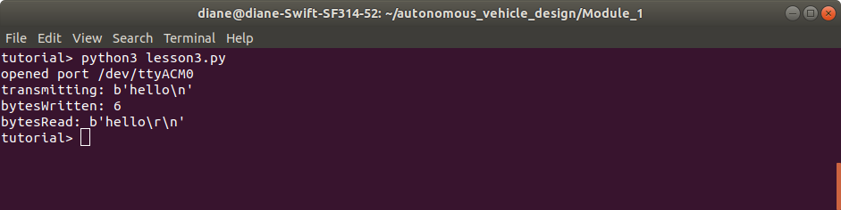

## ## Lesson 3 - python transmits and receives bytes to/from Arduino

Objectives
- Learn how to use pySerial write function 
- Observe behavior that python program must sleep before establishing contact with Arduino
- Learn how to use Arduino  Serial.readStringUntil function

 
 

### Arduino Source Code - lesson3.ino

Description
- The program Serially receives a message from a python program and then echos back the data read 
- The Serial.readStringUntil(terminator) function reads from the serial buffer until the terminator character is found. The terminator character is discarded from the serial buffer.

Instructions
- Upload the code to the Arduino. 
- Open the Arduino serial monitor, set the correct baud rate, type some input text and press the enter key or Send button. Make sure Newline is chosen in the dropdown box, so that the newline character is added to the end of the input text.
    - You should see the Arduino program echoing your input.
- Close the serial monitor program. (The python program cannot connect while the serial monitor program is open.)

 
 

### python source code - lesson3.py

Description
- The program opens the serial connection to the Arduino. The path "/dev/ttyACM0" is hard-coded in the program. If your path differs, change it before running the program. Note the baud rate is 38400, not the default 9600.
- The program waits for 2 seconds before transmitting data to the Arduino. When python connects to the serial port, the Arduino is reset. If not allowed enough time, the Arduino will not receive the python transmitted message. 
- Note that the transmitted byte array is terminated with '\n' because the Arduino program is looking for this terminating character to signal the end of the message.
- The program then waits to receive the same data back from the Arduino
- The serial connection is closed and the program terminates.

Instructions
- Run the program by typing `python3 lesson3.py` in a terminal command line.
- Study the program and its output. 

 

**Output**

> The program output is shown below. 
 

 
 

**Summary**

> This lesson illustrated how to send data from python to Arduino. Lesson 5 will introduce how to send multiple transmissions from python to Arduino. The python program will require an infinite loop. When running a program with an infinite loop, one of the only ways to stop it is by pressing CTRL+C. That stops the program, but it does not let the program exit gracefully, by performing necessary tasks such as closing the open port connection. Lesson 4 will teach you how to handle a CTRL+C signal interrupt before integrating that into lesson 5.
