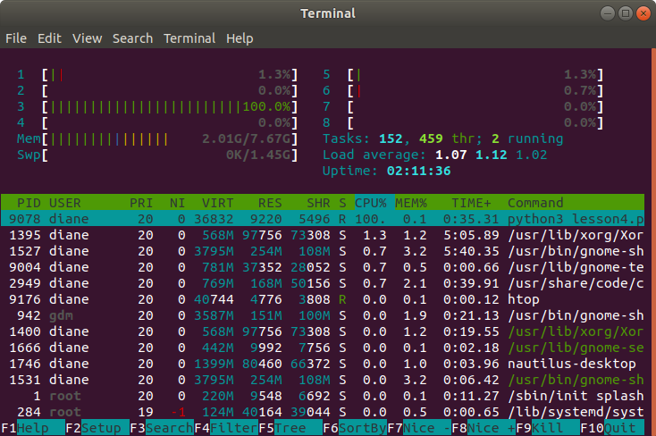

## Lesson 4 - Catching SIGINT

### Introduction

We need a method to gracefully terminate long-running software applications with CTRL+C keystroke event. When the user presses CTRL+C, this generates a keyboard interrupt signal call SIGINT (signal interrupt). In this lesson, we will learn how to use the singal library to catch SIGINT and take the appropriate action.

### Catching Signals
> To catch a signal in python, we need to register the signal for which to listen and specify what function is called when that signal is received. The example below shows how to catch a SIGINT and exit gracefully.

```
from signal import signal, SIGINT
from sys import exit 

def handler(signal_received, frame):
    # handle clean up actions here
    print('SIGINT or CTRL-C detected. Exiting gracefully')
    exit(0)


if __name__ == '__main__':
    # register the signal handler
    # tells python to run the handler() function when SIGINT is received
    signal(SIGINT, handler)

    print('Running, press ctrl-c to exit')
    while True:
        # do nothing and use cpu resources until SIGINT received
        pass

```


### Instructions

- Run the program `python3 lesson4.py`
- Open another terminal window and type `htop` to view cpu usage. You will see 100% cpu usage by the infinite loop.
    - You may need to install htop first: `sudo apt-get install htop`
- Type ctrl+c to end the program.

<br>

#### htop output

htop is a system monitoring utility. The image below shows 100% cpu usage for the process thread running lesson4.py.

 

<br>

#### lesson 4 output

 

<br>
