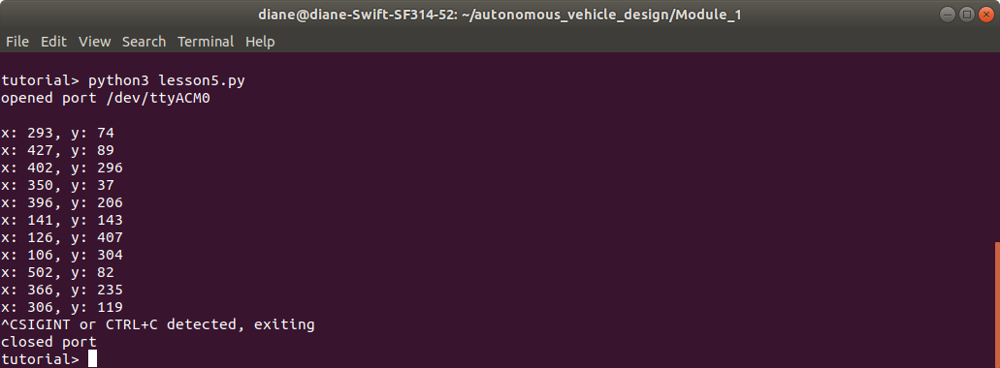

## Lesson 5 - Arduino transmits random xy values to python

Objectives
- Learn how to use Arduino timers to execute tasks with different delay intervals
- Learn how to use delimiters to transmit and extract data
- Learn how to add signal handler to python program running an infinite loop

 
 

### Arduino Source Code - lesson5.ino

Description
- The program performs two tasks:
    - blink an LED every 500 ms
    - transmit random x, y values every 300 ms
- Delimiters
    - The colon is used to delimit the x and y values
    - The newline character is used to mark the end of transmission

Instructions
- Upload the code to the Arduino. 
- Open the Arduino serial monitor, set the correct baud rate, and view the form of the data transmitted.
- Close the serial monitor program. (The python program cannot connect while the serial monitor program is open.)

 
 

### python source code - lesson5.py

Description
- The program opens the serial connection to the Arduino. The path "/dev/ttyACM0" is hard-coded in the program. If your path differs, change it before running the program.
- A signal handler function is registered to handle Ctrl+C terminating the program.
- An infinite while loop reads serial data received and extracts the x,y integer values from the byte array.
- The program ends when Ctrl+C causes a signal interrupt, properly closing the serial port connection before terminating.

Instructions
- Run the program by typing `python3 lesson5.py` in a terminal command line.
- Study the program and its output. 

 

**Output**

> The program output is shown below. 
 

 
 

**Summary**

> This lesson illustrated how to send multiple data values from Arduino to python. Encoding the message with delimiters aids in extracting the received information. The Serial.print functions were used to transmit data as ASCII characters. The delimiters were necessary as the length of x and y values varied from 1 to 3 digit values.
> The lesson combined signal interrupt handling with an infinite loop, allowing the program to exit gracefully, closing the serial connection before terminating.
