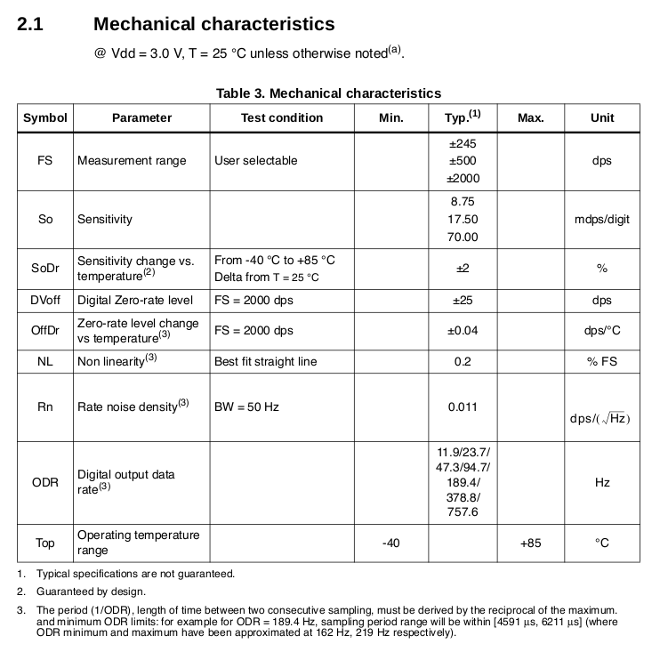
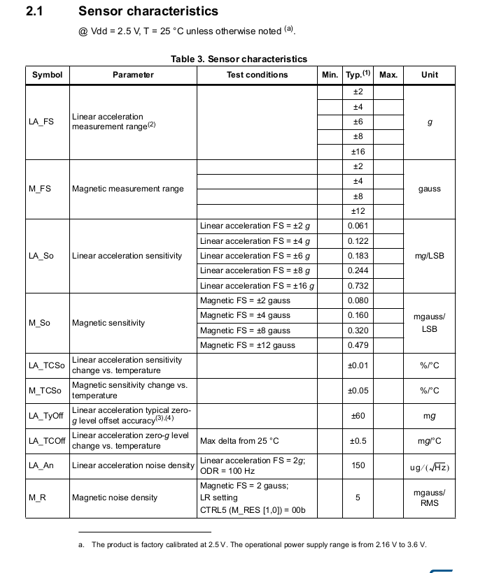

# Interial Measurement Unit Sensors

An inertial measurement unit (IMU) is a device that measures and reports a body's force, angular rate, and orientation, using a combination of accelerometers, gyroscopes, and magnetometers. The accelerometers detect linear acceleration. Gyroscopes measure the rotational (angular) rate. Some IMUs include a magnetometer to provide a heading reference. 

 This module focuses on the ZumoShield Library examples using the LGD20H and LSM303D sensors as an inertial measurement unit. 

  

## LGD20H Three-Axis Gyroscope 

The L3GD20H is a low-power three-axis angular rate sensor. It includes a sensing element and an IC interface able to provide the measured angular rate to the external world through digital interface (I2C/SPI).

The sensor features a user-programmable gyro full-scale range of ±245, ±500, and ±2000 °/sec (dps).

Watch these excellent Brian Douglas videos to learn about the device operation and how to read the data sheets.

[Robotic Car - How to read Gyro Datasheets(part 1)](https://youtu.be/anMzEbbbrp8)

[Robotic Car - How to read Gyro Datasheets(part 2)](https://youtu.be/EOZX5MOUvhI)

## LSM303D Three-Axis Accelerometer and Three-Axis Magnetometer
and a user-programmable accelerometer full-scale range of ±2g, ±4g, ±8g, and ±16g. Additional features include an embedded temperature sensor and an on-chip oscillator with ±1% variation over the operating temperature range." [2]

