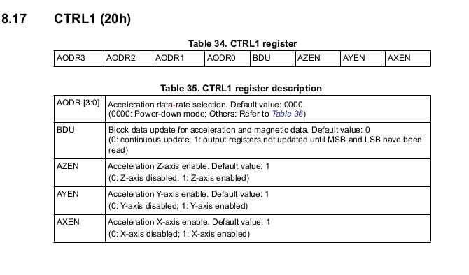
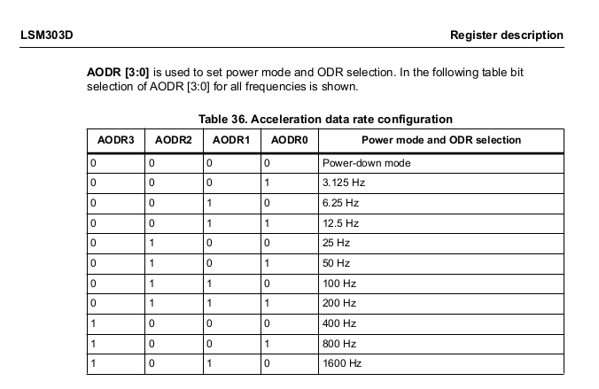
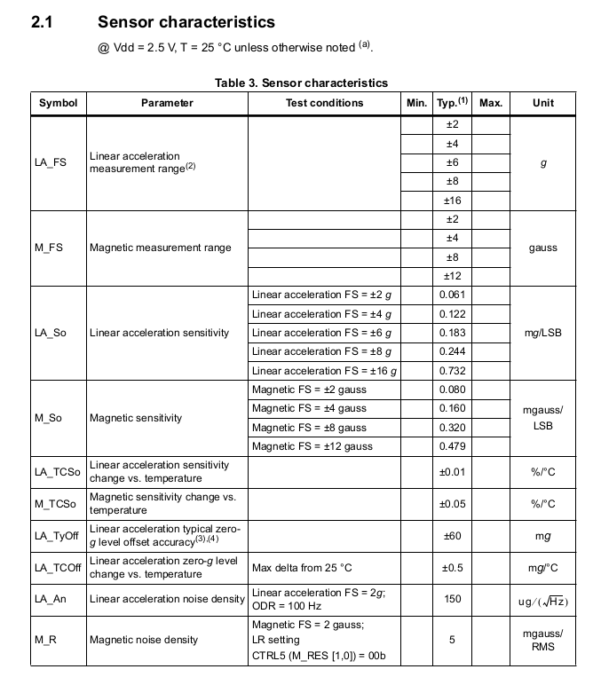

# ZumoIMU Functions

The ZumoShield Arduino library includes the ZumoIMU class, defined in ZumoIMU.cpp and ZumoIMU.h. This class is written to handle the following devices: LSM303D, L3GD20H, LSM6DS33, and LIS3MDL. Our Zumo for Arduino robots are version 1.2 which has the LSM303D (gyro) and L3GD20H (accel & magnetometer).

These sensors communicate with the Arduino using the I2C protocol, requiring use of the Arduino Wire library.

The class ZumoIMU provides a set of functions, allowing the user to easily extract data from these sensors. The user is not then responsible for the details of reading and writing the sensor registers, along with assembling the register data bytes into signed integer form.

Two example sketches: InertialSensors and TurnWithCompass, provide the user with examples reading the raw data measurements and configuring the magnetometer. When
writing your own sketch, the following setup actions are required. 

- Include the Wire and ZumoIMU header files
- Create an object of type ZumoIMU
- Initialize the Wire library and join the I2C bus as a master
- Call the ZumoIMU init function: This function attempts to read one byte from the whoami register to verify I2C communication is working. Returns true when successful, false when it fails to communicate with the sensor. 
- Upon initialization success, the enableDefaults() function performs the following for case ZumoIMUType::LSM303D_L3GD20H

   - Accelerometer Control Register 1, CTRL1 20h
      - Bits AODR[3:0] acceleration data rate selection are set to 50 Hz
      - Bit BDU block data update is set to 0 for continuous update of output registers
      - Bits AZen, AYen, AXen are set to 1 (enabled)  
      
   - Accelerometer Control Register 2, CTRL2 21h
      - Bits AF2[2:0] acceleration full-scale set to +- 2G

   - Magnetometer Control Register 5, CTRL5 24h
      - Bits M_RES = 11 (high resolution mode)
      - Bits M_ODR = 001 (6.25 Hz ODR)
   - Magnetometer Control Register 6, CTRL6 25h
      - BitsMFS = 01 (+/- 4 gauss full scale)
   - Gyroscope control register 1
      - Data rate 189.4 Hz
      - All axes enabled 
   - Gyroscoope control register 5
      - Full scale +/- 245 dps
</br></br>

  



```cpp
#include <Wire.h>
#include <ZumoShield.h>


void setup(ZumoIMU& imu)
{
  // Transmit error messages, data
  Serial.begin(9600);
  
  // Initialize the Wire library and join the I2C bus as a master
  Wire.begin();

  // Initialize IMU
  if (!imu.init())
  {
    // Failed to detect the sensors and communicate via I2C
    while(1)
    {
      Serial.println(F("Failed to initialize IMU sensors."));
      delay(100);
    }
  }

  /*  Accelerometer: 
   *   Sets data aquistion rate to 50 Hz
   *   enables all axes x,y,z
   *   
   *  Magnetometer:
   *   Sets data aquisition rate to 6.25 Hz
   *   enables all axes x,y,z
   *   
   *  Gyroscope:
   *    Sets data aquistion rate to 189.4 HZ
   *    enables all axes x,y,z
   */
  imu.enableDefault();
}


int main(void)
{
  ZumoIMU imu;
  ZumoIMU::vector<int16_t> aG = {0,0,0};
  setup(imu);

  while(1){
    // main processing loop
  }
  
}
```

</br></br>

## Scaling Raw Accelerometer Measurements to units of g

Table 3 below shows 0.061 mg/LSB for linear acceleration full-scale setting +/- 2g. LSB refers to the raw data measurement values. These values are acquired with a 16-bit ADC (analog to digital converter). Signed 16-bit binaray represents decimal (base 10) values in the range -32768 to +32767.

Mapping the range -2g, +2g to -32768,+32767 gives a LSB value of 16384 for 1g.

(2g - 0g)/2 = 1g 
(32767-0)/2 = 16383.5  

Thus, 16384 is approximately 1g.

Using the data sheet scale factor 0.061 mg/LSB: 
(16384 LSB) * (0.061 mg/LSB) * (1/1000 g/mg) = 0.999474 g


### Data Sheet, Table 3, Sensor Characteristics


