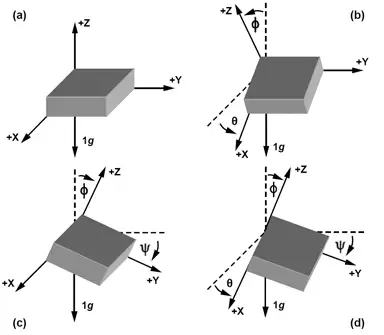
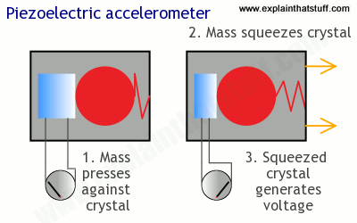
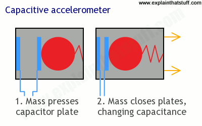
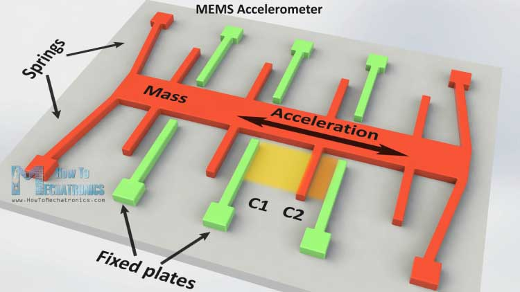
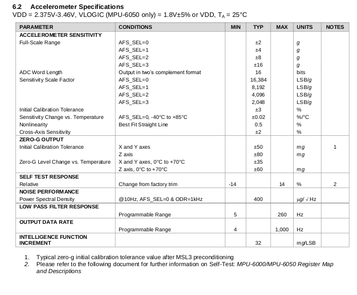

# Guide to Acclerometers

## What is an accelerometer?

An accelerometer is an electromechanical device that will measure acceleration forces. These forces may be static, like the constant force of gravity pulling at your feet, or they could be dynamic - caused by moving or vibrating the accelerometer.
 

## What are accelerometers useful for?

- Static acceleration provides orientation with respect to ground, measured by gravity
- Dynamic acceleration tells us how the device is moving.

[1](https://www.digikey.com/en/articles/techzone/2011/may/~/media/Images/Article%20Library/TechZone%20Articles/2011/May/Using%20An%20Accelerometer%20for%20Inclination%20Sensing/TZS111_Using_An_Fig_12.jpg)   

## What is acceleration?

Acceleration is defined as the change in velocity over time. Measuring acceleration in this manner requires knowledge of velocity and a time interval for measurement.

Newton's second law of motion defines acceleration, with requiring time to elapse. Force = mass * acceleration. Acceleration is the amount of force needed to move each unit of mass.
  

## How do accelerometers work?

- In general, they measure force by sensing how a mass presses on something when a force acts on it.
    - Piezoelectric effect - microscopic crystal structures, stressed by accelerative forces, cause a voltage to be generated. 

     [2](https://cdn4.explainthatstuff.com/capacitive-accelerometer.png)   

    - Change in capacitance - If you have two microstructures next to each other, they have a certain capacitance between them. If an accelerative force moves one of the structures, then the capacitance will change. Add some circuitry to convert from capacitance to voltage, and you will get an accelerometer. 

     [3](https://cdn4.explainthatstuff.com/capacitive-accelerometer.png)   

    **MEMS Accelerometer**

    It measures acceleration by measuring change in capacitance. Its micro structure looks something like this. It has a mass attached to a spring which is confined to move along one direction and fixed outer plates. So when an acceleration in the particular direction will be applied the mass will move and the capacitance between the plates and the mass will change. This change in capacitance will be measured, processed and it will correspond to a particular acceleration value.

     [4](https://howtomechatronics.com/wp-content/uploads/2015/11/MEMS-Accelerometer-How-It-Works.jpg)
 
 
 
## Considerations when choosing an accelerometer

<b>Accelerometer Type - Capacitive MEMS, Piezoelectric, or Piezoresistive</b> - Generally a capacitive MEMs accelerometer is best for motion sensing applications, where the motion is relatively slow/low frequency. Human motion and robot motion fit this category. Piezoelectric is best for vibration; and piezoresistive is best for shock testing.

<b>Analog output versus digital output</b> - This is determined by the hardware interface with the accelerometer. Analog style accelerometers output a continuous voltage proportional to acceleration. Digital output is usually a pulse width modulation, with duty cycle proportional to acceleration. For hardware with analog input capability, choose the analog style. For hardware with only digital inputs, choose the digital style. Digital style requires using timing resources to measure the duty cycle and performing additional computation operations.

<b>Number of axes</b> - For most projects, two is enough. However, if you want to attempt 3d positioning, you will need a 3 axis accelerometer, or two 2 axis ones mounted at right angles.

<b>Measurement Range</b> - The level of acceleration supported by the sensor's output signal specifications, typically specified in +-g. This is the greatest amount of acceleration the part can measure and accurately represent as output. For example, the output of a +-2g accelerometer is linear up to +-2g. If it is accelerated at 3g, the output may rail.

If you only care about measuring tilt using earth's gravity, a ±1.5g accelerometer will be more than enough. If you are going to use the accelerometer to measure the motion of a car, plane or robot, ±2g should meet requirements. For a project that experiences very sudden starts or stops, you will need one that can measure ±5g or more.

<b>Sensitivity</b> - The ratio of the change in acceleration (input) to the change in the output signal. Sensitivity is specified at a particular supply voltage and is typically expressed in unit of mV/g for analog-output and LSB/g for digital-ouput. Sensitivity due to temperature change is generally specified as a % change per &deg;C. 

Generally speaking, the more sensitivity the better. This means that for a given change in acceleration, there will be a larger change in signal. Since larger signal changes are easier to measure, you will get more accurate readings.

<b>Bandwidth</b> - Bandwidth information indicates if the accelerometer can measure slow or static accelerations and defines the upper frequency limit where the accelerometer will still be accurate. In  digital-output accelerometers, this defines the rate at which data is sampled. Bandwidth is the highest frequency signal that can be sampled without aliasing. In analog-output accelerometers, bandwidth is defined as the signal frequency at which the response falls to -3 dB of the response to low-frequency acceleration.
  

### MPU 6050 Accelerometer Specifications   

 
