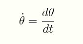
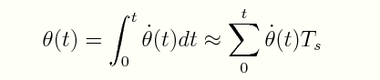

# Calculating Angular Orientation with Gyroscope Data

In this lesson we explore approximating the sensor's angular position using only the gyroscope rate data. The advantage of gyros is that they are not susceptible to vibration as much as the acceleromters. Note that while the gyros do not have the noise problem seen in the accelerometers, we now have a new problem that the gyros are susceptible to long term drift.  
</br></br>

## The Math

The gyroscope measures the rate of change of angular position over time, angulary velocity, in units of [deg/s]. This is the derivative of angular position with respect to time.</br></br>



</br></br>

The angular position is estimated by integrating the angular velocity. We assume some initial value for &theta at time t = 0 and find the angular position at any moment t with the equation below.



</br></br>

Integration in a digital system is calculated by summing a finite number of samples taken at a constant interval T<sub>s</sub>, aka the sampling period. This approximation method introduces error. When the data changes faster than the sampling frequency, it will not be detected, making the integral approximation incorrect. This error is called *drift*, as it increases in time. It will result in the sensor reading not returning to zero when the sensor is at rest. 

Generally, higher sampling frequencies produce better estimates. The sampling frequency is dependent the sensor configuration and the software program's computational speed.</br></br>

## Arduino - gyroAngleEstimate.ino

The program approximates the integration by multiplying the angular rate [deg/s] times the elapsed sample time period and then add the product to the sum. The code below show the x axis calculations.</br>

gyroRate.x is the sensor measurement, adjusted for the offset. It is an integer type, cast to a double to retain decimal information. It is scaled by its sensitivity value to put it in the form of deg/s. Multiplying by the elapsed sample time period, scaled to seconds produces the change in angular position over the time interval, deltaPosition. This change is then added to the summation variable gryoPosition, which is the approximated integral of all previous values. The same calculations are performed for y and z.</br></br>

```cpp
// scale the data to deg/s and calculate change in position
deltaPosition.x = (double)gyroRate.x / 134.0 * elapsedTimems / 1000.0;

/* or use data sheet 8.75 mdps/digit
    deltaPosition.x = (double)gyroRate.x (8.75/1000.0)* elapsedTimems / 1000.0;
*/
gyroPosition.x += deltaPosition.x;
```

Run the program with the unit in a static position. Are the angular positions fairly accurate? Begin moving the board around to watch the positions change. When the board is static again, you will likely see some drift error in x and y, with significant drift error in z.

To achieve an accurate yaw (z-axis rotation) orientation, an additional sensor, such as a magnetometer is often used.</br></br>

## Next lesson

In the next lesson, we will use both the accelerometer and gyroscope data to achieve a better position estimate.  
