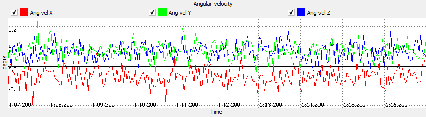
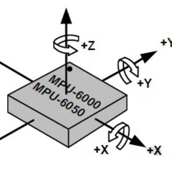
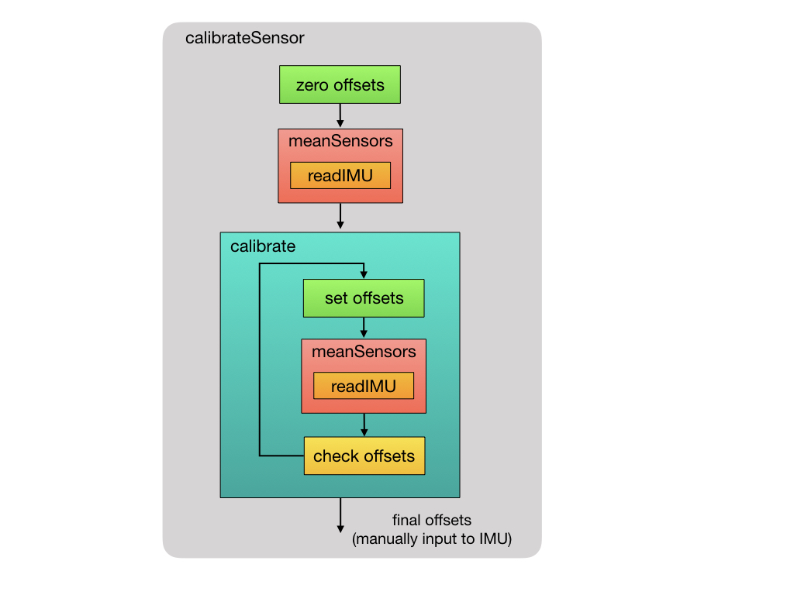

# Calculating Sensor Bias Offset

When an inertial sensor is at rest, there is often a small offset difference from the expected zero measurement values. This offset is known as sensor bias. The image below shows measurements from a gyroscope at rest, illustrating this device's sensor bias.



## Sensor Bias  

Sensor bias is caused by changes in physical properties over time. The physical property of each sensor is different, so they must each be individually calibrated to correct for the bias. Because the bias changes over time, sensors must be regularly calibrated.</br></br>

### Gyro Bias Offset  

The bias of a rate gyro is the average output when the device is sitting still. When the gryo is not moving, we expect its output to be zero (i.e. rotation is 0 degrees/sec). However, there is often a small offset in the average signal output, which is known as sensor bias. </br></br> 

You can find the constant bias (offset) error of a gyro by taking the average of the output over a long period of time while the device is not rotating. Once you know the constant bias you can subtract it from subsequent measurements to eliminate this form of error.

### Accelerometer Bias Offset  

The accelerometer bias is calculated by placing the device on a flat surface, where it measures 0g on the X and Y axis and +1g on the Z axis. The offset is calculated in the same manner, by taking the average of the output over a long period of time while the device is not moving.</br></br>


</br></br>

## Calculating the Offset Biases 

Place the sensors on flat surface in a level position. With the Z-axis pointing into the flat surface, the expected accelerometer measurement is 16384 (1g). The expected accelerometer X and Y axis measurements are zero. The device must be stationary so that the expected gyro output of each axis will be zero.  

Sampling measurements from each axis, we will be able to determine the average offset from the ideal values and use those average values as the offset biases.

### Simple Average Method

Collect a sample of accelerometer and gyro measurements. Find the average values of the sampled measurements and use these average values of the bias offset. How many samples? That will require some experimentation with your sensor to determine if 100, 250, 500, or some other amount produce better performing offsets.

**Algorithm**

- Read and store n samples of ax, ay, az, gx, gy, gz values
- Calculate the average values of ax, ay, az, gx, gy, gz values
- Calculate each offset as the difference between the expected value and the average value
</br></br>

**Applying Offset**

Now that you have the offset values, apply them to sensor data measurements.  

Example: offsetCorrectedAX = ax + axBiasOffset

Compare the results over a large number of samples. Do the bias offset adjusted values produce results closer to the expected values?</br></br>


## Acceptable Error

How many samples do we need to determine the offset bias? Suppose we choose 1000 samples and calculate average offset values. What is the error of these offset values?  Are these errors acceptable? What is our acceptable error level? 

Let's assume the accelerometer and gyroscope are set to their most sensitive configuration of +-2g (16384 LSB/g) and +-245 &deg;/sec (134 LSB/&deg;/sec). For the gyro, is 1 &deg;/sec acceptable? Integrating angular rotation for one axis, with an error of 1 &deg;/sec might result in an error of 60 degrees. Is 0.1 &deg;/sec acceptable? Over 60 seconds, that's a much smaller error of 6 degrees, but that error only continues to grow over time.

Realistically, we cannot reduce the bias error to zero, but let's see how small a value we can achieve. We will use the calibration process Luis Rodenas implemented in his MPU6050_calibration.ino program. (https://github.com/ezgode/Arduino_MPU6050/blob/master/Ardu_Sketches/MPU6050_calibration/MPU6050_calibration.ino) This example is widely referenced as a working calibration method for the MPU6050. Let's see how well it works for our sensors.


```
int accel_deadzone=8;    // Acelerometer error allowed, make it lower to get more
                         // precision, but sketch may not converge 

int gyro_deadzone=1;     // Gyro error allowed, make it lower to get more precision, 
                         // but sketch may not converge 
```

The errors are based on sampling measurements with the accel and gyro configured at their most sensitive configurations of +-2g (16384 LSB/g) and +-245 &deg;/sec (134 LSB/&deg;/sec), respectively.</br>

> Note: The 16-bit ADC (analogy to digital converter) provides 65636 (2<sup>16</sup>) unique binary combinations. Therefore the range of +/-2g can be mapped to -32768 to +32767. Looking at have the range and bit resolution, there are 32768 bits used to represent 0g to 2g. (2g-0g)/2 = 1g and (32768 LSB/2) = 16384. Thus, 16384 approximates to 1g.

> Similarly, 0 to 245 deg/sec can be scaled to LSB by 32768 LSB / 245 deg/sec = 134 LSB/deg/sec  

- 8/16384 is approximately 0.00049 g
- 1/134 is approximately 0.0075 &deg;/sec</br></br>

## Converge to Acceptable Error Calibration Algorithm

The image below illustrates the calibration process.</br></b>

 [2](http://mjwhite8119.github.io/Robots/assets/images/Control-Theory-Slides.025.jpeg)
</br></br>

- **meanSensors algorithm**
  - Loop until n measurements have been read and summed
    - Example: let n = 500, axsum = 0, aysum = 0, azsum = 0, gxsum = , gysum = 0, gzsum = 0
    - while loopCount < n:
      - axsum = axsum + axDataMeasurement
      - aysum = aysum + ayDataMeasurement
      - azsum = azsum + azDataMeasurement
      - gxsum = axsum + gxDataMeasurement
      - gysum = aysum + gyDataMeasurement
      - gzsum = azsum + gzDataMeasurement
  - calculate the average offset values
    - axavg = axsum / n
    - ayavg = aysum / n
    - azavg = azsum / n
    - gxavg = gxsum / n
    - gyavg = gysum / n
    - gzavg = gzsum / n
  - return the average values</br></br>

- **Converge to Acceptable Error Calibration**
  - Create a data structure or variables to store the cumulative offset values and initialize to zero.
    - axCumOffset = 0, ayCumOffset = 0, azCumOffset = 0, gxCumOffset, gyCumOffset, gzCumOffset
  - Create constants for the expected values
    - axExpectedValue = 0, ayExpectedValue = 0, azExpectedValue = 16384, gxExpectedValue = 0, gyExpectedValue = 0, gzExpectedValue = 0

  - perform meanSensors routine (shown above)
    - Read n measurements
    - calculate and return the average offset values
  - check offsets
    - intialize variable totalCalibrated to zero
    - Compare the newly found average offset values to the required offset tolerance for each sensor measurement: ax, ay, az, gx, gy, gz
      - if the absolute value(newly calculated mean) is less than or equal to the deadzone error tolerance, add 1 to totalCalibrated
        - Example: if (abs(axExpectedValue - axavg) <= accel_deadzone)
          - totalCalibrated = totalCalibrated + 1
      - else update the offset value
        - updated offset = previous offset + (desired measurement value - mean offset) / deadzone
          - Example: axCumOffset = axCumOffset + (axExpectedValue - axavg) / deadzone
    - continue the calibration processs until the offset values converge to the desired tolerance, i.e. the totalCalibrated equals six.</br></br>

- **Final Offset Values**
  - Store the final offsets value calculated in an appropriate data structure or variable
  - Record the final offset values. The calibration process takes some time to complete. You will not want to run this every time your robot restarts. Recording and storing the offset values in your programs will allow you to apply the offsets in your other robotic application programs without recalibrating.  
</br></br>

## Sensor Configuration Settings

**Accelerometer Configuration** - Set the full scale range to +- 2g, its most sensitive range. The self-test bits should be turned off.

**Gyroscope Configuration** - Set the full scale range to +- 250&deg;/sec, its most senstive range. The self-test bits shoud be turned off.</br></br>

## Calculating Mean Offset Values - Discarding Measurements

1. Read 100 measurements and disregard them
2. Read 1000 measurements and calculate their sum. Don't forget to wait between readings to ensure you are not reading the same value multiple times. The delay is based on the sensor's sample rate configuration.
3. Find the mean value of the sample by dividing the sum by 1000.

<p>It is a common practice to read and throw away several measurements, such as the first 100, to allow the device to stabilize. Why 100? Internet forum & blog posts advise this. In terms of credible advice, the MPU-6050 has been on the market for several years and widely used, making it a good starting point.</p> 

<p>Is there anything in the device data sheets or register descriptions that supports this? Not that I have directly found.</p>
</br></br>

## Error Tolerance Declaration

The routine's objective is to converge to a set of offset values that converge to an acceptable error tolerance. Earlier, we defined the followed as acceptable error levels:</br>

- 8/16384 is approximately 0.00049 g </br>
- 1/131 is approximately 0.0076 &deg;/sec</br>

In practice, when testing the algorithm, make the error tolerances larger, so that the algorithm will converge fairly quickly. Once your code is converging, then begin making the tolerance smaller to find an acceptable error level that converges to a solution.
</br></br>

## Offset Calculation

- Offset = Desired Value - Mean Measured Value</br>
    Example: Gyro X axis desired value is 0 deg/sec
    Gyro X axis mean measured value is 87
    Offset = 0 - 87 = -87

</br></br>

## Student Exercise

Implement and test both calibration methods described above.
