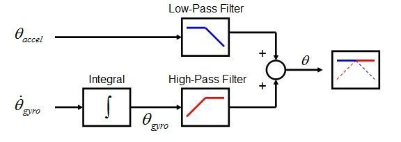

# The Complementary Filter

We have learned that accelerometer is a good indicator of orientation in static conditions and the gyroscope is a good indicator of tilt in dynamic conditions.

The accelerometer measures all forces acting on the robot. The gravity vector provides pitch and roll orientation, but other forces acting on the sensor create disturbances in this data. The accelerometer angle is noisy in the short term. Applying a low pass filter averages out the noise due to movement.  

The gyroscope provides accurate data over a short time interval and is less susceptible to external forces. Over time, the integration estimate causes drift, not returning to zero when a system is back to its original position. Drift is considered a dc error, or slow changing value that can be removed by a high pass filter.

The complementary filter allows us to combine the accelerometer and gyroscope data into a more reliable estimate of pitch and roll. It favors the gyroscope input over the short term and the accelerometer estimate over the long term.  

## Complementary Filter  

A complementary filter consists of two filters that complement each other, a high-pass filter and a low-pass filter. The signal flow diagram below shows the filtered angle &theta; is the sum of the low-pass filtered accelerometer angle &theta;accel and the high-pass filtering of the integrated gyro angle &theta;dotgyro * &delta;t.

The general form is &theta;[n] = &alpha; * (&theta;[n-1] + &theta;dotgyro[n] * &delta;t ) + (1-&alpha;) (&theta;accel [n])

&alpha; is the scaling factor

To understand how the complementary filter acts as both a low-pass and high-pass filter, let's examine its behavior in two different cases:
- gyroscope is in static steady state
- accelerometer is in static steady state

### How does the Complementary filter act as a Low-pass Filter?

The complementary filter formula: &theta;[n] = &alpha; * (&theta;[n-1] + &theta;dotgyro[n] * &delta;t ) + (1-&alpha;) (&theta;accel [n])

Assume the gyroscope reading is zero, steady state, then the complementary filter formula reduces to 

&theta;[n] = &alpha; * (&theta;[n-1] ) + (1-&alpha;) (&theta;accel [n])

This is the same as the general form of the low-pass filter, previously studied:

y[n] = (1-&alpha;) x[n] + &alpha; y[n-1] 

x is the sensor input data 
y is the filtered output

Conclusion: when the gyroscope is removed from the complementary filter equation, we see the filter acts as a low-pass filter for the accelerometer data.
 
 

**Time Constant**

The time constant &Tau; approximately equals (&alpha; * &delta;t)/(1-&alpha;) where &delta;t is the sampling period.

How does the time constant relate to noise?

Example: Assume the sampling frequency is 100 Hz, &delta;t = 10 ms and &alpha; = 0.8, the time constant is 40 ms. Noise shorter than 40 ms duration will be removed.
 
 

## How does the Complementary filter act as a High-pass Filter?

The complementary filter formula: &theta;[n] = &alpha; * (&theta;[n-1] + &theta;dotgyro[n] * &delta;t ) + (1-&alpha;) (&theta;accel [n])

Assume the accelerometer is in a static steady state, its values are zeros.
Remove the accelerometer zero values from the complementary filter equation, leaving only the effect of the gyroscope signal. 

&theta;[n] = &alpha; * (&theta;[n-1] + &theta;dotgyro[n] * &delta;t ) 

The general form of a high-pass filter equation is y[i] = &alpha; y[i-1] + &alpha; (x[i] - x[i-1])

where y is the filtered output and x[i] - x[i-1] is the change in input. The integration &theta;dotgyro[n] * &delta;t is the gyro displacement, the equivalent to the x[i] - x[i-1] term.

Conclusion: when the accelerometer is removed from the complementary filter equation, we see the filter acts as a high-pass filter for the gyroscope data.
 
 

**&alpha; value**

The &alpha; value is usually large, 0.70 to 0.98, allowing the large gyro displacement values to have a short term effect on the angle estimation. The smaller weight on the accelerometer data has a longer term effect of adding a small amount of the accelerometer angle, ensuring there is less drift in the measurement.

## Student Exercise - Implement and test the complementary filter