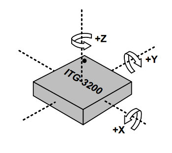
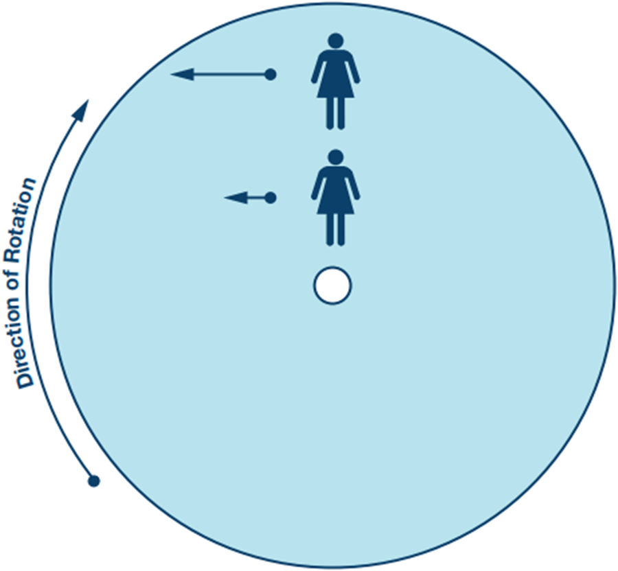
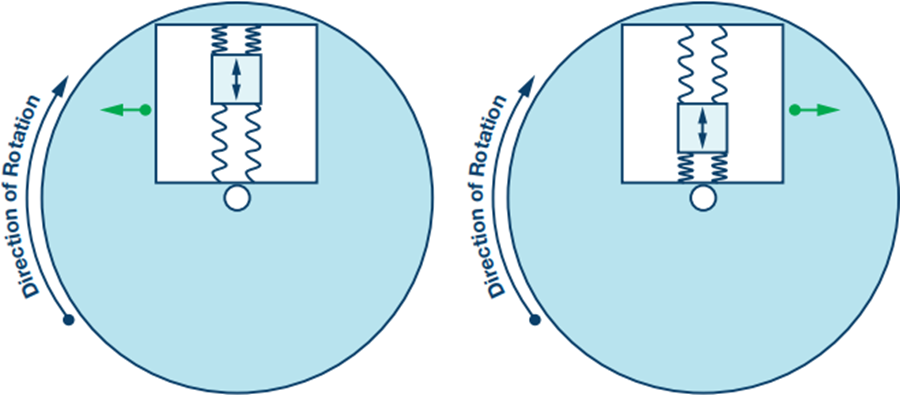
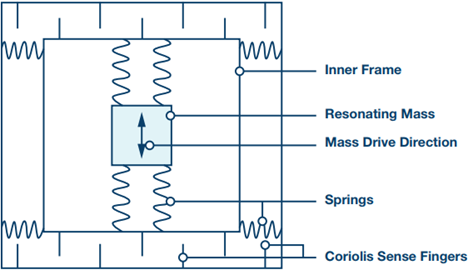
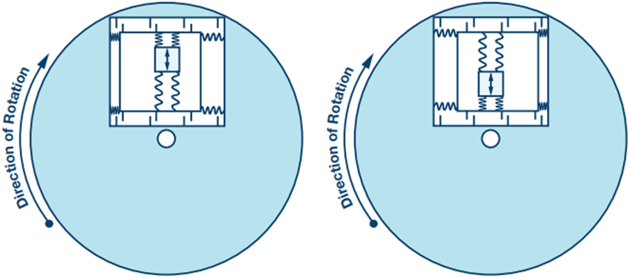
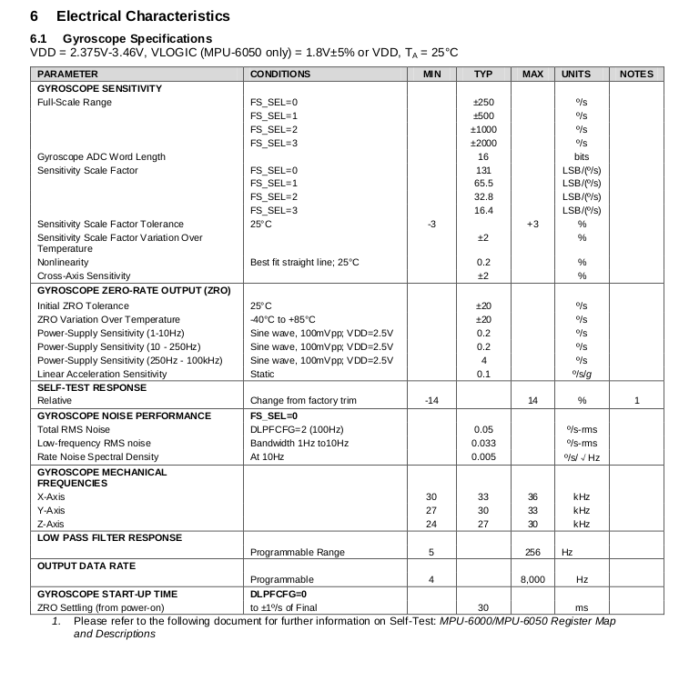

## What is a Gyroscope?

Gyroscopes, or gyros, are devices that measure or maintain rotational motion. MEMS (microelectromechanical system) gyros are small, inexpensive sensors that measure angular velocity. The units of angular velocity are measured in degrees per second (°/s) or revolutions per second (RPS). Angular velocity is simply a measurement of speed of rotation.

A gyroscope sensor can be used to determine orientation.  They are found in most autonomous navigation systems. For example, if you want to balance a robot, a gyroscope can be used to measure rotation from the balanced position and send corrections to a motor.

## How a gyroscope works

The gyroscope measures angular rotation about a fixed axis. A triple axis MEMS gyroscope can measure rotation around three axes: x, y, and z. Gyros are used to measure objects that do not spin too fast, but instead rotate a few degrees on each axis.

  

MEMS gyroscopes measure angular rate by means of Coriolis acceleration. The Coriolis effect can be explained as follows, see figure below. Consider yourself standing on a rotating platform, near the center. Your speed relative to the ground is shown as the blue arrow lengths. If you were to move to a point near the outer edge of the platform your speed would increase relative to the ground, as indicated by the longer blue arrow. The rate of increase of your tangential speed, caused by your radial velocity, is the Coriolis acceleration.
  

[2](https://www.analog.com/-/media/analog/en/landing-pages/technical-articles/mems-gyroscope-provides-precision-inertial-sensing/figure1.png?w=900&la=en)   

If Ω is the angular rate and r is the radius, the tangential velocity is Ωr. So if r changes at speed v there will be a tangential acceleration Ωv. This is half of the Coriolis acceleration. There is another half from changing the direction of the radial velocity giving a total of 2Ωv. If you have a mass (M), the platform must apply a force—2MΩv—to cause that acceleration, and the mass experiences a corresponding reaction force. The gryscope takes advantage of this effect by using a resonating mass analogous to the person moving out and in on a rotating platform. The mass is micromachined from polysilicon and is tethered to a polysilicon frame so that it can resonate only along one direction.

The figure below shows that when the resonating mass moves toward the outer edge of the rotation, it is accelerated to the right and exerts on the frame a reaction force to the left. When it moves toward the center of the rotation it exerts a force to the right, as indicated by the green arrows.
  

[3](https://www.analog.com/-/media/analog/en/landing-pages/technical-articles/mems-gyroscope-provides-precision-inertial-sensing/figure2.png?w=900&la=en)  

To measure the Coriolis acceleration, the frame containing the resonating mass is tethered to the substrate by springs at 90° relative to the resonating motion, as shown below. This figure also shows the Coriolis sense fingers that are used to sense displacement of the frame through capacitive transduction in response to the force exerted by the mass.
  

[4](https://www.analog.com/-/media/analog/en/landing-pages/technical-articles/mems-gyroscope-provides-precision-inertial-sensing/figure3.png?w=900&la=en)  

The figure below shows the complete structure, demonstrates that as the resonating mass moves and as the surface to which the gyroscope is mounted rotates, the mass and its frame experience the Coriolis acceleration and are translated 90° from the vibratory movement. As the rate of rotation increases, so does the displacement of the mass and the signal derived from the corresponding capacitance change. It should be noted that the gyroscope may be placed anywhere on the rotating object and at any angle, so long as its sensing axis is parallel to the axis of rotation
  

 [4](https://www.analog.com/-/media/analog/en/landing-pages/technical-articles/mems-gyroscope-provides-precision-inertial-sensing/figure4.png?w=900&la=en)  

## How to Select a Gyro

### Range

The measurement range, or full-scale range, is the maximum angular velocity that the gyro can read.

### Sensitivity

The sensitivity is measured in mV per degree per second (mV/°/s). Don’t let the weird dimension of this value scare you. It determines how much the voltage changes for a given angular velocity. For example, if a gyro is specified with a sensitivity of 30mV/°/s and you see a 300mV change in the output, you rotated the gyro at 10 °/s. A good rule to remember: as the sensitivity increases, the range decreases.

### Bias

As with any sensor, the values you measure will contain some amount of error or bias. You can see gyro bias by measuring the output when the gyro is still. Though you’d think you would see 0° when the gyro is still, you will always see a slight non-zero error in the output. These errors are sometimes called bias drift or bias instability. The temperature of the sensor greatly affects the bias. To help minimize the source of this error, most gyros have a built in temperature sensor. Thus, you are able to read the temperature of the sensor and correct or any temperature dependent changes. In order to correct for these errors, the gyro must be calibrated. This is usually done by keeping the gyro still and zeroing all of the readings in your code.

 
 

### MPU 6050 Accelerometer Specifications   

 
