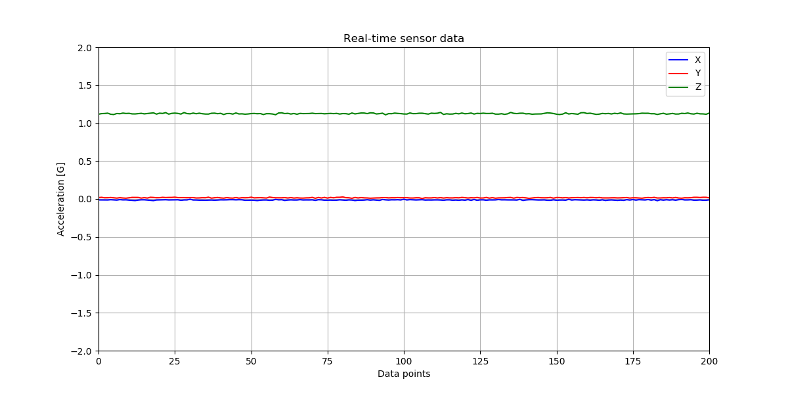
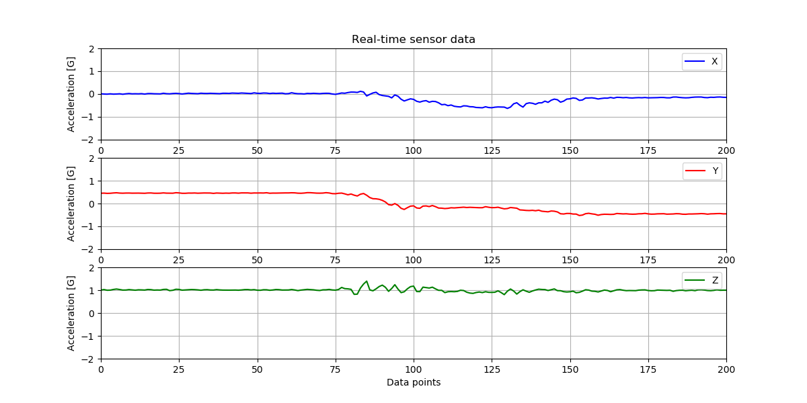

# Real-time Plotting

In this example, the Arduino will be transmitting accelerometer measurements to a python program for plotting. Plotting real-time data has challenges regarding the amount of data and continually redrawing the plot for new data.  

The amount of data depends on the sampling rate and program run-time. If the accelerometer data is sampled at 1 kHz, that's 1000 data points to plot over a one second time interval. How should the python program handle that? Does it keep appending received data and trying to redraw the plot at 1 kHz?  

When trying to visualize data in real-time, we are usually concerned with current data. Past data is valuable for logging and later analysis. We will plot only the most recent measurements.</br>
</br>

## Arduino Sketch - txAccelPrint.ino

The [sketch](./txAccelPrint/txAccelPrint.ino) serially transmits accelerometer x, y, and z measurements at a rate of 10 Hz, sample interval 100 ms. The accelerometer data is not calibrated or scaled. The python program scales the measurements to units of g when plotting.</br>

### What baud rate should we use for serial transmission?

1. What data is transmitted?</br>
    Accelerometer x, y, z values separated by ',' characters with a carriage return and line feed after z.

2. What is the worst case for number of bits per transmission?

    The accelerometer values' data type is int16_t, range: -32768, 32767. Using Serial.print to transmit data as ASCII characters, the worst case for an accelerometer value is six characters for -32768.

    Note that each character is one byte.

    Worst case transmission: x,y,z\r\n  
    3 values (xyz) * 6 characters/value + 2 comma characters + 1 carriage return character + 1 newline character = 22 characters

    Serial settings: 8 data bits, 1 start bit, 1 stop bit, 0 parity bit = 10 bits/character.

    22 characters * 10 bits/character = 220 bits  


3. What are the per second transmission time requirements?

    Sample interval is 0.10 seconds, sample frequency is 1/.1 = 10 Hz

    Require 220 bits / sample * 10 samples / sec = 2200 bits /second.

**Baud rate** must be greater than 2200  bits/second.
</br></br></br>

## python - plotAccel.py

The python program [plotAccel.py](plotAccel.py) receives the data and plots the last 200 data points received, about 20 seconds of data.</br></br>

### Importing Library Modules

The following libraries are used:

```python
import serial
import numpy as np
from matplotlib import pyplot as plt
from matplotlib import animation
```

### Creating a Figure Window

```python
fig = plt.figure(figsize=(12, 6))
```

The code above creates a new figure window 12 inches wide and six inches tall. The matplotlib.pyplot.figure method prototype is shown below. The two parameters of interest are num and figsize.

>matplotlib.pyplot.figure(num=None, figsize=None, dpi=None, facecolor=None, edgecolor=None, frameon=True, FigureClass=<class 'matplotlib.figure.Figure'>, clear=False, **kwargs)[source]

</br>

**num** parameter

> If the **num** parameter is not provided, a new figure will be created, and the figure number will be incremented. The figure objects holds this number in a number attribute. If num is provided, and a figure with this id already exists, make it active, and returns a reference to it. If this figure does not exist, create it and return it. If num is a string, the window title will be set to this figure's num.

</br>

**figsize** parameter

>figsize : (float, float), optional, default: None
width, height in inches. If not provided, defaults to rcParams["figure.figsize"] = [6.4, 4.8].

https://matplotlib.org/3.1.3/api/_as_gen/matplotlib.pyplot.figure.html 
</br></br>

### Creating Axes Object

One set of axes is created, with the x and y limits specified.

```python
numPoints = 201                                
ax = plt.axes(xlim=(0,numPoints-1), ylim=(-2, 2))
```

https://matplotlib.org/3.1.1/api/_as_gen/matplotlib.pyplot.axes.html 
</br></br>

### Plot Labeling

Next, we specify labeling, line color and legend location. The pyplot axes.plot function returns a list of Line2D objects representing the plotted data. graphX will contain data for the x axis plot, graphY for the y axis plot, and graphZ for the z axis plot.

```python
plt.title('Real-time sensor data')
plt.xlabel('Data points')
plt.ylabel('Acceleration [G]')
ax.grid(True)

graphX, = ax.plot([], [], 'b', label = 'X')
graphY, = ax.plot([], [], 'r', label = 'Y')
graphZ, = ax.plot([], [], 'g', label = 'Z')
ax.legend(loc='upper right')
ax.legend(loc='upper right')
ax.legend(loc='upper right')
```

</br></br>

### Data List Initialization

The next code section creates a list, t, containing integers in the range [0,200]. Three empty lists for the accelerometer data are declared and then filled with zeros.  

```python
t = list(range(0, numPoints))
accelx = []
accely = []
accelz = []

for i in range(0, numPoints):
    accelx.append(0)
    accely.append(0)
    accelz.append(0)
```

</br></br>

## Animation with FuncAnimation

The matplotlib.animation package offer some classes for creating animations. FuncAnimation creates animations by repeatedly calling a function.

> class matplotlib.animation.FuncAnimation(fig, func, frames=None, init_func=None, fargs=None, save_count=None, *, cache_frame_data=True, **kwargs)[source]

https://matplotlib.org/3.1.3/api/_as_gen/matplotlib.animation.FuncAnimation.html 
</br></br>

**fig parameter**

fig : Figure
The figure object that is used to get draw, resize, and any other needed events.
</br></br>

**func parameter**

The function to call at each frame. The first argument will be the next value in frames. Any additional positional arguments can be supplied via the fargs parameter.

The required signature is:
`def func(frame, *fargs) -> iterable_of_artists`

If blit == True, func must return an iterable of all artists that were modified or created. This information is used by the blitting algorithm to determine which parts of the figure have to be updated. The return value is unused if blit == False and may be omitted in that case.
</br></br>

**init_func parameter**

init_func : callable, optional

A function used to draw a clear frame. If not given, the results of drawing from the first item in the frames sequence will be used. This function will be called once before the first frame.

The required signature is: `def init_func() -> iterable_of_artists`

If blit == True, init_func must return an iterable of artists to be re-drawn. This information is used by the blitting algorithm to determine which parts of the figure have to be updated. The return value is unused if blit == False and may be omitted in that case.
</br></br>

**interval parameter**

interval : number, optional
Delay between frames in milliseconds. Defaults to 200. 
</br></br>

**blit parameter**

blit : bool, optional
Controls whether blitting is used to optimize drawing. Note: when using blitting any animated artists will be drawn according to their zorder. However, they will be drawn on top of any previous artists, regardless of their zorder. Defaults to False.

What is blitting in graphics?
"To "blit" is to copy bits from one part of a computer's graphical memory to another part. This technique deals directly with the pixels of an image, and draws them directly to the screen, which makes it a very fast rendering technique..." [1]

[1] https://gamedevelopment.tutsplus.com/articles/gamedev-glossary-what-is-blitting--gamedev-2247 

</br></br>

**Source Code**

The example program passes four parameters to FuncAnimation, as show below.

```python
delay = 20
anim = animation.FuncAnimation(fig, animate, init_func=init,
                               interval=delay, blit=True)
```

</br></br>

**init function**

This is our function to draw a clear frame with the empty Line2D objects graphX, graphY, and graphZ. They are returned 

```python
def init():
    graphX.set_data([], [])
    graphY.set_data([], [])
    graphZ.set_data([], [])
    return graphX, graphY, graphZ
```

</br></br>

**animate function**

The animate function is repeatedly called. It appends the accelerometer x,y,z data received to its related list. The oldest data is removed from the front of each list with the pop method. The data is then added to each graph set for plotting.

```python
global t, accelx, accely, accelz

    while (ser.inWaiting() == 0):
        pass

    arduinoString = ser.readline().decode("utf-8")
    dataArray = arduinoString.split(',')

    accelx.append(float(dataArray[0])/(32767/2))    
    accely.append(float(dataArray[1])/(32767/2))    
    accelz.append(float(dataArray[2])/(32767/2))
    accelx.pop(0)
    accely.pop(0)
    accelz.pop(0)

    graphX.set_data(t, accelx)
    graphY.set_data(t, accely)
    graphZ.set_data(t, accelz)

    return graphX, graphY, graphZ
```

</br></br>

### Example Output - plotAccel.py

The plot shown below was generated from a static, accelerometer, placed on a flat, level surface. Run the programs and move the accelerometer to see the graph respond.


</br></br></br>

### Example Output - subplotAccel.py

The file [subplotAccel.py](subplotAccel.py) illustrates how to plot the same data in separate subplots.





</br></br></br>

Reference: https://i-systems.github.io/IoT/html/07_Arduino_with_Python_blank.html 

</br></br>

### Stopping the python program

Close the figure to stop the python program. If this does not work, ctrl + z will kill the running process.
